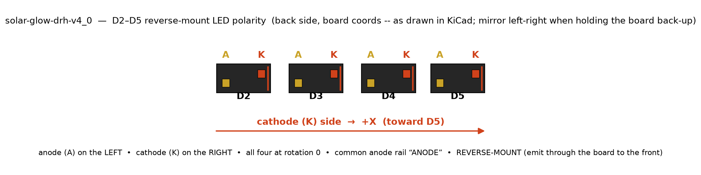
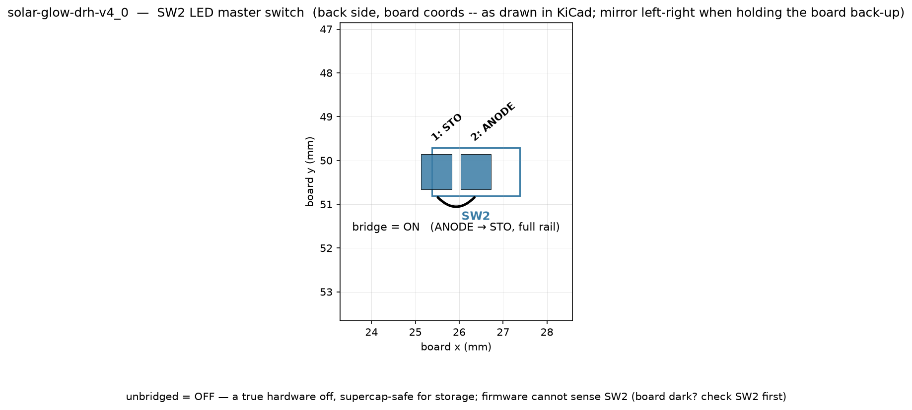

# SOLAR-GLOW · DRH - PCB (v4.0): Order & Build Guide

<table>
<tr>
<td width="50%"></td>
<td width="50%"></td>
</tr>
<tr>
<td align="center"><b>Front</b> — the card face</td>
<td align="center"><b>Back</b> — the component side</td>
</tr>
</table>

**This is what PCBWay ships**: the 1-up card still attached to its 65.6 × 103.7 mm frame, before
you snap the two tabs. The gold ring inset in the frame is the hard-gold plating bus, mask-opened
so the plating rack has bare copper to clip, with a spur crossing each break tab into the card at
x = 25.4. Both faces are raytraced from the panel CI actually generates — see
`scripts/render.py`, and "The PCBWay panel" below. No components are shown because none are
fitted at this stage; that is the fab's deliverable, not an omission.

## Assembled

<table>
<tr>
<td width="50%"></td>
<td width="50%"></td>
</tr>
<tr>
<td align="center"><b>Back</b> — 51 fitted parts</td>
<td align="center"><b>Front</b> — the two solar cells</td>
</tr>
</table>


The same board with its components on: 53 of the 72 footprints carry a 3D body, which is every part
that actually gets populated. The other 19 are holes, solder-bridge pads, the `NPTH_mech` set, and
**J1**, which is DNP.

> **Read the big grey slabs as ENVELOPES, not as photographs.** The four supercaps, the two solar
> cells, the LEDs, both QFNs, the FRAM, the accelerometer and the NFC tag are **clearance solids**
> generated by `scripts/make_3d_models.py` — each is its part's maximum outline at its **maximum**
> height, because the question they exist to answer is "does the brace clear it?" and a pretty model
> at the wrong height would be worse than useless. They are not appearance references. The chip
> passives and SOT-23s are stock KiCad models and do look roughly like the real parts.
>
> The supercap **locator tabs are deliberately absent** — see `TODO.md`; their real folded geometry
> has never been measured, so the envelope near the two short edges is unverified.
>
> **Every body you see is rendered from this repo, not from a KiCad install.** The nine stock models
> live in `PCB/kicad-3dmodels/` because the image CI renders in carries no 3D library at all — that
> was measured, not assumed (`models: 15/53 resolve ... NO stock 3D library found`), and it is why an
> earlier version of this render was missing every chip passive and both SOT-23s. `render.py` points
> `${KICAD10_3DMODEL_DIR}` at the vendored copy when the host has none, and consistency check [5]
> fails if a new part references a stock model nobody vendored.

---

This folder holds the **board** for SOLAR-GLOW · DRH — the KiCad project, the bill of
materials, and the artwork reference for the SW2 selector. It is the thing you fab and
populate. This README is the procedure: **how to order the bare PCB, how to order the
parts, and how to build the assembly.**

> **One revision lives here.** As of 2026-07-28 that is **v4.0**; the seven `*-v3_0.*` files
> (board, schematic, project, prl, dru, and both BOMs) were removed, the same way v2_1–v2_3 were
> before them. Superseded revisions are kept by git, not by this folder — carrying a second 1.6 MB
> board around only invites someone to open the wrong one. To get one back:
> ```sh
> git log --diff-filter=D -- PCB/solar-glow-drh-v3_0.kicad_pcb   # the commit that removed it
> git show <sha>^:PCB/solar-glow-drh-v3_0.kicad_pcb > /tmp/v3.kicad_pcb
> ```
> **`enclosure/solar-glow-drh-v3_0-backshell-*` is unaffected.** Those keep their v3_0 names but are
> current, fab-ready, and staying — the name records which board revision the shell was first cut
> against, and the v4 board carries the identical 8-hole pattern.

```
PCB/
├── solar-glow-drh-v4_0.kicad_pro     # KiCad project (open this)
├── solar-glow-drh-v4_0.kicad_sch     # schematic
├── solar-glow-drh-v4_0.kicad_pcb     # board — 2-layer, routed, teardropped (source of truth)
├── solar-glow-drh-v4_0.kicad_prl     # local project state
├── solar-glow-drh-v4_0.kicad_dru     # two-tier design rules (PCBWay floor + marginal band)
├── solar-glow-drh.kibot.yaml         # CI recipe — regenerates ../Generated/ on every push
├── solar-glow-drh-v4_0-BOM.xlsx      # bill of materials - v4.0 master (adds the AEM10300 harvest chain: U7 FRAM, U8 PMIC, U9 LDO, L2/FB1, C22–C28, R15–R17; mostly 0402, with C26/C27 on 0805 and ten more on 0603 — see the BOM table below)
├── solar-glow-drh-v4_0-BOM-assembly.xlsx  # trimmed PCBA BOM (36 placed parts)
├── kicad-3dmodels/                   # the 9 stock KiCad .step bodies this board uses, mirroring the
│                                     #   library layout (CC-BY-SA 4.0, licence bundled). CI's render
│                                     #   image ships NO 3D library, so without these the assembled
│                                     #   render silently loses 38 of 53 component bodies.
└── DRC.rpt / ERC.rpt                 # last GUI report exports (CI keeps live copies in ../Generated/)
                                      # (v2_1 / v2_2 / v2_3 / v3_0 revisions live in git history, not this folder)
```

> **The board is the source of truth.** `solar-glow-drh-v4_0.kicad_pcb` / `.kicad_sch`
> govern. The design *reasoning* lives one level up:
> - `../firmware/board.h` + `../firmware/README.md` - as-built pin map and net list (the firmware target); `../solar-glow-drh-v2-hardware.md` is frozen v2 lineage only.
> - `../solar-glow-drh-v2-mechanical.md` — board envelope, heights, mount holes, keepouts.
> - `../solar-glow-drh-design-notes.md` — why each decision was made; the landmines.
> - `../README.md` — the project overview and the standing open question (energy budget).
>
> Where a number here and a number in those files ever disagree, re-read the `.kicad_pcb`.

> **Read this before committing money: the energy budget has never been measured.** Harvest
> under real indoor light versus four breathing LEDs at the current 150 Ω ballast is an
> unproven bet. It does not stop you fabbing one board — it stops you populating a *batch*.
> See **First power & bring-up** below and `../solar-glow-drh-design-notes.md` §2.

---

## Board at a glance

| Parameter | Value |
|---|---|
| Outline | 50.80 × 88.90 mm rounded rectangle, **3.0 mm corner radius** |
| Layers | **2 copper**: F.Cu (cells, plating ties, monogram art) · B.Cu (everything else) |
| Power architecture | **GND = full-board B.Cu pour** (~3000 mm²); **VS = routed B.Cu mesh** |
| Finished thickness | **0.6 mm** FR4 |
| Surface finish | **ENIG** + **selective hard (electrolytic) gold** on the F.Cu gold set — the plating bus exists to feed it (see the order special request) |
| Soldermask | **Matte black**, both sides |
| Silkscreen | White (back-side identifiers / logos); front face is intentionally bare |
| Components | **52 on the back**; the front carries only the two solar cells (PV1/PV2) |
| Teardrops | **Enabled** — **298** curved teardrop zones (pads, vias, and track-ends). _(Was documented as 243; recounted from the board 2026-07-28.)_ R14 and the reworked U6 area have none, and **6 more were removed from the PV1/PV2 SRC pads** when the cells were re-centred on 2026-07-28 — their shape is derived from a pad/track relationship that changed, so translating them would have been wrong. **Run Tools → Add Teardrops before plotting** to regenerate all of them. |
| NFC | NT3H2211 tag (U5) + **PCB-etched 7-turn coil** on B.Cu, power-gated by U6. Coil stays **under soldermask** — see the note below. A contactless mark on F.Mask over the antenna says the card is NFC-enabled |
| Front ornament | **Generated, not drawn** — `scripts/mask_art.py` opens F.Mask only where the copper beneath is GND, so the routing itself becomes the pattern (gold mesh, dark rivers). 216 mm², narrowest gold aperture 0.122 mm. Re-run `--apply` after any front re-route; consistency check [6] fails if you don't |
| Indicative parts cost | **≈ $93/board** at qty 1–10; supercaps + solar cells are most of it |

**Glow window — the one feature a fab must not "clean up."** A rectangle at
**x 14.95–35.85, y 40.8–47.0** (≈ 20.9 × 6.2 mm, board center) is a **keepout on both
copper layers** and has the **soldermask opened over it on both faces**. The rear LEDs fire
*through* the bare FR4 to light the front monogram; the open rear mask lets the gold ENIG
reflect that light forward instead of absorbing it. Tracks are allowed inside the window;
**vias, copper pour, and footprints are not.** Do not let a DFM auto-edit flood mask back
over it.

**NFC coil region — the second feature a fab must not "improve."** The east band at
**x 36.8–49.0, y 31.6–57.4** carries the etched antenna: the B.Cu GND pour is kept out of
it, and F.Cu is a keepout over it. The **LA↔LB track crossing at (41.0, 38.0) is the coil's
electrical junction — intentional, not a short.** Any DFM note offering to "fix" the
crossing or to flood the region gets declined.

---

## Step 1 — Open the project and run DRC

1. Open `solar-glow-drh-v4_0.kicad_pro` in **KiCad** (designed in the 2026 file format).
2. Register the footprint library: the board uses a local `solarglow` library that is not
   registered on a fresh machine. Add it under **Preferences → Manage Footprint Libraries**
   (or accept KiCad's prompt) so the footprints resolve.
3. **Run DRC.** The project carries a two-tier rule file (`solar-glow-drh-v4_0.kicad_dru`):
   - **error tier** = the do-not-ship floor (clearance/track ≥ 0.126 mm, annular ≥ 0.125,
     drill ≥ 0.2) — sized against PCBWay's stated 2-layer capability;
   - **warning tier** = the *marginal band* [0.126, 0.1524): PCBWay-legal geometry that is
     tighter than 6 mil, flagged on purpose so the ledger stays visible.

   **Expected result: 0 errors, ~61 warnings, 11 exclusions** (verify the exclusion count against
   `Generated/solar-glow-drh-v4_0-drc.html`, which CI writes — the catalogue's history lives in
   `CLAUDE.md`). The excluded set is the two gold-plating tie stubs crossing the outline, the
   LA↔LB coil junction, the seven supercap NPTHs inside courtyards, and the `TC1/b`↔SC1 courtyard
   overlap — all intentional.
   The footprints that shipped without a courtyard (U1, U8, U5, U3, D2-D5, J1, TC1) now carry
   courtyards + pin-1/cathode markers. The one accepted courtyard overlap is the **`TC1/b`
   Tag-Connect mirror under the SC1 supercap** (its ancestor — the pre-2026-07-30 B-side TC1 over
   the same can — died with the side flip and KiCad pruned the exclusion; the 2026-08-01 mirror
   recreates it deliberately: bare pads under a part body, used only before SC1 is fitted);
   courtyard-overlap is otherwise a hard CI gate. The two proximities this exposed (U8/L2, U1/J1) were resolved in the layout.
   The warnings are the marginal-band ledger (mostly the 0.127 mm parallel corridors of the
   west-side bus) plus fourteen 0.15 mm track-width notes. **Do not "fix" warnings blindly**,
   and do not be alarmed if the warning *count* differs slightly between runs — KiCad's
   row enumeration jitters on long parallel runs (see the design notes, "row-count jitter"). After any board edit — including the R14 patch — **refill zones (B.Cu) before running DRC**; the committed fills predate the patch.
4. CI runs the same DRC (plus ERC and the full fab plot) on every push and commits the
   results to `../Generated/`. If your local run and `Generated/` disagree on *substance*
   (not row counts), stop and investigate.

---

## Step 2 — Generate the fab outputs (do this in KiCad, not from a script)

There are **no Gerbers committed in this folder** — generate them fresh (or take the
CI-built set from `../Generated/gerbers/`, which comes from the same exporter).

> **Use KiCad's own Fabrication Outputs exporter.** Older revisions of this project emitted
> geometry-derived Gerbers from a Python preview script; **do not fab from those.** A preview
> emitter lacks real thermal-relief spokes, exact mask expansion, and teardrop fills. Plot
> from **File → Fabrication Outputs → Gerbers…** so the production set carries what the
> board actually specifies.

**Plot (Gerbers):**
- Layers: **F.Cu, B.Cu**, **F.Mask, B.Mask**, **F.SilkS, B.SilkS**, **Edge.Cuts**, and
  **F.Paste / B.Paste** (for the stencil — Step 5).
- Format **Gerber X2** (or whatever PCBWay's order page asks for), millimeters, 4.6 resolution.
- Leave KiCad's mask and via-tenting settings as-is. **Vias are tented** on this board (clean
  card face); confirm the plot keeps them tented and keeps the glow-window mask openings.

**Drill (Excellon):**
- **File → Fabrication Outputs → Drill Files…** Generate Excellon + a drill map.
- Plated holes: the **109** vias (uniform 0.30 mm) and the eight M2 mount holes (Ø 2.2 mm; 4 corner MH1-4 + 4 panel-corner MP1-4).
  _(Said 79 until 2026-07-30; the board had 108 and now has 109. Count it, don't quote it: `grep -c '^\t(via$'`.)_
  Non-plated: the TC2030 latch/alignment holes. Export PTH and NPTH per PCBWay's preference.

**Bundle** the Gerbers + drill into one zip for upload.

---

## Step 3 — Order the bare board (PCBWay)

Order parameters, from the committed board:

| PCBWay field | Set to |
|---|---|
| Layers | **2** |
| Material / thickness | FR4, **0.6 mm** finished |
| Surface finish | **ENIG** (**ENEPIG accepted alternate** — decide at quote; either satisfies the rule below), plus **selective hard gold** per the special request below |
| Soldermask color | **Matte black** |
| Silkscreen | White |
| Min track / spacing used | **0.15 mm track / 0.127 mm spacing** (the marginal-band corridors) |
| Vias | **Uniform: 0.30 mm drill / 0.60 mm pad** (0.15 mm annular), 79 total, tented (resin-fill + cap ordered board-wide) |
| Non-plated holes | TC2030: Ø **2.3749 mm** (4× leg-latch) and Ø **0.9906 mm** (3× alignment) |
| Plated mount holes | Ø **2.2 mm** ×4 (M2, corners, tied to GND) |
| Castellations | **None** (verified — only the corner mount holes sit within 1.5 mm of the rim) |

**Run PCBWay's DFM check against these.** The binding features are the **0.127 mm spacing**
and **0.15 mm tracks** — inside PCBWay's stated 0.1 mm/4 mil 2-layer capability, but worth a
glance at their sheet. There are no fine vias on this board (the whole board runs the one 0.30/0.60
via), and no controlled-impedance nets to declare.

> ### Two fabs, one board file (2026-07-27)
>
> The design rules in `solar-glow-drh-v4_0.kicad_dru` are the **intersection of PCBWay and OSH Park**,
> so this board can be ordered from either without re-checking anything: PCBWay for fast, cheap,
> local prototypes and small batches, OSH Park **After Dark** (black FR4 + clear soldermask, ENIG,
> 1.6 mm) for the naked "midnight" variant.
>
> | | PCBWay | OSH Park | governs |
> |---|---|---|---|
> | trace / space | 0.100 mm | **0.1524 mm** | OSH Park |
> | drill | 0.200 mm | **0.254 mm** | OSH Park |
> | annular ring | **0.150 mm** | 0.127 mm | **PCBWay** |
> | copper → board edge | not stated | **0.381 mm** | OSH Park |
>
> Annular ring inverts — OSH Park is the *looser* one there. Do not relax it to 0.127 on the strength
> of their spec page; that breaks PCBWay.
>
> **The single thing that cannot satisfy both fabs** is the pair of 0.4 mm plating-bus stubs
> crossing the outline at x = 25.4. They are *required* at PCBWay to feed electrolytic hard gold and
> *prohibited* at OSH Park, which needs 0.381 mm of copper pullback from the edge and offers ENIG
> only. **The OSH Park upload deletes those two objects and nothing else** — everything else in the
> board is common to both. (OSH Park also cannot do the selective hard gold at all, so the midnight
> variant's monogram table is ENIG rather than hard gold; the bus has no job there regardless.)
>
> Since 2026-07-28 that difference is a **build step, not an edit**: PCBWay gets the panel
> (`Generated/panel/`, see below), whose frame carries the bus the stubs were always drawn for;
> OSH Park gets the plain 1-up set from `Generated/gerbers/` with the two stubs deleted. Both come
> out of the same committed board.
>
> Variant differences are otherwise fab *order options*, not artwork: soldermask colour, substrate
> colour, board thickness, and whether the Ti back-shell is fitted.

#### The midnight variant, rendered

<table>
<tr>
<td width="50%"></td>
<td width="50%"></td>
</tr>
<tr>
<td align="center"><b>Front</b></td>
<td align="center"><b>Back</b></td>
</tr>
</table>

**OSH Park After Dark: black substrate, clear soldermask, ENIG, 1.6 mm, no components.** Not
panelised — OSH Park panelises for you, and the plating bus has no job there, so the render drops
the two stubs exactly as the upload does.

The important thing this render shows is that **midnight is not just production-in-a-different-colour.**
Under a clear mask you see *all* the copper, so the crosshatch stops being a sub-mask texture and
becomes the dominant graphic — a copper field with the black core showing through its gaps. And
because surface finish only lands on mask-opened copper, the hatch stays bare copper while the
monogram table, frame and ornaments come back gold. Production hides the hatch and shows the gold;
midnight shows both, and the contrast between them *is* the design.

### The PCBWay panel (`scripts/panelize.py` → `Generated/panel/`)

**Order the panel, not the bare board.** The plating stubs are only half a circuit on a 1-up
board — they end 0.4 mm outside the outline and connect to nothing, so an ENIG-only run would
leave them as dead copper and the face with no wear surface. The panel is the other half: a
frame the plating rack can clip, with a copper bus ring joined to both stubs across the break
tabs.

| | |
|---|---|
| Panel | **65.6 × 103.7 mm**, 1-up, card at (0, 0)–(50.8, 88.9) |
| Routed slot (moat) | **2.4 mm**, follows the card's rounded outline |
| Frame rail | **5.0 mm** all four sides |
| Break tabs | **2**, one per short edge, 5.0 mm wide, centred on **x = 25.4** |
| Mouse bites | **8** total: Ø0.5 mm NPTH, 4 per tab, on the card outline (y = 0 / 88.9) |
| Plating bus | 0.4 mm across each tab → 1.0 mm ring inset 2.5 mm from the panel edge, F.Cu, GND |
| Bus mask | Ring is **mask-opened along its whole length** — a plating rack needs bare copper to clip |

The mask opening matters more than it looks: a bus ring buried under soldermask is decoration, not
a plating path, because the rack has nothing bare to grip. Exposing the whole ring does put ~319 mm²
of copper in reach of the gold bath, but that is ~6 mg of gold — well under a dollar — on material
that gets routed away, so it is priced in rather than engineered around. The special request above
tells the fab the rail is hardware and not artwork.

The tab sits at x = 25.4 because that is where the stubs already crossed the outline — the
board was drawn expecting this panel long before it existed. Each tab keeps a **1.0 mm
hole-free web** at its centre so the bus crosses without a mouse bite eating into it
(0.30 mm drill-to-copper either side); the remaining 4.0 mm of tab is perforated.

**Getting it:** CI rebuilds the panel on every `PCB/**` push and plots its fab set. As with the rest
of `Generated/`, the result is **committed only on `main`** — on a feature branch the panel build is
a gate, not a commit. The panel `.kicad_pcb` itself is gitignored everywhere (a ~9.7 MB regenerated
blob), so rebuild it locally if you want to look at it:

```sh
python3 -m pip install shapely
python3 scripts/panelize.py          # -> Generated/panel/solar-glow-drh-v4_0-panel.kicad_pcb
python3 scripts/panelize.py --check  # geometry report only, writes nothing
```

The panel is **derived, never hand-maintained** — it is the committed board plus a frame, and the
script asserts that (it re-reads Edge.Cuts and fails loudly if the outline stops being one closed
region). Change the board; the panel follows. Never edit the panel and expect it to survive.

**On the order form:** upload `Generated/panel/solar-glow-drh-v4_0-panel-fab_zip.zip` and set
**panel = "panel by customer"**. Quantity is counted in *panels*, so 5 cards = 5 panels. Everything else (2-layer,
0.6 mm, ENIG + the hard-gold special request above, matte black, white silk) is unchanged.

**Depanel:** snap the two tabs, then file the edge flat at x ≈ 25.4 on both short edges. The
filing is not optional and not a defect — a gold-plated bus nub is left behind by design, and
dressing it flush is the last step of the plating scheme. Expect to touch up the mask/edge there.

**Deliberately not on this panel:** fiducials, tooling holes and copper thieving. The first two
want a wider rail than the bus leaves room for, and this board is hand-finished rather than
machine-placed (see the hand-assembly notes below), so none of them buy anything today. Say so if
a PCBWay DFM reviewer asks — their absence is a decision, not an oversight.

**Add to the order notes / gerber review:**
- "**Leave soldermask open over the central window per the mask layers — do not tent or
  flood.**" (The bare-FR4 + open-ENIG window is the whole optical trick.)
- "**Keep vias tented.**"
- **Selective hard gold (the reason the plating bus exists):** paste this verbatim into the
  special-request box —

  > *"Selective hard gold plating on top side, defined **by net**: gold **every top-side copper
  > surface exposed by an F.Mask opening that belongs to the GND net**, with one exception — the
  > four solar-cell N-side solder lands (PV1/PV2 pads N and Nt) stay with the base finish, because
  > they are soldered and thick electrolytic gold embrittles solder joints. Concretely the gold set
  > is: the DRH monogram field and letter rims, the perimeter frame, the six edge ornament shapes,
  > the four corner M2 mounting-hole annuli, the TC2030 GND pad, and the small contactless-mark
  > arcs right of the monogram. Where the crosshatched ground pour shows inside one
  > of those openings, plate it with them; that is intended, not a defect. All other exposed top-side
  > copper stays with the base finish: the eight solar-cell lands PV1/PV2 (four SRC + the four
  > excepted GND solder lands) and TC2030 pads 1/2/4/5/6 (not on GND, so they have no electrical
  > path to the plating bus and cannot be electrolytically plated; they are spring-contact
  > programming pads and the base finish is acceptable there). The crosshatched pour
  > itself is under solder mask across ~90% of its area and is not a plating surface — it is a
  > decorative texture meant to be read THROUGH the mask, so please do not open mask over it or add
  > extra mask thickness to 'even it out'. The two 0.4 mm traces crossing the board outline at
  > x=25.4 (top and bottom edges) are plating-bus connections; they run across the break tabs onto
  > the panel frame's bus ring, which is where the plating rack should clip. Please retain them
  > through plating and rout at depanel. The bus ring on the frame rail is plating hardware, NOT part
  > of the gold set — it is mask-opened so you have bare copper to contact, and it is routed away at
  > depanel; no need to plate it. The gold set is GND-referenced by design (the four M2 mounting-hole pads overlap the
  > frame at all four corners); not floating copper, not a defect. All in-pad vias: resin-filled and
  > copper-capped (POFV, IPC-4761 Type VII)."*

  A DFM reviewer will flag copper-to-edge = 0 at the two stubs; that is by design. (Net inventory
  re-verified against the committed board 2026-07-31, when the request moved from an enumerated
  area list to the **net rule** above: the front's F.Mask-opened pads are exactly PV1/PV2 ×8
  (4 SRC + the 4 GND solder lands the rule excepts) and TC2030 ×6 (1 GND, in the gold set; 2
  signal + 3 unconnected, unplateable — no bus path); every graphic opening exposes GND pour or
  bare laminate only, which `scripts/mask_art.py`'s guard enforces for its own art. (`TC1/b`,
  the 2026-08-01 B-side mirror, opens **B.Mask** only — it is outside the front gold set by
  construction and takes the board-wide base finish like every other back pad.) The gold set
  stays a single connected F.Cu group fed by the pour — the net rule *adds* the TC2030 GND pad
  (a spring-contact surface, which is what hard gold is for) and the contactless-mark arcs
  relative to the old enumeration; same look, better wear, one sentence of spec.) Ordering plain
  ENIG without this request leaves the bus as dead copper and no wear surface on the face — do
  not ship without it.

  > **Why the wording changed (2026-07-27, the crosshatch upload).** The request used to say the
  > gold set was "**all connected copper on F.Cu**." The crosshatch rework enlarged the F.Cu pour
  > outline to 0.5 mm from the board edge, so the pour now overlaps the gold artwork by **157.3 mm²**
  > — 52% of the frame + ornament copper — where it used to graze it over 0.069 mm². Connectivity
  > therefore stopped being a usable way to name the gold area.
  >
  > **How big a problem that actually was: smaller than it first looked.** A fab can only plate
  > copper the mask leaves exposed, and the crosshatch is a *sub-mask* ornament — **89.6% of it
  > (1816.9 of 2028.1 mm²) sits under solder mask** and is not a plating surface at all. Only
  > **211.2 mm²** of hatch is exposed, and that is hatch falling inside the monogram / frame /
  > ornament mask windows, where plating it with them is the correct outcome anyway. So the old
  > wording was ambiguous rather than expensive. (An earlier draft of this note claimed it would have
  > gold-plated ~2,400 mm² of pour. That was wrong — it ignored the mask.) **The monogram field is
  > untouched** regardless: it sits inside the `optical_window` keepout, which the pour cannot enter,
  > so its overlap is exactly 0.00 mm².
  >
  > The new wording names the gold area by **F.Mask opening** instead, which is what physically
  > governs it: top-side mask openings total 562.2 mm² (473.0 graphics + 89.2 pad apertures), and
  > 97% of the 387.5 mm² artwork sits inside one. It also tells the fab the pour is decorative and
  > must stay masked — the texture only reads if the mask telegraphs the 35 µm copper step, so extra
  > mask thickness would flatten the effect the hatch exists for. **Durable fix, if you want one:**
  > draw the gold area on a dedicated user layer (`User.1`, empty today) and plot it as its own
  > gerber, so the region is artwork rather than prose. Not done here.
- "**The LA/LB track crossing at (41.0, 38.0) is the NFC coil junction — intentional.**"
- **Bench pad strip (`TP1` + `JP1`, back east edge, x 48.4):** five bare 1.7 mm SMD probe pads
  (SRC / GND / STO / SCL / SDA at 2.54 pitch) - no component; they are in the mark-as-DNP list
  above. Pinout and the bench-power ritual live in `solar-glow-drh-v2-hardware.md` (note: that frozen doc predates the v3->v4 VS->STO change, so JP1.2 is now the STO tank node, not the VS rail).
- **Via-in-pad -- several vias land inside pads** on this board: the soldered pads (`TC1.1`, `U1.EP`,
  `U5.1`, `SW2.1`, `J1.2`, `PV1.N`, `PV2.N`, `PV2.Nt`)  [D1.K and R13.2 removed - D1 and R13 are not on the v4 board; re-verify the full via-in-pad set against the v4 layout, since v4 added U7/U8/U9/L2/FB1] plus 2 in the bench-strip
  probe pads (`JP1.3`, `JP1.4` — bare pads, hand-solder optional). The clean answer is
  the same as always: **order resin-fill + cap (via-in-pad process) board-wide.** The one
  that *must* be flat and hole-free is **TC1.1** (a Tag-Connect pogo contact); the rest
  are large or hand-soldered pads where a plugged via is merely tidy.

> **Resolved in the R14 patch:** the previously undocumented Ø 0.89 mm NPTH at (37.9, 75.4)
> (under SC4's body) was **deleted from the board** — nothing in the repo claimed it. If it had a
> purpose, it's one git revert away. *(Lineage re-checked 2026-07-02: absent from the v0
> prototype; entered at v2.1 inside an anonymous `NPTH_mech` footprint; never appeared in the fab
> hole table; the enclosure generator places nothing there. Orphan confirmed — deletion stands.)*

A **frameless solder-paste stencil** (from the F.Paste / B.Paste plot) is strongly
recommended — the QFN EP and the LGA accelerometer reflow far more reliably with paste than
hand-tinning. Order it alongside the board.

> **What the stencil deliberately does NOT open (2026-07-26).** Paste has been removed from the
> pads of every part that is not reflowed, so the stencil only opens where paste is wanted:
>
> | | pads | why |
> |---|---|---|
> | **PV1, PV2** (solar cells) | 8 | hand-soldered, consigned; **4 pads each** — a Ø3.5 mm terminal plus a 4 × 3 mm tab 3.1 mm outboard |
> | **SC1–SC4** (supercaps) | 8 | hand-soldered to the under-body P/N pads |
> | 11 DNP parts (incl. **TC1/b**, the B-side mirror, 2026-08-01) + **TC1** | 35 | not placed / pogo contacts must stay bare |
>
> The PV and SC pads alone are **≈ 366 mm² of aperture** — the largest on the board by a wide
> margin, equivalent to about 1,200 0402 pads. Reflowing that much paste under parts meant to be
> hand-soldered is not a small waste: it is enough solder volume to float the part.
> **Copper and mask are untouched** — only the paste layer was removed, so every pad solders by
> hand exactly as before.

---

## Step 4 — Order the parts

**BOM state.** The masters are now **`solar-glow-drh-v4_0-BOM.xlsx`** and
**`solar-glow-drh-v4_0-BOM-assembly.xlsx`**, reworked for the v4.0 managed-solar redesign - the passive diode/shunt/comparator parts (U2, U4, Q1, D1, D9–D11, R7–R9) are removed and the AEM10300 harvest chain (U7, U8, U9, L2, FB1, C22–C28, R15–R17) is added, on top of the earlier fixes:
**U6 (TPS22917DBVT since the 2026-07-23 dark-current swap) and R14 (1 M `NFC_EN` pulldown) added**, the stale **JP1/JP2 rows dropped** (the `JP1` designator is reused for the v3.0 bench pad strip — bare pads, not a BOM part)
(those headers left the board in v3.0), and **most passives converted to 0402** to match the board's placed lands — the v2.2 file still
listed 0805 MPNs for most R/C. _(Updated 2026-07-25: the 2026-07-23 longevity/precision passes moved
several off 0402 — **0603**: C4, C13, C25, C22, C23, R5, R6, R15, R16, **FB1**; **0805**: C26, C27.
(FB1 is 0603 in the BOM and the schematic but the **board still draws its 0402 land** — see TODO.md.)
SJ1 is **gone
outright** — DNP'd 2026-07-23 with the AVR-EA swap, then symbol, land and strap deleted from the
schematic and board on 2026-07-30 (PR #114 sch cull + the board sync); the BOM master keeps its
row as lineage. New parts since: **Q2** (SOT-23) + **R18** (0402). The table below is the
current truth.)_ Converted and added
lines had their prices blanked at the time; **that is no longer true — every ordered line is now
live-priced** (full DigiKey/Mouser sourcing pass, 2026-07-23, subtotal ≈ $140). The `v2 2` and older
BOM files remain in git history as lineage.

Summary of the **orderable** lines:

> **Derived snapshot, regenerated from the BOM master 2026-07-25.** The master is
> `solar-glow-drh-v4_0-BOM.xlsx` (with `-BOM-assembly.xlsx` for the machine-place set) — order
> from those, not from this table. This copy had drifted badly (it still listed the pre-swap
> `AVR64DD28-I/STX`, `TPS22918DBVR`, the SOIC-8 FRAM and the pre-longevity-pass passives), so
> treat any disagreement as this table being wrong.

| Ref(s) | Qty | Value | Package | MPN |
|---|---:|---|---|---|
| U1 | 1 | AVR64EA28, 64 KB, 20 MHz | VQFN-28 (4×4×1.0 mm, w/ EP) | `AVR64EA28-E/STX` |
| PV1, PV2 | 2 | Voc 4.15 V, 184 mW, mono, 1.2 mm thick | 42×23×1.2 mm, custom land | `SM141K06TF` |
| SC1, SC3 | 2 | 1.8 F, 2.75 V (SS17) | SS17 (under-body P/N pads, 39 mm) | `3-153-440` |
| SC2, SC4 | 2 | 1.0 F, 2.75 V (WS17) | WS17 (under-body P/N pads, 28.5 mm) | `3-153-438` |
| D2–D5 | 4 | Amber 617 nm, Vf≈2.25 V | SMD, 3.4x1.9 mm | `LA P47F-V2BB-24-3B5A-30-R18-Z` |
| R1–R4 | 4 | 150 Ω, ±1% | 0402 | `AC0402FR-07150RL` |
| R12 | 1 | 220 Ω, ±1% | 0402 | `AC0402FR-07220RL` |
| R5, R6 | 2 | 1 MΩ, ±0.1%, 25 ppm, 0603 | 0603 (R_0603_1608Metric) | `RT0603BRD071ML` |
| C5 | 1 | 100 nF, X7R, 50 V | 0402 | `GRT155R71H104KE01D` |
| U3 | 1 | I²C 0x1D, ±2–8 g | LGA-12 CC-12-4 (2.2×2.3×0.87 mm) | `ADXL367BCCZ-RL7` |
| R10, R11 | 2 | 4.7 kΩ, ±1% | 0402 | `AC0402FR-074K7L` |
| C1 | 1 | 100 nF, X7R, 50 V | 0402 | `GRT155R71H104KE01D` |
| C3 | 1 | 100 nF, X7R, 50 V | 0402 | `GRT155R71H104KE01D` |
| C4 | 1 | 10 µF, X5R, 16 V | 0603 | `GRT188R61C106KE13D` |
| C6 | 1 | 100 nF, X7R, 50 V | 0402 | `GRT155R71H104KE01D` |
| C11 | 1 | 0.22 µF (220 nF), X7R, 16 V | 0402 | `GRT155R71C224KE01D` |
| C12 | 1 | 100 nF, X7R, 50 V | 0402 | `GRT155R71H104KE01D` |
| C7 | 1 | 100 nF, X7R, 50 V | 0402 | `GRT155R71H104KE01D` |
| SW2 | 1 | 3-pad bridge | solder-bridge | **(none — PCB bridge)** |
| SB1–SB4 | 4 | solder-bridge | solder-bridge | **(none — PCB bridge)** |
| TC1 | 1 | TC2030-MCP-FP | TC2030 legged land | **(no part — pogo interface)** |
| J1 | 1 | 1×3, 0.1″ | 0.1″ THT pads | **(unpopulated / 0.1″ header)** |
| JP1 | 1 | 4× bare SMD pads | 1.7 mm sq, 2.54 mm pitch, B side | **(bare pads — no component)** |
| TP1 | 1 | 1× bare SMD pad | 1.7 mm sq, B side | **(bare pad — no component)** |
| MH1–MH4 | 4 | M2 | 2.2 mm plated | **(no part — drill)** |
| U5 | 1 | NTAG I²C plus, 2 KB, I²C 0x55 | XQFN8 (SOT902-3, 1.6×1.6×0.5 mm) | `NT3H2211W0FHKH` |
| C8 | 1 | 100 nF, X7R, 50 V | 0402 | `GRT155R71H104KE01D` |
| C9 | 1 | 47 pF, C0G/NP0, ±2 %, 250 V, High-Q | 0805 | `QSCT251Q470G1GV001E` |
| C13 | 1 | 10 µF, X5R, 16 V | 0603 | `GRT188R61C106KE13D` |
| L1 | 1 | 2.76 µH design value | PCB copper — no package | **(no part — PCB feature)** |
| U6 | 1 | Ultra-low-leakage load switch | SOT-23-6 (DBV) | `TPS22917DBVT` |
| R14 | 1 | 1 MΩ, ±1% | 0402 | `AC0402FR-071ML` |
| U8 | 1 | AEM10300 | QFN-28 (4x4 mm, EP land 2.30) | `10AEM10300C0000` |
| U9 | 1 | TPS7A0233, 3.3 V, ~25 nA Iq | SOT-23-5 | `TPS7A0233PDBVR` |
| U7 | 1 | MB85RC512TY | DFN-8 LCC-8P-M05 (5.0×6.0×0.90 mm MAX, 1.27 mm pitch) | `MB85RC512TYPN-GS-AWEWE1` |
| L2 | 1 | 10 uH | 1008/2520 (L_1008_2520Metric), 2.5x2.0 mm | `DFE252010F-100M` |
| FB1 | 1 | 0603 bead | 0603 (`L_0603_1608Metric` — **board still draws the 0402 land**, see TODO.md) | `BLM18PG221SN1D` |
| C22 | 1 | 1 uF, 25 V, 0603, X7R | 0603 (C_0603_1608Metric) | `GRT188R71E105KE13D` |
| C23 | 1 | 2.2 µF, 25 V, 0603, X7R | 0603 (C_0603_1608Metric) | `GRM188Z71E225ME43D` |
| C24 | 1 | 100 nF, 0402, X7R | 0402 | `GRT155R71H104KE01D` |
| C25 | 1 | 22 uF, 10 V, 0603, X5R | 0603 | `GRT188R61A226ME13D` |
| C26, C27 | 2 | 10 µF, 10 V, 0805, X7R | 0805 (C_0805_2012Metric) | `GRM21BR71A106KA73L` |
| C28 | 1 | 100 nF, 0402, X7R | 0402 | `GRT155R71H104KE01D` |
| R15 | 1 | 2 M, 0603, ±0.1%, 25 ppm | 0603 (R_0603_1608Metric) | `MCT0603MD2004BP500` |
| R16 | 1 | 1 M, 0603, ±0.1%, 25 ppm | 0603 (R_0603_1608Metric) | `RT0603BRD071ML` |
| R17, R18 | 2 | 1 M, 0402, ±1% | 0402 | `AC0402FR-071ML` |
| Q2 | 1 | N-ch MOSFET, 60 V, logic-level | SOT-23 | `BSS138LT1G` |

**No ordered part — these are board features, not BOM line items:**
- **SW2** (LED OFF/ON/TINY) and **SB1–SB4** (per-LED force-on) are **solder bridges** on the PCB.
- **The NFC antenna is etched copper** — no wound coil to buy, and it stays **under soldermask**.
  Opening the mask over it was tried on 2026-07-29 and reverted the same day: exposed copper gets
  ENIG, and nickel in an RF conductor costs Q (~7× copper's resistivity, ferromagnetic, and at
  13.56 MHz its skin depth is thinner than the plated layer, so the surface current runs in the
  nickel). It also bought nothing to look at — the shell is back-only, so the whole rear of the
  board is inside titanium. Soldermask is non-magnetic, so removing it never helped the ferrite
  either; that shielding scales with µ′ × ferrite thickness.
- **A contactless mark sits on the show face**, over the antenna at x[41.3,44.1] y[42.2,46.7] —
  generated by `scripts/mask_art.py` under its `(glyph − live copper)` rule, so it can only ever
  lay GND or bare laminate bare. It is the ONLY thing that generator writes now — the left-field
  cartouche was switched off on 2026-07-29 (see that file's `CARTOUCHE`). It falls inside the coil keepout
  where there is no front pour, so it reads as **bare laminate like the monogram window**, not
  gold. Generic waves, not the NFC Forum N-Mark, which is licensed.
- **TC1** is the **TC2030 footprint** — no soldered part; it mates with a TC2030-MCP pogo
  cable. **Do not load.** Since 2026-08-01 the land is **double-sided**: `TC1/b` mirrors the
  same three nets (UPDI/STO/GND) onto `B.Cu` at the same XY, so the plug works from either
  side of a board that does not yet carry SC1 (the back land sits under the supercap's can).
- **J1** is an **optional** 0.1″ UPDI header — TC1 is the primary programming path.
- **MH1–MH4** are plated drills — supply your own **M2 screws** if enclosing.

**Flags to clear before you buy:**
- **R1–R4 value (150 Ω) is `SIZED`, not locked.** It sets per-LED peak current and is
  **bench-pending** — the energy-budget test may re-tune it. Buy a small 0402 range
  (e.g. 100 / 150 / 220 / 330 Ω) so you can swap after the measurement.
  *(Corrected 2026-07-26 PCB audit: this used to read "~9 mA on the clamped rail", a stale
  v3 figure — v3 fed the LED anodes from a rail the TLV3011B held near 3.5 V, giving
  (3.5−2.25)/150 ≈ 8.3 mA. v4 deleted that clamp: SW2 now feeds ANODE straight from STO, so
  the peak is (STO−Vf)/150 ≈ **14–18 mA** near the 4.65 V VOVCH ceiling — the LA P47F's Vf
  is itself unbinned across the 3B–5A groups, 1.95–2.55 V at 30 mA. The firmware
  (board.h/led.h) already assumes the v4 number; this line did not.)*
- **C9 is placed, at 47 pF** (changed 2026-07-30 — it was DNP pending a bench trim). The value
  is derived rather than measured: coil L = 0.958 µH by Greenhouse on the board's own rails,
  ferrite-loaded +10–36 %, NT3H2211 Ci = 50 pF, antenna Cc = 6 pF, targeting AN11276 §4.2.1's
  **14.5 MHz** single-tag nominal rather than 13.56. Full derivation in
  `PCB-side-notes-brace-direction.md` §5. **Measure enclosed, not bare** — bare reads ~16.7 MHz
  and the ferrite is what brings it down.
- **SC1–SC4 are the dominant cost** (well over half the BOM). Confirm live pricing.

---

## Step 5 — Assembly (as ordered: PCBWay turnkey)

Ordered as **single-sided turnkey assembly**: PCBWay sources the parts and machine-places
them on the **back**; the front stays naked until you fit the cells. You finish two part
types by hand afterward.

**The split**
- **PCBWay machine-places** (reflow, bottom): U1, U3, U5–U9, Q2, D2–D5, R1–R6, R10–R12, R14–R18, L2, FB1,
  C1, C3–C8, C11–C13, C22–C28. (Recompute the placed count from the v4 board; the v3 clamp/comparator
  parts - U2, U4, Q1, D1, D9–D11, R7–R9, C2, C10 - are gone.)
  *(Corrected 2026-07-26: **SJ1 removed** from this list — it was then DNP/not-ordered and never
  placed. Since 2026-07-30 the question is moot: SJ1's symbol, land and strap were deleted from the
  schematic and board outright (PR #114 sch cull + the board sync). **Q2 and
  R18 added** — the charge-disable buffer from the cold-start-deadlock fix. **U7 is correctly in this
  list**: it carried a stray DNP attribute in the .kicad_pcb, now cleared so the board agrees with the
  schematic. That flag did not affect this project's fab output — the CI pick+place CSV is informational
  and already listed U7 — but the two files must agree, since a schematic sync overwrites the board.)* `solar-glow-drh-v4_0-BOM-assembly.xlsx` is
  that trimmed file - **regenerate it from the v4 board** so it reflects the v4 placed set.
- **You hand-solder afterward:** SC1–SC4 supercaps and PV1–PV2 solar cells. They are kept
  **off** the PCBA BOM on purpose — the supercaps are manual-solder only (SCHURTER SCPC),
  and the cells are heat-sensitive.
- **Not placed:** SW2, SB1–SB4 (solder bridges you set), TC1 (Tag-Connect pad), J1
  (optional header), MH1–MH4 (mounting holes). *(C9 was on this list until 2026-07-30; it is now
  a placed 47 pF part.)*

**Sourcing:** turnkey, with the standing instruction that anything PCBWay can't source they
flag and you consign from DigiKey — **no substitutes without approval**. The likeliest to
need consigning are **U1** (AVR64EA28-E/STX), **U8** (AEM10300 - e-peas harvest PMIC, source early), **U5** (NT3H2211 - going
end-of-life in places; check stock early), and **D2–D5** (the ams OSRAM amber bin — confirm
the exact reverse-mount P/N, OSRAM sells top-emit lookalikes).

**Files handed to PCBWay:** the trimmed assembly BOM, the **centroid / pick-and-place**
(KiCad → Fabrication Outputs → Component Placement; **CSV, mm, exclude-DNP** after marking
SC1–SC4 / PV1–PV2 / J1 / JP1 / TP1 as DNP — **not C9 any more**; **Absolute origin** to match
the drills), and
`../Generated/docs/solar-glow-drh-v4_0-led-orientation.png` (CI draws it from the board —
`scripts/ref_figures.py` — so it cannot lag a re-route; it replaced the hand-made
`led-orientation-D2-D5.png` on 2026-08-01).

**Order-form settings that matter:** bottom side, qty 5, ENIG (or ENEPIG, whichever quotes cleaner) **+ selective hard gold (special request above)** / matte-black / white silk,
**resin-fill + via-in-pad** (cleans the 10 via-in-pad joints and keeps the TC1 pogo pad
flat), **moisture-sensitive = U1 / U3 / U5** (U3 is a MEMS part - observe peak reflow
temp, no ultrasonic clean), no China substitutes. **Black-FR4 core stays OFF** — the glow
needs translucent FR4, the black look comes from the soldermask.

> **LED polarity (reverse-mount `LA P47F`):** anode **A** on the left, cathode **K** on the
> right, all four at **rotation 0** (see `../Generated/docs/solar-glow-drh-v4_0-led-orientation.png`).
> They emit *down* through the FR4 to the front. A flipped LED will not glow — this is the
> single most common PCBA defect on this board.
>
> 

### Finishing the board by hand (after PCBWay returns it)

> ### ⚠ Program the MCU BEFORE fitting the SOLAR CELLS
>
> **TC1 moved to the FRONT in the 2026-07-30 board sync** (`5934b7d`), deliberately: the footprint
> went `B.Cu` → `F.Cu`, pads and mask with it, plus a 180° rotation. XY did not move (13.3, 16.9).
> The point of it is the programming window — see below.
>
> Worth knowing regardless: **nothing in CI catches a footprint changing sides.** DRC has no
> opinion, schematic parity has no layer concept, and `check_consistency` compares refdes and
> footprint assignment, not side. This one surfaced only because `board_parts("B")` stopped
> returning TC1 and the brace's pocket list changed with it. A side flip that *isn't* intended
> would arrive just as quietly.
>
> What it changes: **SC1 no longer blocks TC1.** The supercap is on `B.Cu` and the Tag-Connect
> pads are now on `F.Cu`, so a TC2030-MCP pogo cable reaches them with SC1 fitted. What blocks
> them now is **PV1**: the cell's body spans (2.3, 4.25)–(48.5, 27.25) and the pad cluster
> (12.219, 15.184)–(14.381, 18.616) sits well inside it. PV1's *solder pads* do not touch TC1's
> — the overlap is 0.0% — so this is a mechanical obstruction, not an electrical one.
>
> **2026-08-01: the land went double-sided.** `TC1/b` mirrors UPDI/STO/GND onto `B.Cu` at the
> same XY, so on a board fresh from PCBWay (no supercaps, no cells) the plug seats from
> **either side** — face-up or face-down on the bench, it does not care. The sequencing rule is
> unchanged, it just gains a symmetric clock: **SC1 covers the back land** (that is the accepted
> `TC1/b`↔SC1 courtyard exclusion), **PV1 covers the front land** — so hand-solder the supercaps
> and cells only after firmware is flashed and verified, same as before. `TC1/b` is bare copper
> on the B side: no paste, no part, nothing to place.
>
> So: **flash and verify the firmware first, then hand-solder the cells.** If you need to
> re-program after PV1 is on, your options are the optional **J1** UPDI header or lifting the
> cell — and the cell is the heat-sensitive part (≤ 260 °C / 2 s), which makes removing it a
> worse trade than removing a supercap was. Worth loading J1 on any board you expect to iterate
> firmware on.
>
> **The window got LATER, and that is the point of the move.** SC1 is reflowed with the rest of
> the SMD parts, so the old rule closed the programming window at reflow — you had to flash a
> board with no energy storage on it. The cells are hand-soldered last, so now you can reflow
> everything, flash a board that is otherwise complete, and only then fit PV1/PV2. The root
> README's assembly order was reordered to match: **flash is step 3, the cells are step 4.**
>
> _(Until 2026-07-30 this box read "before fitting SC1" and said both parts were on B.Cu, which
> was true of the board it was written against. TC1's XY position did not move — 100% of its pads
> are still inside SC1's outline, 5.464 mm in — only its side did, and that is the whole
> difference.)_
>
> This is the assembly consequence of the 7 × `npth_inside_courtyard` DRC exclusions. Those were
> accepted as a *geometry* decision; the ordering constraint they imply was never written down
> until the 2026-07-28 exclusion audit.
> _(This also named a `courtyards_overlap` exclusion until 2026-07-30. That violation stopped
> firing in the 2026-07-30 board sync and KiCad pruned the dead exclusion — 14 → 13. **The
> geometry did not change and neither does this warning:** TC1 is still 100% under SC1, which is
> a measurement of the two footprints, not a DRC finding. Nothing here was relaxed.)_

Work outside-in by heat sensitivity:

1. **Supercaps SC1–SC4 — hot air / hotplate, not an iron.** They solder to **flat pads under
   the body**; the **asymmetric P/N widths (P = 7.8 mm, N = 12.2 mm) are the polarity key**.
   The folded end tabs are coated, non-solderable locators — never solder to those. The cells
   sit at the board ends, clear of the central cluster, so localized hot air will not disturb
   the reflowed parts.
2. **Solar cells PV1 / PV2 last (most fragile).** Iron **≤ 260 °C, ≤ 2 s per joint**, and
   **do not clean with IPA**. Mind cell polarity to the custom land.
3. **Set the LED master switch SW2** (3-pad bridge): center–left = **ON** (`ANODE` straight
   to `STO`), center–right = **TINY** (dim: `ANODE` → `TINY` → R12 220 Ω → `STO`),
   unbridged = **OFF** (a true hardware off — supercap-safe for storage).

   
4. **SB1–SB4: leave open.** Each is a per-LED *force-on* bridge that shorts that LED's drive
   node (LDRVn) to GND. Open is the normal state (the MCU drives the LED); bridge one only to
   force that LED hard-on without firmware.
5. **SJ1 no longer exists — nothing to set.** (Historical: SJ1 was the DD-era VDDIO2→VS tie.
   On the **AVR64EA28 pin 10 is plain `PD0`**, not VDDIO2 — no MVIO, no I/O-supply pin to feed —
   so bridging it would have tied a GPIO to VS. It was DNP'd with the 2026-07 EA swap and the
   symbol, land and strap were deleted from the schematic and board on 2026-07-30; U1's schematic
   note records the removal. If you find an SJ1 land, you are holding a pre-v4 board — leave it
   open.)

**Critical, do-not-get-wrong** (full rationale in `../solar-glow-drh-design-notes.md`): the
supercap under-body land and its asymmetric-width polarity key; reverse-mount LED orientation;
and the glow-window mask staying open (Step 3) — a tented window kills the optics.

---

## Step 6 — First power & bring-up

1. **Measure the energy budget first — this is the project's #1 gate.** Before populating a
   second board, put the cells under your **actual target lighting** and measure **harvest
   current vs. LED draw**. That single number sizes the duty cycle and the feature set. See
   `../solar-glow-drh-design-notes.md` §2 and the open-question section in `../README.md`.
2. **Confirm SW2 is ON or TINY.** If SW2 is OFF, no firmware and no PWM will light the LEDs —
   that is the hardware master switch by design.
3. **Flash firmware over UPDI.** Use a **TC2030-MCP** pogo cable on `TC1` (hands-free), or
   solder a 3-pin header on `J1` as the backup. Firmware lives in **`../firmware/`**; its
   knobs and wake model are in `../firmware/README.md`, and the pin map it targets is
   `../firmware/board.h` (with `../firmware/README.md`) - where the v4 additions PA4=EN_STO_CH and PD1=STO_SNS are recorded.
   > **Programming caution:** `NFC_EN` (PA7) now has a **1 MΩ pulldown (`R14`)** — U6
   > defaults hard-off while PA7 floats during reset / UPDI. Still drive PA7 low early in
   > init as belt-and-suspenders. The **U6 pin-map check is done** — TI SLVSD76C
   > (`../datasheets/U6  TPS22918DBVR  $0.55.pdf` — the *then*-fitted part; U6 is now the
   > pin-identical `TPS22917DBVT`, see `../datasheets/U6  TPS22917DBVT  $1.14.pdf`) showed the symbol had **VIN/VOUT and GND/QOD
   > transposed**; the board was **fixed 2026-07-02** (pads renetted to TI truth, schematic
   > pin numbers corrected, local copper reworked). Details in
   > `../solar-glow-drh-design-notes.md`, U6 pin-map addendum.

---

## Enclosure note

An optional machined-titanium back-shell lives in `../enclosure/` (v3.0 shell committed; see
its README and `../solar-glow-drh-v2-mechanical.md`). It is **on ice until the board is
validated** — and note the shell interacts with the electronics twice: it kills capacitive
sensing (why the actuator is the accelerometer) and it sits behind the NFC coil (why C9 is
trimmed with the shell fitted). Nothing about ordering or building the bare board depends
on it.

---

*Part of SOLAR-GLOW · DRH. © 2026 Devin R. Horowitz. MIT License (see `../LICENSE`).*
