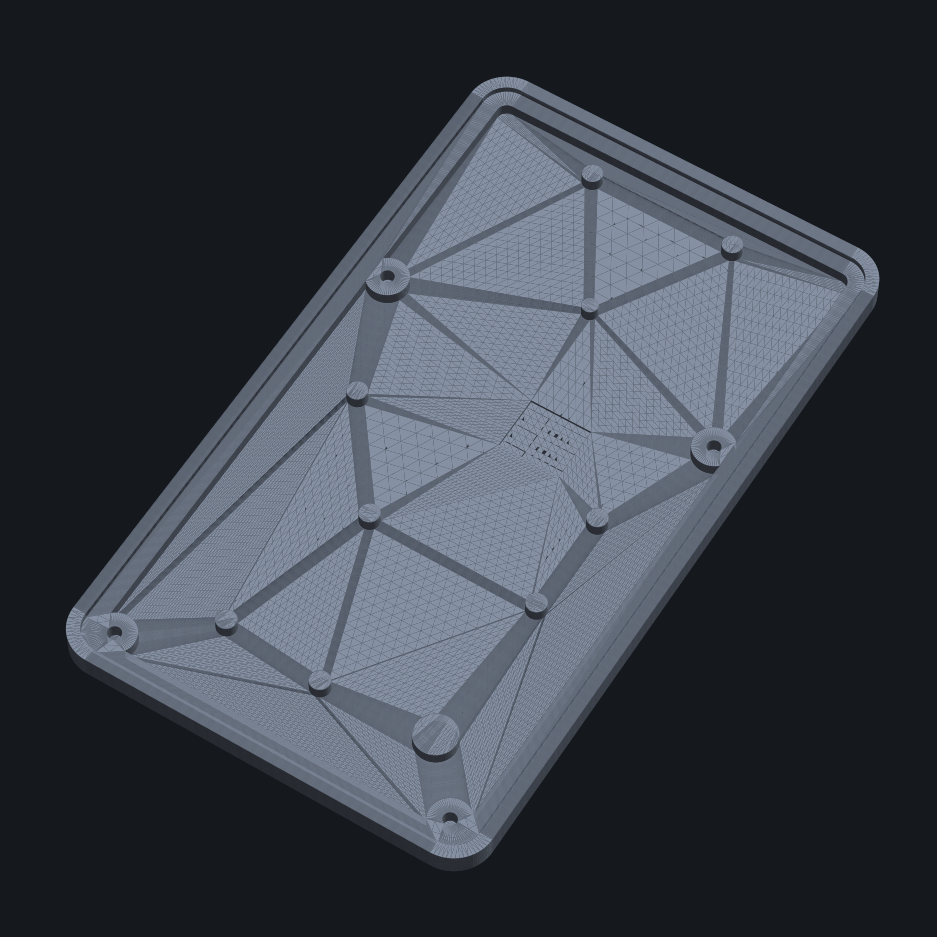

# SOLAR-GLOW · DRH

A glowing business card that runs on light. An ATtiny1616 breathes four amber LEDs through the board while an indoor solar cell — or a pair of hidden coin cells — trickle-charges a supercapacitor bank. The whole PCB is generated from Python, not drawn by hand.


> **Status:** REV J — boards ordered (OSH Park), parts ordered (DigiKey), enclosure drafted. Firmware parked pending first articles and an energy-budget check.

---

## What it is

A 2-layer, business-card-sized PCB (50.8 × 88.9 mm, 0.8 mm FR4, ENIG, rounded corners) that:

- **Harvests** indoor light with an ANYSOLAR SM141K06L cell **or** runs from two hidden CR1632 coin cells — the two power paths share a footprint and are mutually exclusive.
- **Stores** energy in two series supercapacitors (5.5 V, ~150 mF), kept balanced by an ALD910025 dual SAB-MOSFET.
- **Glows** by PWM-breathing four reverse-mount amber LEDs that fire through ~1.64 mm apertures to the front face.
- **Listens** for a press on a 12 mm metal snap dome (or a bare-pad capacitive touch) driven by the MCU.

The board is **code-defined**: `pcb_route.py` builds the geometry and runs DRC, `gerber_export.py` emits the fab files. No schematic-capture or layout tool in the loop.

---

## How it works

| Block | Part | Notes |
|---|---|---|
| MCU | ATtiny1616 (20-VQFN) | PWM breathing, cap-touch, charge logic |
| Solar | ANYSOLAR SM141K06L | Voc 4.15 V, 184 mW **at full sun** — indoor harvest is a small fraction of that |
| Blocking diode | onsemi MMSD301T1G | Schottky; stops the caps back-feeding the cell |
| Storage | 2× SCHURTER 3-153-434 | 300 mF / 2.75 V each → 150 mF / 5.5 V in series |
| Balancer | ALD910025SALI | dual SAB MOSFET — the only non-leaky way to balance the stack |
| LEDs | 4× ams OSRAM LA P47F | amber 617 nm, reverse-mount, 1 kΩ ballast each |
| Button | Snaptron F12340 | 12 mm / 340 gf metal snap dome |
| Battery option | 2× Keystone 3012 + 2× MMSD4148 | CR1632 retainers, mutually exclusive with the solar cell |

Breakouts and features: UPDI (`J1`) for programming, I²C (`JP1`) for expansion, seven test points, five castellated edge pads, and four **grounded** M2 mounting holes.

Full part numbers, live pricing, and per-part datasheet links are in **`solar-glow-drh-BOM.xlsx`**.

---

## The open question — read this before assembling a batch

The board is well-verified; the **energy budget is not**. The 184 mW solar figure is a full-sun number, and indoor light delivers a small fraction of it, while four breathing LEDs average several mW. The supercap bank is sized to *harvest slowly, glow in bursts*, but that bet has never been measured.

**First move when boards arrive:** put the cell under your real target lighting and measure harvest current against the LED draw, before populating a stack. The coin-cell path is the fallback — the card glows on batteries no matter what.

---

## Repository layout

```
solar-business-card/
├── pcb_route.py                   # board geometry + DRC (code-defined)
├── gerber_export.py               # emits Gerbers + drill files
├── gerbers/                       # fabrication output (sent to OSH Park)
├── solar-glow-drh-BOM.xlsx        # bill of materials — parts, prices, datasheet links
├── datasheets/                    # every component's datasheet
└── enclosure/                     # rear cover
    ├── solar-glow-drh-backshell-cad.py          # parametric generator (CadQuery → STEP + STL)
    ├── solar-glow-drh-backshell.step / .stl       # 0.8 mm board · 9 support pillars
    └── solar-glow-drh-backshell-0p2mm.step/.stl   # 0.2 mm board · dense pillar brace
```

---

## Building the board

```bash
pip install shapely gerbonara pymupdf
python3 pcb_route.py        # builds the board, prints DRC (connectivity / shorts)
python3 gerber_export.py    # writes the Gerber + drill set into gerbers/
```

The board is currently 0.8 mm. The design will take anything from 0.8 down to 0.2 mm — thinner FR4 passes more light through the substrate if the apertures alone don't give the glow you want, at the cost of needing more enclosure bracing (which the 0.2 mm enclosure variant provides).

---

## The enclosure

A **back-only** cover: it protects the populated rear and the four edges and leaves the front — solar cell, dome, LED apertures — naked, which is the whole point.



- **Low profile.** ~2.2 mm behind the board (~3.0 mm tall cover on the 0.8 mm board). The lone tall part — the U2 balancer at 1.75 mm — sits in a local floor pocket so the rest of the plate stays thin.
- **Stiff.** The board lands on a continuous perimeter shelf, four M2 bosses, a post directly under the dome (so a press collapses the dome, not the board), and a field of internal pillars auto-placed on a keepout grid that never lands on a part, header, or via.
- **Press fit.** The four walls run ~0.05 mm/side under the board with the corners relieved; lap the wall faces to a clean slip-press.

Regenerate or retune:

```bash
pip install cadquery
python3 enclosure/solar-glow-drh-backshell-cad.py   # writes both variants' STEP + STL
```

Key parameters at the top of the script: `board_th` (PCB thickness — supports are invariant to it), `edge_fit` (interference), `floor_th` (**bump to ~1.0 for a plastic test print**), and `WINDOW_U2` (open a window under U2 for a ~1.8 mm flush profile). The standard solid runs ~14 g in aluminum, ~23 g in titanium, ~44 g in brass.

---

## Assembly order (when boards arrive)

1. **Validate the energy budget** — harvest vs. LED draw under real lighting.
2. **Reflow the SMD parts first** — QFN, passives, LEDs, balancer.
3. **Hand-solder last** — the PV1 cell (heat-sensitive: ≤260 °C / 2 s, no IPA), the snap dome, and the coin retainers if building the battery variant.
4. **Fit the enclosure** — lap the walls, screw down through the four bosses.
5. **Flash firmware** over UPDI.

---

## Firmware

Parked until first articles land and the harvest question is answered. Scope: the PWM breathing curve, cap-touch tuning on the dome pad, and charge / brown-out management around the supercap bank.

---

## Cost

- **Per board, solar build: ≈ $50**, of which the two supercaps are ~60%. This is a showpiece, not a hand-out-by-the-hundred card.
- Battery option adds ≈ $2.74 (retainers, diodes, decoupling; cells user-supplied).

---

*© Devin R. Horowitz. Personal project — license TBD.*
