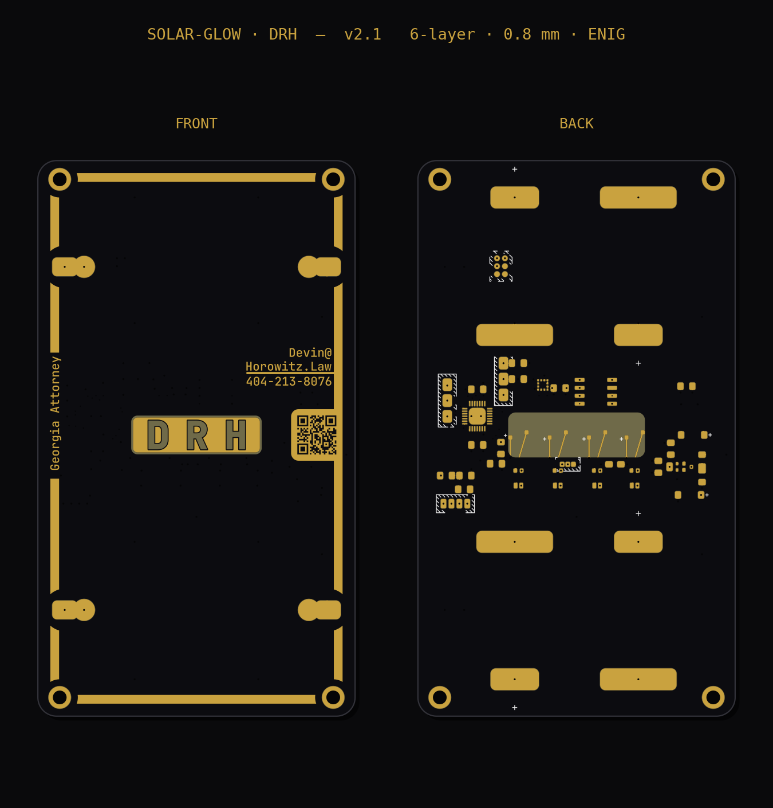
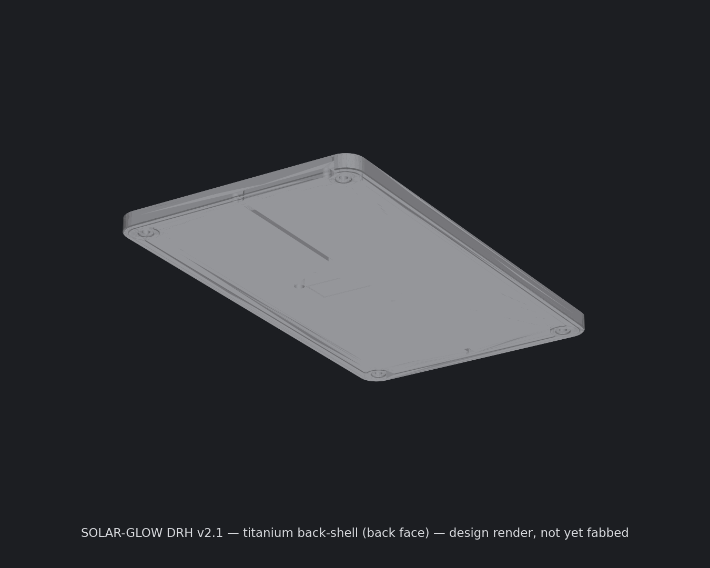

# SOLAR-GLOW · DRH

A business card that runs on light. An AVR microcontroller breathes four amber LEDs
*through* the board — a monogram cut into the front copper that glows when the rear LEDs
backlight it through the bare fiberglass — while a pair of indoor solar cells trickle-charge
a supercapacitor bank that holds the charge.



> **Status: v2.1 — fully routed, DRC-clean in KiCad. Not yet fabbed.**
> Six-layer, 0.8 mm, bound for PCBWay. The one thing standing between here and a build is the
> **energy budget** — harvest vs. draw under real indoor light has never been measured. See
> *“The open question.”*

---

## What it is

A business-card-sized PCB — **50.8 × 88.9 mm, 0.8 mm FR4, ENIG, rounded corners** — that:

- **Harvests** indoor light with **two** ANYSOLAR solar cells wired in parallel, each behind
  its own blocking diode so a half-shadow on one can’t back-feed the other.
- **Stores** energy in **four** series-parallel supercapacitors — **1 F at 5.5 V, ≈ 15 J** —
  kept balanced by a dual SAB-MOSFET, and held to a safe voltage by a shunt clamp.
- **Glows** by back-lighting a **“DRH” monogram** that’s cut into the front copper: a gold
  ENIG field with the three letters opened to bare FR4. Four reverse-mounted amber LEDs on the
  back fire up through the translucent substrate, so the letters themselves light up — and PWM
  on the LED drives makes them breathe.
- **Wakes** to a **tap.** A 3-axis accelerometer feels you pick the card up (or the enclosure
  being tapped) and interrupts the MCU out of sleep — no button, no moving parts.

The front face stays naked — solar cells and the glowing monogram exposed — and the dense work
all lives on the back, ready for an optional machined-metal back-shell.

> **A note on lineage:** earlier revisions (REV J and before) were *generated from Python* —
> geometry and Gerbers emitted by script, no layout tool in the loop. **v2.1 is a full KiCad
> design** (schematic + board). The old generators are kept only as history; the KiCad files
> are the source of truth.

---

## How it works

| Block | Part | Notes |
|---|---|---|
| MCU | **AVR64DD28** (28-VQFN) | TCA0 hardware PWM, I²C to the accel, charge/sleep logic; MVIO-capable |
| Solar | **2× ANYSOLAR SM141K06TF** | monocrystalline indoor cells (Voc 4.15 V), in parallel — two panels ≈ 2× the harvest |
| Blocking diodes | **2× onsemi MMSD301T1G** | Schottky, one per panel; isolates the cells *and* the supercaps |
| Storage | **4× SCHURTER 3-153-438** (WS17) | 1 F / 2.75 V each, wired 2P2S → **1 F @ 5.5 V ≈ 15 J** on one balanced node |
| Balancer | **ALD910025SALI** | dual SAB MOSFET — the low-leakage way to hold the series midpoint |
| Rail clamp | **TI TLV431 + onsemi BCP53 PNP** | shunt clamp holds the rail **≤ ~3.47 V** so the accel stays inside its 3.6 V max |
| LEDs | **4× ams OSRAM LA P47F** (amber) | reverse-mount; glow through the FR4 window, **150 Ω** ballast each |
| LED master switch | **SW2** (solder-bridge) + **R12** | OFF / ON / TINY — TINY routes the LEDs through a 220 Ω ballast for a dim, long-runtime glow |
| Motion | **ST LIS2DH12** | 3-axis accel; tap / double-tap wakes the MCU via interrupts |
| Light sense | **R5 / R6 divider → PD2** | VIN ÷ 2 off the *solar input* (not the rail) — tracks light directly; doubles as wake-on-light |

**Breakouts and features:** a **TC2030** Tag-Connect pad (`TC1`) for hands-free UPDI
programming, a backup UPDI header (`J1`), an I²C expansion header (`JP1`), a spare-GPIO header
(`JP2`), per-LED disable jumpers (`SB1–4`), a VDDIO2 tie jumper (`SJ1`), and **four grounded
M2 mounting holes** at the corners.

Full part numbers, pricing, and per-part datasheet links are in
**`PCB/solar-glow-drh-v2_1-BOM.xlsx`**.

---

## The board

- **Six copper layers** on 0.8 mm FR4 — L1 signal/parts · **L2 GND plane** · L3–L4 signal ·
  **L5 VS plane** · L6 signal/parts — the two internal signal layers carry the dense back-side
  routing around the supercaps.
- **The glow window is a keepout on every layer.** The monogram cutout and the four LED
  light-paths are voided through all six layers so nothing — copper pour, trace, or via —
  shadows the light between the rear LEDs and the front face. The rear soldermask is left
  *open* over the window on purpose: bare ENIG reflects the LEDs’ light forward instead of
  absorbing it.
- **Rail discipline.** The supercap stack can sit near 5.5 V, but the accelerometer tops out at
  3.6 V — so a TLV431-referenced PNP shunt clamp sits on the **VS rail** (after the blocking
  diodes) and holds VS ≤ ~3.47 V, directly limiting what the accelerometer sees. Its sense
  divider draws a standing microamp or two from the rail — small against the other always-on
  loads, and the trade for regulating VS itself rather than the solar input.
- **Power planes** carry the supercap charge/discharge currents; the four cells eat the better
  part of the back, so the layout is geometry-bound and the planes earn their layers.

---

## The open question — read this before building a batch

The board is well-verified; the **energy budget is not.** A solar cell’s headline rating is a
full-sun number, and indoor light delivers a small fraction of it, while four breathing LEDs
average several milliamps. The two-panel harvest and the 15 J tank are sized to **harvest
slowly and glow in bursts** — but that bet has never been put on a meter.

What changed the math since the early notes: the rail is now **clamped to ~3.47 V** and the
ballasts are **150 Ω**, so each LED peaks near **~9 mA** rather than the old estimate. Four
on at once is a real load against an indoor harvest measured in fractions of a milliamp.

**First move when boards arrive:** put the cells under your actual target lighting and measure
**harvest current against LED draw** before you populate a full stack. That single number sizes
the duty cycle, the feature set, and whether the always-on accelerometer earns its microamps.

---

## Repository layout

```
solar-business-card/
├── README.md                       # this file
├── PCB/                            # KiCad project + fabrication BOM
│   ├── solar-glow-drh-v2_1.kicad_pcb   # the board — 6-layer, routed (source of truth)
│   ├── solar-glow-drh-v2_1.kicad_sch   # schematic
│   ├── solar-glow-drh-v2_1.kicad_pro   # KiCad project
│   └── solar-glow-drh-v2_1-BOM.xlsx    # bill of materials — parts, prices, datasheet links
├── solar-glow-drh-v2-hardware.md   # as-built wiring & pin map — the firmware target
├── solar-glow-drh-v2-mechanical.md # board mechanics, keepouts, programming access
├── solar-glow-drh-design-notes.md  # design rationale, energy model, enclosure board-side rules
├── firmware/                       # bare-metal C (AVR64DD28); register-verified, see firmware/README.md
├── datasheets/                     # every component's datasheet
├── docs/                           # renders and figures
├── enclosure/                      # machined-titanium back-shell: CAD / STEP / STL / drawing / README
└── v0 prototype/                   # the original prototype, kept for posterity
```

---

## Building the board

The board is a KiCad project — open it, run DRC, and export the fab set:

1. Open `solar-glow-drh-v2_1.kicad_pro` in **KiCad**.
2. **Run DRC.** It comes back clean apart from two expected items: the unregistered
   `solarglow` footprint library (register it locally), and one intentional dangling stub on
   the reserved `BTN` net. The rear soldermask “bridges” over the reflective window are
   deliberate, not errors.
3. **Plot Gerbers + drill** and order from **PCBWay** (6-layer, 0.8 mm; confirm the via-fill
   and minimum-clearance rules against PCBWay’s stackup).

> The supercap land is the one thing to never get wrong. The WS17 cell solders to **flat pads
> under its body** (the asymmetric P/N widths are the polarity key), **not** to the folded end
> tabs — those are non-solderable mechanical locators. The footprint in this design is built to
> the correct under-body land; don’t substitute an end-tab land.

---

## Assembly order (when boards arrive)

1. **Validate the energy budget first** — harvest vs. LED draw under real lighting (above).
2. **Reflow the SMD parts** — the QFN MCU and the LGA accelerometer need hot air / a hotplate;
   the EP and the accel pad reflow to their planes.
3. **Hand-solder last** — the solar cells (heat-sensitive: ≤ 260 °C / 2 s, no IPA), and set the
   **SW2** bridge for OFF / ON / TINY.
4. **Flash firmware** over UPDI — the Tag-Connect pad (`TC1`) is the no-header path; `J1` is the
   backup header.

---

## Firmware

A first implementation now lives in **`firmware/`** — bare-metal C, **verified at the register
level** against the AVR64DD28 and LIS2DH12 datasheets but **not yet compiled against a real
toolchain or run on hardware**. Its knobs, wake model, and power notes are in
**`firmware/README.md`** (authoritative); the wiring it targets is in
**`solar-glow-drh-v2-hardware.md`** (complete pin map, PORTMUX, the accel at I²C `0x18`). Final
duty-cycle and feature tuning stay **gated on the energy-budget measurement** below. In short,
the board gives it:

- **LED breathing** — the four LEDs sink into **PA0–PA3 = TCA0 WO0–WO3**, so split-mode PWM
  drives all four as independent 8-bit channels (the 150 Ω ballast sets the peak; PWM sets the
  average, so you trim brightness *below* that ceiling).
- **Tap-to-wake** — the accelerometer’s two interrupts land on **PF1 / PF0**; configure
  tap / double-tap and let it pull the MCU out of sleep.
- **Light sensing** — the divider taps the **solar input** (VIN ÷ 2) into **PD2** (AIN2), so it
  reads light directly — ~0 V dark, rising under light; firmware adapts the glow to available
  light and can also read **VDD/10** and the internal temp sensor.
- **Wake-on-light** — the card can also wake when light appears, with no tap. The implemented
  path is an **RTC-timed ADC poll** in deep Power-Down (sample PD2/AIN2 every ~1–2 s, glow on a
  dark→light rise). The tempting *instant* AC0-comparator version was checked against the
  datasheet and found **non-viable on this part** — the AC interrupt doesn't update with the
  peripheral clock stopped, and the AC isn't a Standby/Power-Down wake source, so it would never
  fire. Instant response isn't lost: the accelerometer interrupt wakes from Power-Down, and
  picking the card up to carry it into the light *is* that motion. (Standing current is
  dominated by the always-on accelerometer, not the poll — see `firmware/README.md`, and the
  corrected `solar-glow-drh-v2-hardware.md` §6.)
- **Low-power housekeeping** — `VREGCTRL.PMODE = AUTO` for sub-µA power-down; RTC/PIT off the
  internal ULP oscillator (no crystal); an EEPROM “times-activated” counter that survives a
  full supercap drain; and the core **IDLE-sleeps through the breathing glow** while TCA0 keeps
  the PWM running, rather than busy-waiting. (An autonomous CCL + EVSYS light-wake is a possible
  v-next, but isn't what the current firmware does.)

Still open (what the bench measurement unlocks): final breathing-curve and tap-gesture tuning,
charge / brown-out management around the supercap bank, and the duty-cycle adaptation the
harvest number sizes.

---

## Enclosure (parked)

An optional back-only **machined-titanium** shell hugs the populated rear; the front stays naked.
CAD, STEP, STL, fab notes and a dimensioned drawing are in `enclosure/`, on ice until the board is
validated — see `enclosure/README.md`.



The decisions that matter once it’s cut: **titanium (Ti-6Al-4V Grade 5)**, **3-axis CNC-milled** by
PCBWay; the cavity is **part-limited to ~1.90 mm** by the tallest component (U2), and the floor is run
to a **0.55 mm** card-thin skin (backed by ribs) — the one number that gets re-issued to whatever
minimum the shop will hold. Retention is **four corner M2 screws**, not a press fit. The electrical
gotcha — the screws tie the metal body to board GND, so the enclosed variant **drops the edge
castellations** (or adds a die-cut Kapton isolation layer) so nothing shorts to the grounded shell.
With a metal back, the **accelerometer tap is the actuator** — there’s no button to press from outside.

---

## Cost

- **Per board ≈ $100** at quantity one, and the **four supercaps are the dominant line** —
  well over half the BOM. This is a showpiece, not a hand-out-by-the-hundred card.
- The energy tank is where the money goes; everything else is comparatively cheap.

---

*© 2026 Devin R. Horowitz. Released under the [MIT License](LICENSE).*
