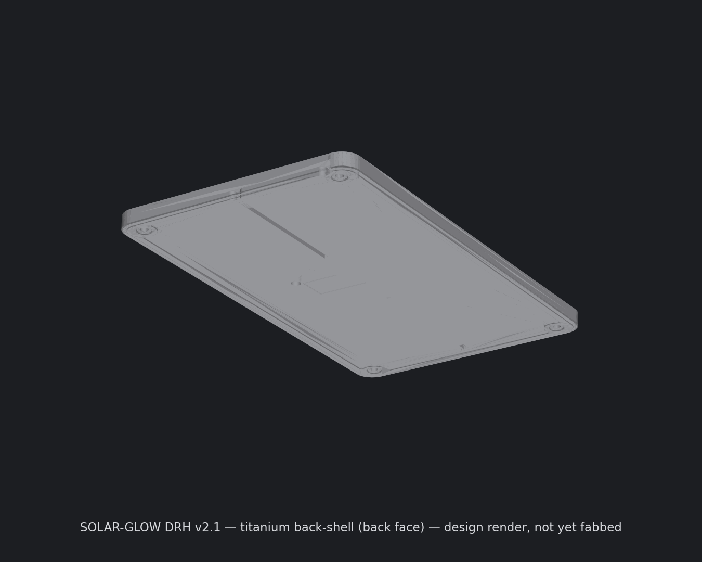

# SOLAR-GLOW · DRH

A business card that runs on light. An AVR microcontroller breathes four amber LEDs
*through* the board — a monogram cut into the front copper that glows when the rear LEDs
backlight it through the bare fiberglass — while a pair of indoor solar cells trickle-charge
a supercapacitor bank that holds the charge.


> **Status: v4.0 (managed-solar redesign) in progress** -- working files are `v4_0`, currently the v3.0
> baseline being reworked to the AEM10300 active-harvest architecture (see the design-notes v4 addendum +
> `v4-aem10300-prewiring.md`). **v3.0 -- fully routed, audit-clean, not yet fabbed -- is frozen as the final
> unmanaged-solar revision.**
> Two-layer, 0.6 mm FR4, bound for PCBWay; the 4-layer **v2.3** is the fallback design, kept in git history (not the working tree).
> The one thing standing between here and a build is the **energy budget** — harvest vs. draw under
> real indoor light has never been measured. See *“The open question.”*

### Current revision — the one canonical summary

| What | Current | Notes / fallback |
|---|---|---|
| **PCB** | **v4.0 - 2-layer** (F / B) | GND = full-board B.Cu pour; VS = routed B mesh. **v2.3 (4-layer: F / In1 GND / In2 VS / B) is the fallback design, in git history.** v2.1 was 6-layer (history). |
| Board | 50.80 × 88.90 mm, r3.0 corners, **0.60 mm** FR4, ENIG, matte-black mask | 0.6 mm — committed in the board stackup (frees the shell floor to 1.0 mm) |
| Mounting holes | **8× M2, GND** -- 4 corner (MH1-4) at **(3.0, 3.0) / (47.8, 3.0) / (3.0, 85.9) / (47.8, 85.9)** (pitch **44.80 × 82.90 mm**) + 4 panel-corner (MP1-4) at **(3.0, 28.5) / (47.8, 28.5) / (3.0, 60.4) / (47.8, 60.4)** | corners concentric with the r3.0 fillets; MP1-4 at the E/W mid-edges for the shell clamp |
| **Enclosure** | **Ti back-shell** - 1.00 floor, 1.80 cavity (0.95 local relief, re-keyed from the removed v3 U2 to U7/FRAM, the tallest B-side part; generators updated, STEP regen pending), overall **3.55 mm**; center support via the resin diffuser brace | 8-hole pattern (4 corner + 4 panel-corner); see `enclosure/README.md` |
| BOM | **v4_0 master** - U6 + R14 added, JP1/JP2 dropped (JP1 later reused for the bench pad strip), most passives 0402 (SJ1 0R and the bulk caps C4/C13/C25/C27 are 0603) | master is `PCB/solar-glow-drh-v4_0-BOM.xlsx`; placed set in `-BOM-assembly.xlsx` |
| Firmware | register-verified C, not yet on hardware | LED pin map re-mapped in v3.0 (see `firmware/README.md`) |

### Where the truth lives — how these docs stay from drifting

Each fact has exactly one home; everything else points at it rather than restating it.

| Domain | Source of truth |
|---|---|
| Board copper / geometry / holes | `PCB/solar-glow-drh-v4_0.kicad_pcb` + `.kicad_sch` |
| Enclosure geometry | `enclosure/solar-glow-drh-v3_0-backshell-0p6b-brace-cad.py` (prints the Z-stack; regenerates the STEP) |
| Firmware pin map + knobs | `firmware/board.h` (+ `firmware/README.md`; both match the schematic) |
| BOM | `PCB/solar-glow-drh-v4_0-BOM.xlsx` (v4.0 master -- converted lines have prices blanked pending quote; see `PCB/README.md` Step 4) |
| Design *reasoning* / lineage | `solar-glow-drh-design-notes.md` |
| Open work / cross-domain to-dos | `TODO.md` (an index of what's left; each item points back at the files above) |

When a number here disagrees with a source-of-truth file, the source file wins and this table is the
thing to correct. The `solar-glow-drh-v2-*` docs are v2-era history (banner-marked at the top of
each); read them for lineage, not for current values.

---

## What it is

A business-card-sized PCB — **50.8 × 88.9 mm, 0.6 mm FR4, ENIG, rounded corners** — that:

- **Harvests** indoor light with **two** ANYSOLAR solar cells merged into a single solar node (SRC) that feeds the AEM10300 harvester (U8),
  which runs the MPPT and handles reverse-blocking so neither panel back-feeds the
  other - the v3 per-panel blocking diodes are removed.
- **Stores** energy in **four** series-parallel supercapacitors -- a **hybrid tank** (two larger
  SS17 cells + two WS17), **~1.3 F at 5.5 V, ≈ 21 J** -- with the AEM10300 harvester (U8) balancing
  the series midpoint (MID), which is what lets the two cell sizes share the series stack safely; the safe 3.3 V VS rail
  is set by the U9 TPS7A0233 LDO, not a shunt clamp.
- **Glows** by back-lighting a **“DRH” monogram** that’s cut into the front copper: a gold
  ENIG field with the three letters opened to bare FR4. Four reverse-mounted amber LEDs on the
  back fire up through the translucent substrate, so the letters themselves light up — and PWM
  on the LED drives makes them breathe.
- **Wakes** to a **tap.** A 3-axis accelerometer feels you pick the card up (or the enclosure
  being tapped) and interrupts the MCU out of sleep — no button, no moving parts.

The front face stays naked — solar cells and the glowing monogram exposed — and the dense work
all lives on the back, ready for an optional machined-metal back-shell.

> **A note on lineage:** earlier revisions (REV J and before) were *generated from Python* —
> geometry and Gerbers emitted by script, no layout tool in the loop. **v2.1 is a full KiCad
> design** (schematic + board), continued through v4.0. The old generators are kept only as
> history; the KiCad files are the source of truth.

---

## How it works

| Block | Part | Notes |
|---|---|---|
| MCU | **AVR64EA28** (28-VQFN) | TCA0 hardware PWM, I²C to the accel, charge/sleep logic; 2026-07 family swap from the AVR64DD28 (12-bit diff ADC + PGA; no MVIO on the EA, so SJ1 is DNP) |
| Solar | **2× ANYSOLAR SM141K06TF** | monocrystalline indoor cells (Voc 4.15 V), in parallel — two panels ≈ 2× the harvest |
| Harvest PMIC | **e-peas AEM10300** (U8, QFN-28 4×4) | MPPT buck-boost that merges both panels at SRC and charges the supercap tank (STO) - replaces the v3 per-panel blocking diodes |
| Storage | **2× SCHURTER 3-153-440** (SS17, 1.8 F) + **2× 3-153-438** (WS17, 1.0 F) | hybrid tank, 2.75 V/cell, wired 2S2P → **~1.3 F @ 5.5 V ≈ 21 J** on one balanced node (AEM holds MID so the smaller WS pair can't over-volt) |
| Midpoint balance | **AEM10300 (U8) BAL** | the harvester balances the 2S supercap midpoint (MID net) - replaces the v3 ALD910025 dual SAB MOSFET |
| Rail regulator | **TI TPS7A0233** (U9, SOT-23-5) | nanopower LDO (~25 nA Iq) regulates STO down to the fixed **3.3 V VS rail** the MCU + accel run on - replaces the v3 TLV3011 + PNP shunt clamp |
| LEDs | **4× ams OSRAM LA P47F** (amber) | reverse-mount; glow through the FR4 window, **150 Ω** ballast each |
| LED master switch | **SW2** (solder-bridge) + **R12** | OFF / ON / TINY — TINY routes the LEDs through a 220 Ω ballast for a dim, long-runtime glow |
| Motion | **ADI ADXL367** | 3-axis accel; tap / double-tap wakes the MCU via interrupts; 0.89 µA (swapped from LIS2DH12 on backorder) |
| Light sense | **R5 / R6 divider → PD2** | SRC ÷ 2 off the *merged solar input* (not the rail) - tracks light directly; doubles as wake-on-light |
| NFC | **NXP NT3H2211** (NTAG I²C plus 2K) | present from v3.0 - a contact **vCard** a phone taps to save; field-detect (FD, PA6) also wakes the glow - I²C `0x55`, shares the accel's bus; VCC **power-gated by `U6`** (`NFC_EN`/PA7, off by default); the **U7 MB85RC512TY FRAM** (I²C 0x50, C28) rides always-on VS parked in its 0.2 µA I²C Sleep mode (the 2026-07-23 back-power fix - see design notes) |

**Breakouts and features:** a **TC2030** Tag-Connect pad (`TC1`) for hands-free UPDI
programming, a backup UPDI header (`J1`), a **5-pad bench strip** on the back east edge
(`TP1` SRC + `JP1` GND/STO/SCL/SDA - bare SMD probe pads for bench power injection and an I²C
tap; pinout in `solar-glow-drh-v2-hardware.md`), per-LED disable jumpers (`SB1–4`), the retired VDDIO2
tie jumper (`SJ1`, DNP since the AVR-EA swap), and **eight grounded M2 mounting holes** (four corners + four panel-corner at the E/W mid-edges). (The v2-era
`JP1`/`JP2` 2.54 mm breakout headers are gone; the `JP1` name is reused for the strip.)

Full part numbers, pricing, and per-part datasheet links are in
**`PCB/solar-glow-drh-v4_0-BOM.xlsx`** - the master BOM (v4.0): every orderable line now carries a
live-verified distributor P/N and price (2026-07-23 sweep, subtotal ≈ $139.76). **U6 is the
TPS22917DBVT** (ultra-low-leakage dark-current swap) with **R14 (1 M `NFC_EN` pulldown)**; the stale
JP1/JP2 rows are dropped (the `JP1` designator is reused in v3.0 for the bench pad strip - bare pads,
no BOM part). Passives are X7R / AEC-Q200 / precision grade: most on **0402** lands, with the
stability upsizes on 0603 (C22/C23, R5/R6, R15/R16, plus the bulk caps C4/C13/C25) and 0805
(C26/C27); SJ1 is DNP. Lineage: v2.2 added the NFC parts (U5 / C8 / C9 / R13); the `v2 2` and older
BOM files stay in the repo as history.

---

## The board

- **Two copper layers** on 0.6 mm FR4 (v3.0): **F.Cu** signal/parts and **B.Cu**. **GND is a
  full-board B.Cu pour** (`GND_B` zone) with stitch straps, and **VS is a routed mesh on B** — the
  4→2-layer conversion of v2.3, whose internal GND/VS *planes* moved onto the back copper. The
  4-layer **v2.3** (F · In1 GND · In2 VS · B) is the fallback (recoverable from git history) if the
  back-side trace texture showing faintly on the naked front reads wrong.
- **The glow window is a keepout on every layer.** The monogram cutout and the four LED
  light-paths are voided through both layers so nothing — copper pour, trace, or via —
  shadows the light between the rear LEDs and the front face. The rear soldermask is left
  *open* over the window on purpose: bare ENIG reflects the LEDs’ light forward instead of
  absorbing it.
- **Rail discipline.** The supercap stack can sit near 5.5 V, but the accelerometer tops out at
  3.6 V - so the **U9 TPS7A0233 LDO** regulates the supercap tank (STO) down to the fixed
  **3.3 V VS rail**, directly bounding what the accelerometer sees. Its ~25 nA quiescent
  draw is negligible against the other always-on loads, and it regulates VS itself rather
  than the solar input. (v3's TLV3011 + PNP shunt clamp and the per-panel blocking diodes
  are gone - the AEM10300 now owns the harvest path.)
- **Power planes** carry the supercap charge/discharge currents; the four cells eat the better
  part of the back, so the layout is geometry-bound and the planes earn their layers.

---

## The open question — read this before building a batch

The board is well-verified; the **energy budget is not.** A solar cell’s headline rating is a
full-sun number, and indoor light delivers a small fraction of it, while four breathing LEDs
average several milliamps. The two-panel harvest and the ~21 J tank are sized to **harvest
slowly and glow in bursts** — but that bet has never been put on a meter.

What changed the math since the early notes: the LED string is fed from the **STO supercap tank** (through the
SW2 anode switch), which the AEM10300 holds at up to **4.65 V** (VOVCH), and the ballasts are **150 Ω** -- so each
LED peaks near **~16 mA** at a full tank ((4.65 V - amber Vf ≈ 2.25 V)/150 Ω, the figure `firmware/README.md`
quotes), sagging toward zero as STO discharges. (VS, the regulated 3.3 V LDO output, powers the MCU and accel,
not the LEDs.) Four on at once is a real load against an indoor harvest measured in fractions of a milliamp.

**First move when boards arrive:** put the cells under your actual target lighting and measure
**harvest current against LED draw** before you populate a full stack. That single number sizes
the duty cycle, the feature set, and whether the always-on accelerometer earns its microamps.

---

## Repository layout

```
solar-business-card/
├── README.md                       # this file (canonical current-revision summary)
├── PCB/                            # KiCad projects + fabrication BOM
│   ├── solar-glow-drh-v4_0.kicad_pcb   # the board: v4.0 managed-solar rework (AEM10300), 2-layer (source of truth)
│   ├── solar-glow-drh-v4_0.kicad_sch   # schematic: synced to the v4.0 board netlist
│   ├── solar-glow-drh-v4_0-BOM.xlsx    # bill of materials -- v4.0 master (U6 + R14; mostly 0402, C4/C13/C25/C27 are 0603)
│   ├── solar-glow-drh-v4_0-BOM-assembly.xlsx  # placed-parts BOM for PCBA (machine-place count pending recount/xlsx regen against the v4 net)
│   └── README.md                       # order & build guide
├── solar-glow-drh-v2-hardware.md   # as-built wiring & pin map (v2-era; v3.0 LED-map delta noted at top)
├── solar-glow-drh-v2-mechanical.md # board mechanics, keepouts, access (v2-era; v3.0 hole/enclosure deltas at top)
├── solar-glow-drh-design-notes.md  # design rationale, energy model, lineage (incl. the v3.0 chapter)
├── firmware/                       # bare-metal C (AVR64EA28); compile-verified, see firmware/README.md
├── datasheets/                     # every component's datasheet
├── docs/                           # renders and figures
├── enclosure/                      # machined-titanium back-shell: CAD / STEP / STL / README (v3.0 + v2.1 kept)
└── v0 prototype/                   # the original prototype, kept for posterity
```

---

## Building the board

The board is a KiCad project — open it, run DRC, and export the fab set:

1. Open `solar-glow-drh-v4_0.kicad_pro` in **KiCad** (2026 file format).
2. **Run DRC.** It comes back clean apart from the intentional exceptions catalogued in
   `PCB/README.md` and `solar-glow-drh-design-notes.md` (the NFC coil `LA`↔`LB` short, the four
   GND-tie mounting-hole/gold-frame contacts, the two plating-bus stubs crossing Edge.Cuts at
   x=25.4, the illumination copper inside the glow window, and the benign `lib_footprint_issues`
   plus the reserved `BTN` `track_dangling`). Fill zones (press **B**) before checking.
3. **Plot Gerbers + drill** from KiCad's own Fabrication Outputs and order from **PCBWay**
   (**2-layer**, 0.6 mm; selective hard gold + plating bus + resin-fill/cap per `PCB/README.md`).

> The supercap land is the one thing to never get wrong. The WS17 cell solders to **flat pads
> under its body** (the asymmetric P/N widths are the polarity key), **not** to the folded end
> tabs — those are non-solderable mechanical locators. The footprint in this design is built to
> the correct under-body land; don’t substitute an end-tab land.

---

## Assembly order (when boards arrive)

1. **Validate the energy budget first** — harvest vs. LED draw under real lighting (above).
2. **Reflow the SMD parts** — the QFN MCU and the LGA accelerometer need hot air / a hotplate;
   the EP and the accel pad reflow to their planes.
3. **Hand-solder last** — the solar cells (heat-sensitive: ≤ 260 °C / 2 s, no IPA), and set the
   **SW2** bridge for OFF / ON / TINY.
4. **Flash firmware** over UPDI — the Tag-Connect pad (`TC1`) is the no-header path; `J1` is the
   backup header.

---

## Firmware

A first implementation now lives in **`firmware/`** — bare-metal C, **verified at the register
level** against the AVR64EA28 and ADXL367 datasheets and **compile-verified in CI** (warning-free
against the AVR-Ex DFP; not yet run on hardware). Its knobs, wake model, and power notes are in
**`firmware/README.md`** (authoritative); the wiring it targets is in
**`solar-glow-drh-v2-hardware.md`** (complete pin map, PORTMUX, the accel at I²C `0x1D`). Final
duty-cycle and feature tuning stay **gated on the energy-budget measurement** below. In short,
the board gives it:

- **LED breathing** — the four LEDs sink into **PA0–PA3 = TCA0 WO0–WO3**, so split-mode PWM
  drives all four as independent 8-bit channels (the 150 Ω ballast sets the peak; PWM sets the
  average, so you trim brightness *below* that ceiling).
- **Tap-to-wake** — the accelerometer’s two interrupts land on **PF1 / PF0**; configure
  tap / double-tap and let it pull the MCU out of sleep.
- **NFC contact tag** — `U5` (NXP NT3H2211, on the board from v3.0) carries a **vCard** a phone reads on a
  tap to save the contact (RF-powered, so it reads with the cap flat), and its **field-detect**
  line wakes the same glow. The tag has no sleep state and would draw **~195 µA** continuously — the
  card's largest idle load — so firmware **power-gates** its VCC through a load switch (`U6`) on
  **NFC_EN (PA7)**, held **off by default** and raised only around an I²C access; the vCard read and
  the FD-wake both run on the phone's field power, so they still work with the tag's VCC off. Shares
  the I²C bus with the accel (`0x55` vs `0x1D`). See `firmware/README.md` → *NFC contact card*.
- **Light sensing** - the divider taps the **merged solar node SRC** (SRC ÷ 2) into **PD2** (AIN2), so it
  reads light directly — ~0 V dark, rising under light; firmware adapts the glow to available
  light and can also read **VDD/10** and the internal temp sensor.
- **Wake-on-light** — the card can also wake when light appears, with no tap. The implemented
  path is an **RTC-timed ADC poll** in deep Power-Down (sample PD2/AIN2 every ~1–2 s, glow on a
  dark→light rise). The tempting *instant* AC0-comparator version was checked against the
  datasheet and found **non-viable on this part** — the AC interrupt doesn't update with the
  peripheral clock stopped, and the AC isn't a Standby/Power-Down wake source, so it would never
  fire. Instant response isn't lost: the accelerometer interrupt wakes from Power-Down, and
  picking the card up to carry it into the light *is* that motion. (Standing current is ~2.7 µA total — the
  always-on accelerometer (ADXL367, ~0.89 µA) no longer dominates it, and neither the poll nor the NFC tag do, the latter being
  power-gated off by default — see `firmware/README.md`, and the corrected
  `solar-glow-drh-v2-hardware.md` §6.)
- **Low-power housekeeping** — `VREGCTRL.PMODE = AUTO` for sub-µA power-down; RTC/PIT off the
  internal ULP oscillator (no crystal); an EEPROM “times-activated” counter that survives a
  full supercap drain; and the core **IDLE-sleeps through the breathing glow** while TCA0 keeps
  the PWM running, rather than busy-waiting. (An autonomous CCL + EVSYS light-wake is a possible
  v-next, but isn't what the current firmware does.)

Still open (what the bench measurement unlocks): final breathing-curve and tap-gesture tuning,
charge / brown-out management around the supercap bank, and the duty-cycle adaptation the
harvest number sizes.

---

## Enclosure (parked)

An optional back-only **machined-titanium** shell hugs the populated rear; the front stays naked.
CAD, STEP, STL, fab notes and a dimensioned drawing are in `enclosure/`, on ice until the board is
validated — see `enclosure/README.md`.



The decisions that matter once it’s cut: **titanium (Ti-6Al-4V Grade 5)**, **3-axis CNC-milled** by
PCBWay, **bead-blast** finish; the general cavity is **cap-limited to 1.80 mm** by the four 1.70 mm
supercaps (the v3 U2 balancer (removed in v4) sat at 1.75 mm over a small **relief pocket** that drops the local floor 0.05 mm so it
still clears), the floor runs to **1.00 mm** (no ribs — a resin diffuser brace carries center support), and the overall height
is **3.55 mm**. The four bosses sit on the **v3.0 hole pattern** (concentric with the r3.0 corner
fillets), the internal braces are **removed**, and retention is **eight M2 screws** (four corner + four panel-corner), not a press
fit. The electrical gotcha — the screws tie the metal body to board GND, so the enclosed variant
**drops the edge castellations** (or adds a die-cut Kapton layer) so nothing shorts to the grounded
shell, and the **accelerometer tap is the actuator** (cap-touch dies behind a grounded plate). The
dimensioned drawing is mid-regeneration for v3.0 — see `enclosure/README.md`.

---

## Cost

- **Per board ≈ $100** at quantity one, and the **four supercaps are the dominant line** —
  well over half the BOM. This is a showpiece, not a hand-out-by-the-hundred card.
- The energy tank is where the money goes; everything else is comparatively cheap.

---

*© 2026 Devin R. Horowitz. Released under the [MIT License](LICENSE).*
