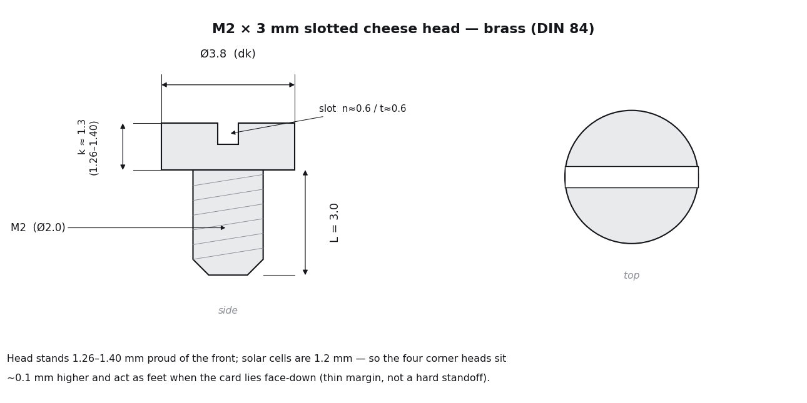

# SOLAR-GLOW DRH v2.1 — Titanium Back-Shell (enclosure)

Back-only titanium shell for the v2.1 solar business-card PCB. It presses over the board
edge and is held by four corner M2 screws; the populated back of the board drops into a
machined cavity while the bare show-front (two solar cells + the backlit DRH monogram
window) stays exposed. Retention is the four screws clamping, not a press fit.

## Views


*Design render of the Ti-max model (0.55 mm floor). Not yet fabricated or fit-checked against a real board.*

## Files

| File | Purpose |
|---|---|
| `solar-glow-drh-v2_1-backshell-cad.py` | Parametric CadQuery generator. **Source of truth** — regenerates the STEP/STL from the verified PCB anchors. |
| `solar-glow-drh-v2_1-backshell-Ti-max.step` | **Recommended.** 0.55 mm floor + cap-gap ribs + 1.0 mm walls. This is the file to send the fab. |
| `solar-glow-drh-v2_1-backshell-Ti-max.stl` | Same geometry, for a quick plastic dry-fit print before committing to titanium. |
| `solar-glow-drh-v2_1-backshell-Ti-max-progwindow.step` / `.stl` | Ti-max plus a TC2030 re-flash window over the programming pads. Optional variant; pick this only if in-enclosure re-flashing is wanted. |
| `solar-glow-drh-v2_1-backshell-DRAWING.pdf` | 2D dimensioned drawing of the four critical dims. Attach to the CNC quote. |

The mating PCB and the four M2 screws are separate, customer-supplied parts, not part of this order.

> A conservative 0.60 mm-floor variant was dropped on purpose: if the shop cannot hold the
> 0.55 mm floor, the part gets re-issued to whatever minimum they *will* hold (see the
> thin-wall advisory), so a pre-baked 0.60 fallback is dead weight.

## What to send PCBWay

The **Ti-max STEP** + the **DRAWING.pdf** + the callouts below. Material: **Titanium Gr5 (TC4)**.
The 3D STEP governs all geometry; the drawing and these notes just flag the few dimensions that
need tighter-than-standard control and the items a titanium shop will otherwise raise as an
engineering query (EQ).

---

## Ordering instructions (PCBWay)

Form settings on the CNC quote page (the on-screen selections override the drawing, so set these to match it):

- **Process:** CNC machining, 3-axis milling.
- **Material:** Titanium → **Titanium Gr5 (TC4)**. **Color:** Silver (natural Ti).
- **Units:** mm. **Quantity:** 1 (prototype).
- **Technical drawing:** attach `solar-glow-drh-v2_1-backshell-DRAWING.pdf`.
- **Threads / tapped holes: Yes** — specify `4× M2×0.4 tapped through, from the back face`. (M2 is a standard thread, so their non-standard-thread disclaimer does not apply.)
- **Inserts: No.**
- **Tolerance: Tighter tolerances required** → on the "Select tightest tolerance" pop-up choose **±0.05 mm**. Two dimensions are marked **±0.05** at their feature on the views and named in note 3 and the critical-dims header: **C1 cavity depth 1.90 ±0.05** (section A-A) and the **C3 mounting-hole pattern 43.80 × 82.90 ±0.05** (plan). PCBWay's tighter-tolerance check wants symmetric linear ± dims marked at the position and matched to this value — an earlier reject came from the depth being asymmetric (1.85 +0.10/−0) and the holes being GD&T, so neither matched the ±0.05 they were looking for. **C1 is the non-negotiable one** (under 1.85 the floor presses on U2; 1.90 ±0.05 = range 1.85–1.95, gap 0.10–0.20). Flatness C2 = 0.05 rides along as a form callout. Don't pick ±0.02 (nothing needs it) or ±0.075/±0.125 (looser than 0.05). Do **not** leave this on "No tighter tolerances."
- **Surface finish: Bead blasting** (matte, uniform on the visible back face) — not Brushed. Read the discrepancy warning before submitting.
- **Surface roughness:** 250 µin / 6.3 µm Ra (default; the blast texture dominates anyway).
- **Finished appearance: Standard** for the first article. Premium only on the proven production run — asking for "no obvious flaws" on a 0.55 mm floor invites rejection.
- **Inspection: Standard Inspection with Formal Report** (2D drawing already supplied; you want the measured cavity depth and floor thickness back). CMM-with-report if you also want flatness and hole position verified.
- **Part marking:** none (the reflector frame is laser-marked per note 9; rear branding is a later step).
- **Product description:** DIY / Demonstration model.

Paste into **Other special request**:

```
- Cavity floor is a uniform 0.55 mm (no thinned section; the reflector frame is
  laser-marked, not cut). Please advise the minimum titanium floor you can
  reliably hold for this ~48 x 86 mm pocket given the internal ribs; we will
  re-issue the STEP to your minimum.
- 4x M2 x 0.4 tapped through-holes, tapped from the back face.
- Break all sharp edges ~0.1 mm (titanium).
- Reflector frame (0.25 mm wide outline on the cavity floor) is LASER-MARKED, not
  cut, so the floor stays a uniform 0.55 mm. Do not engrave a groove.
```

Expect the instant price to move: the 0.55 mm floor plus the tighter-tolerance flags route this to manual engineering review, which is where the floor answer comes from. That answer is the gate before trusting the assembly.

---

## CNC fabrication notes / drawing callouts

### Title / process

| Field | Value |
|---|---|
| Part | SOLAR-GLOW DRH v2.1 back-shell (single piece) |
| Revision | v2.1 |
| Material | **Titanium Gr5 (TC4) = Ti-6Al-4V Grade 5** (PCBWay stock) |
| Process | 3-axis CNC milling, 2 setups (cavity face + back face) |
| Finish | As-machined, or bead-blast matte (recommended, uniform appearance). Customer to confirm. Rear art is laser-marked in the recessed field after finishing. |
| Quantity | _[fill in: prototype 1–5]_ |
| Source model | `solar-glow-drh-v2_1-backshell-Ti-max.step` (0.55 floor) |
| Units | mm |

### 1. Overall dimensions and datum

- Bounding box: **52.70 × 90.80 × 3.40 mm**.
- Datum **Z0 = outer back face** (the largest flat face). +Z is into the part toward the PCB.
- Z stack from the back face:
  - back frame and 4 boss annuli: **proud 0.15 mm** (to Z −0.15)
  - recessed rear art field: at Z 0 (between frame and annuli)
  - cavity floor: at **Z +0.55** (a uniform 0.55 mm of titanium beneath the cavity; the reflector frame is laser-marked, not cut)
  - boss / lip / rib tops (the PCB rest plane): **Z +2.45**
  - PCB recess: Z +2.45 to +3.25 (receives the 0.80 mm board)
- Wall 1.00 mm, perimeter lip 1.50 mm, two cap-gap ribs 1.00 mm wide, back-frame step 0.15 mm.

### 2. Critical dimensions — flag these for tighter control

Default everything to ISO 2768-1 general tolerance. Control **only** the four items below; each is
a function-critical fit. (Per PCBWay, tighter tolerances are identified for production management
and priced per flagged location, so we flag the minimum set.)

| # | Feature | Nominal | Requested tolerance | Why |
|---|---|---|---|---|
| C1 | Cavity depth (boss-top plane → cavity floor) | **1.90 mm** | **±0.05** | Range 1.85–1.95. Sets the air gap over the tallest part (U2, 1.75 mm): gap 0.10–0.20 mm. Must not be **under** 1.85 or the floor contacts U2. |
| C2 | PCB-rest plane flatness (lip + 4 bosses + 2 rib tops, coplanar at Z +2.45) | — | flatness **0.05 mm** | Board must seat flat on all rests so the screws clamp evenly. |
| C3 | 4× mounting-hole pattern (pitch, linear) | 43.80 × 82.90 mm | **±0.05** | Must align with PCB mounts MH1–4. Board clearance holes are ⌀2.2 over M2, leaving ~0.2 mm radial. |
| C4 | Mounting-hole diameter (tapped) | **M2** (tap-drill ⌀1.6, through) | standard | Thread fit for the M2 screws. |

Everything else — outer profile, recess width, frame, spotfaces, ribs, braces, the reflector-frame
mark — at **ISO 2768-1 general**. In particular the board-recess width is **not** a critical
press fit (see note 6).

### 3. Thin-wall advisory (read before quoting)

The cavity floor is a **uniform 0.55 mm**. The reflector frame is **laser-marked, not cut**, so there
is no thinned section: 0.55 mm is the thinnest titanium anywhere. That is still below the general
metal minimum-wall guidance (~0.8 mm) and the titanium-specific minimum wall (~1.0 mm, ~1.5 mm ideal),
because thin titanium flexes and chatters during cutting.

**The customer is aware the floor is below standard wall guidance** and has sized it deliberately. The
floor is internally backed by two full-cavity ribs and two full-cavity posts, all on solid stock, to
limit flex during machining and in service. Please proceed one of two ways and note which on the quote:

- **(A)** Machine the uniform 0.55 mm floor **as-is**; customer accepts the thin-wall risk; **or**
- **(B)** If you cannot reliably hold 0.55 mm, tell us the **minimum floor thickness you will hold** in Ti-6Al-4V for this ~48 × 86 mm pocket given the rib backing, and we will re-issue the model to that value.

There is no separate "conservative" model to quote — the floor is the one variable we will move to
match your capability.

### 4. Threads / tapped holes

- 4× **M2** tapped, **through-holes** (preferred for tapping and chip evacuation), drilled ⌀1.6 then tapped.
- Tap from the **back face**. Engagement is ~2.2 mm of titanium.
- M2 coarse pitch is 0.4 mm, below the 0.6 mm minimum-pitch gate on the online quote form. Please tap
  M2 per this note (or advise) rather than letting the auto-checker reject the thread.
- Customer-supplied fasteners: 4× **brass M2 × 3 mm slotted cheese head**, head ⌀ 3.8 mm (DIN 84), [example listing](https://www.amazon.com/dp/B06WLN47XV). Tip seats flush in the back spotface (note 5).
- Incidental benefit: the cheese head stands ~1.3 mm proud (k = 1.26–1.40 mm), marginally taller than the 1.2 mm solar cells, so the four corner heads act as feet when the card lies face-down and hold the panel surface ~0.1 mm off the table. The margin is thin: the solar cell's own thickness tolerance (1.2 mm **±0.3** per the SM141K06TF datasheet, so up to ~1.5 mm) can by itself erase or invert it, before you even count head-height tolerance, adhesive under the cells, or board flex. Treat it as a nicety, not a guaranteed standoff.



### 5. Spotfaces

- 4× back-face spotface **⌀3.0 mm**, concentric with the mounting holes, depth ~0.2 mm (set so the
  brass M2×3 screw tip seats flush below the proud boss annulus). Modeled in the STEP.

### 6. Press fit — do NOT rely on it

The PCB recess flats are modeled 0.05 mm interference, which is below standard CNC tolerance and is
**not** intended as a working press fit. Treat the recess as a **slip fit**; the four screws provide
retention and clamp. No tight tolerance is needed on the recess width.

### 7. Internal radii and tooling

Internal concave junctions are modeled **sharp**, and a round tool simply leaves its own tool-radius
fillet there — standard practice for a milled pocket, and nothing mates in those corners. They are
left sharp on purpose: pre-modeling the radius here could only be done as a polygon offset, which
exports as **faceted faces a CAM seat cannot measure** (it gets the file rejected). The whole solid is
therefore analytic (planes, cylinders, cones, fillet/chamfer surfaces). The finisher radii are called
out only for reference:

- Cavity (1.90 mm deep): boss-to-lip and rib-to-lip junctions take a **⌀2.0 mm** finisher (R1.0 left by the tool). Cavity inner corners are modeled R1.45.
- Back recessed field (0.15 mm deep): annulus-to-frame junctions take a **≤⌀1.0 mm** finisher (R0.5; shallow, reach trivial).

Rough the open cavity with a ⌀3–4 mm tool; finish corners/walls with the ⌀2.0. No EDM or square
internal corners required.

### 8. Edge break / deburr (note, do not model)

**Break all sharp edges, ~0.1 mm (titanium).** The outer top and bottom rim carries a modeled
0.20 mm ease; all other exposed edges and hole exits to be deburred per this note. Titanium edges
are sharp and nick easily, so no edge left knife-sharp.

### 9. Marking — reflector registration frame

- A hairline frame, **0.25 mm wide**, **laser-marked** on the cavity floor on the 20.9 × 6.2 mm
  monogram-window outline (centered at the window). It locates an adhesive reflector strip; it is
  **non-structural** and **not modeled in the STEP** (a mark, not geometry).
- Laser-mark only, **do not cut a groove**: zero material is removed, so the floor stays a uniform
  0.55 mm. (A cut groove was the old worst case for wall thickness and has been dropped.)
- Any rear branding/art (separate) goes in the recessed back field by laser, after finishing.

### 10. Setup / fixturing guidance

- Two setups: machine the cavity (front) side, then flip to machine the proud back frame and annuli.
- Drill the 4 mounting holes **through in one setup** so front/back alignment is inherent.
- The 0.55 mm floor wants support during the finish pass (the ribs/braces help); wax or vacuum
  fixturing of the thin floor, sharp coated carbide, light climb-finish passes, heavy coolant.

### 11. Inspection

- Report the C1–C3 critical dimensions on the FAI.
- Confirm the cavity floor thickness actually achieved (it is the at-risk dimension).
