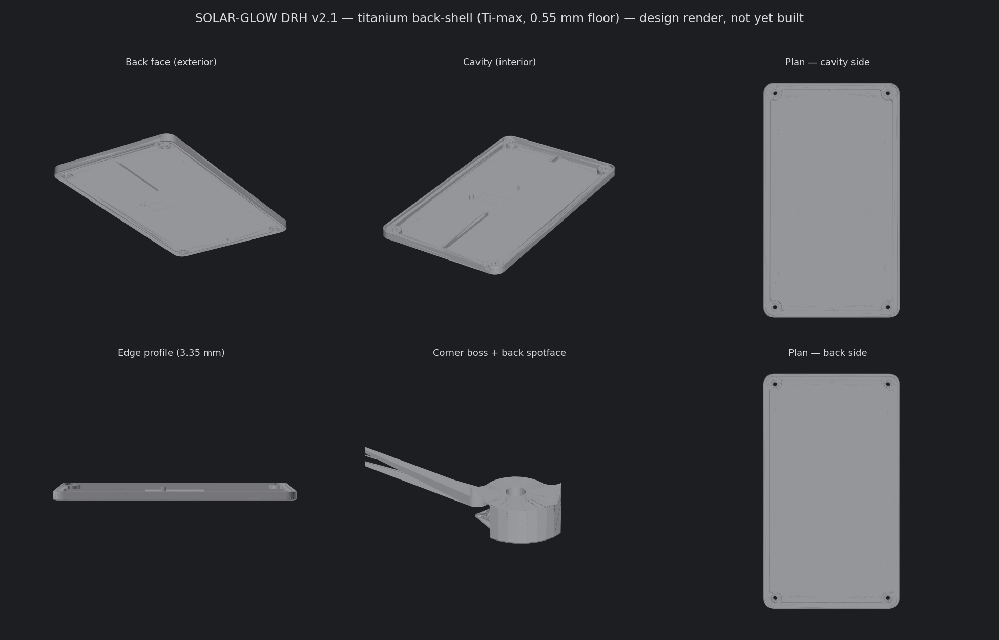

# SOLAR-GLOW DRH v2.1 — Titanium Back-Shell (enclosure)

Back-only titanium shell for the v2.1 solar business-card PCB. It presses over the board
edge and is held by four corner M2 screws; the populated back of the board drops into a
machined cavity while the bare show-front (two solar cells + the backlit DRH monogram
window) stays exposed. Retention is the four screws clamping, not a press fit.

## Views

*Design render of the Ti-max model (0.55 mm floor). Not yet fabricated or fit-checked against a real board.*

## Files

| File | Purpose |
|---|---|
| `solar-glow-drh-v2_1-backshell-cad.py` | Parametric CadQuery generator. **Source of truth** — regenerates the STEP/STL from the verified PCB anchors. |
| `solar-glow-drh-v2_1-backshell-Ti-max.step` | **Recommended.** 0.55 mm floor + cap-gap ribs + 1.0 mm walls. This is the file to send the fab. |
| `solar-glow-drh-v2_1-backshell-Ti-max.stl` | Same geometry, for a quick plastic dry-fit print before committing to titanium. |
| `solar-glow-drh-v2_1-backshell-Ti-max-progwindow.step` / `.stl` | Ti-max plus a TC2030 re-flash window over the programming pads. Optional variant; pick this only if in-enclosure re-flashing is wanted. |
| `solar-glow-drh-v2_1-backshell-DRAWING.pdf` | 2D dimensioned drawing of the four critical dims. Attach to the CNC quote. |

The mating PCB and the four M2 screws are separate, customer-supplied parts, not part of this order.

> A conservative 0.60 mm-floor variant was dropped on purpose: if the shop cannot hold the
> 0.55 mm floor, the part gets re-issued to whatever minimum they *will* hold (see the
> thin-wall advisory), so a pre-baked 0.60 fallback is dead weight.

## What to send PCBWay

The **Ti-max STEP** + the **DRAWING.pdf** + the callouts below. Material: **Titanium Gr5 (TC4)**.
The 3D STEP governs all geometry; the drawing and these notes just flag the few dimensions that
need tighter-than-standard control and the items a titanium shop will otherwise raise as an
engineering query (EQ).

---

## CNC fabrication notes / drawing callouts

### Title / process

| Field | Value |
|---|---|
| Part | SOLAR-GLOW DRH v2.1 back-shell (single piece) |
| Revision | v2.1 |
| Material | **Titanium Gr5 (TC4) = Ti-6Al-4V Grade 5** (PCBWay stock) |
| Process | 3-axis CNC milling, 2 setups (cavity face + back face) |
| Finish | As-machined, or bead-blast matte (recommended, uniform appearance). Customer to confirm. Rear art is laser-marked in the recessed field after finishing. |
| Quantity | _[fill in: prototype 1–5]_ |
| Source model | `solar-glow-drh-v2_1-backshell-Ti-max.step` (0.55 floor) |
| Units | mm |

### 1. Overall dimensions and datum

- Bounding box: **52.70 × 90.80 × 3.35 mm**.
- Datum **Z0 = outer back face** (the largest flat face). +Z is into the part toward the PCB.
- Z stack from the back face:
  - back frame and 4 boss annuli: **proud 0.15 mm** (to Z −0.15)
  - recessed rear art field: at Z 0 (between frame and annuli)
  - cavity floor: at **Z +0.55** (0.55 mm of titanium beneath the cavity; 0.50 mm under the reflector ring)
  - boss / lip / rib tops (the PCB rest plane): **Z +2.40**
  - PCB recess: Z +2.40 to +3.20 (receives the 0.80 mm board)
- Wall 1.00 mm, perimeter lip 1.50 mm, two cap-gap ribs 1.00 mm wide, back-frame step 0.15 mm.

### 2. Critical dimensions — flag these for tighter control

Default everything to ISO 2768-1 general tolerance. Control **only** the four items below; each is
a function-critical fit. (Per PCBWay, tighter tolerances are identified for production management
and priced per flagged location, so we flag the minimum set.)

| # | Feature | Nominal | Requested tolerance | Why |
|---|---|---|---|---|
| C1 | Cavity depth (boss-top plane → cavity floor) | **1.85 mm** | **+0.10 / −0.00** | Sets the air gap over the tallest part (U2, 1.75 mm). Must not be **under** 1.85 or the floor contacts U2. |
| C2 | PCB-rest plane flatness (lip + 4 bosses + 2 rib tops, coplanar at Z +2.40) | — | flatness **0.05 mm** | Board must seat flat on all rests so the screws clamp evenly. |
| C3 | 4× mounting-hole pattern (true position) | 43.8 × 82.9 mm rectangular, per model | true position **⌀0.10 mm** | Must align with PCB mounts MH1–4. Board clearance holes are ⌀2.2 over M2, leaving ~0.2 mm. |
| C4 | Mounting-hole diameter (tapped) | **M2** (tap-drill ⌀1.6, through) | standard | Thread fit for the M2 screws. |

Everything else — outer profile, recess width, frame, spotfaces, ribs, braces, the reflector
groove — at **ISO 2768-1 general**. In particular the board-recess width is **not** a critical
press fit (see note 6).

### 3. Thin-wall advisory (read before quoting)

The cavity floor is **0.55 mm**. A 0.25 mm hairline reflector groove (note 9) cuts 0.05 mm into the
cavity face, so the **thinnest section is 0.50 mm**, which sits right at the bare-minimum achievable
metal wall (~0.5 mm). This is below the general metal minimum-wall guidance (~0.8 mm) and the
titanium-specific minimum wall (~1.0 mm, ~1.5 mm ideal), because thin titanium flexes and chatters
during cutting.

**The customer is aware the floor is below standard wall guidance** and has sized it so the thinnest
point lands at the 0.5 mm metal-wall floor. The floor is internally backed by two full-cavity ribs
and two full-cavity posts, all on solid stock, to limit flex during machining and in service. Please
proceed one of two ways and note which on the quote:

- **(A)** Machine the 0.55 mm floor **as-is** (the groove leaves 0.50); customer accepts the thin-wall risk; **or**
- **(B)** If you cannot reliably hold 0.55 mm, tell us the **minimum floor thickness you will hold** in Ti-6Al-4V for this ~48 × 86 mm pocket given the rib backing, and we will re-issue the model to that value.

There is no separate "conservative" model to quote — the floor is the one variable we will move to
match your capability.

### 4. Threads / tapped holes

- 4× **M2** tapped, **through-holes** (preferred for tapping and chip evacuation), drilled ⌀1.6 then tapped.
- Tap from the **back face**. Engagement is ~2.2 mm of titanium.
- M2 coarse pitch is 0.4 mm, below the 0.6 mm minimum-pitch gate on the online quote form. Please tap
  M2 per this note (or advise) rather than letting the auto-checker reject the thread.
- Customer-supplied fasteners: 4× **brass M2 × 3 mm slotted cheese head**, head ⌀ 3.8 mm (DIN 84). Tip seats flush in the back spotface (note 5).
- Incidental benefit: the cheese head stands ~1.3 mm proud (k = 1.26–1.40 mm), marginally taller than the 1.2 mm solar cells, so the four corner heads act as feet when the card lies face-down and hold the panel surface ~0.1 mm off the table. The margin is thin (head-height tolerance, any adhesive under the cells, and board flex can erase it), so treat it as a nicety, not a guaranteed standoff.

### 5. Spotfaces

- 4× back-face spotface **⌀3.0 mm**, concentric with the mounting holes, depth ~0.2 mm (set so the
  brass M2×3 screw tip seats flush below the proud boss annulus). Modeled in the STEP.

### 6. Press fit — do NOT rely on it

The PCB recess flats are modeled 0.05 mm interference, which is below standard CNC tolerance and is
**not** intended as a working press fit. Treat the recess as a **slip fit**; the four screws provide
retention and clamp. No tight tolerance is needed on the recess width.

### 7. Internal radii and tooling

No internal corner in the model is sharper than the finishing tool. All concave junctions are pre-radiused:

- Cavity (1.85 mm deep): concave boss-to-lip and rib-to-lip junctions radiused **R1.0** (⌀2.0 mm finisher). Cavity inner corners are R1.45.
- Back recessed field (0.15 mm deep): annulus-to-frame junctions radiused **R0.5** (≤⌀1.0 mm finisher; shallow, reach trivial).

Rough the open cavity with a ⌀3–4 mm tool; finish corners/walls with the ⌀2.0. No EDM or square
internal corners required.

### 8. Edge break / deburr (note, do not model)

**Break all sharp edges, ~0.1 mm (titanium).** The outer top and bottom rim carries a modeled
0.20 mm ease; all other exposed edges and hole exits to be deburred per this note. Titanium edges
are sharp and nick easily, so no edge left knife-sharp.

### 9. Marking — reflector registration frame

- A hairline frame, **0.25 mm wide × 0.05 mm deep**, modeled as a cut on the cavity floor, on the
  20.9 × 6.2 mm monogram-window outline (centered at the window). It locates an adhesive reflector
  strip; it is **non-structural**. The floor is sized so this 0.05 cut leaves 0.50 mm of titanium.
- Machine it as modeled (a light engrave with a fine bit), **or** laser-mark the same outline instead
  (zero material removed, floor stays 0.55 mm full). Either is acceptable; the as-modeled cut is the
  worst case for wall thickness.
- Any rear branding/art (separate) goes in the recessed back field by laser, after finishing.

### 10. Setup / fixturing guidance

- Two setups: machine the cavity (front) side, then flip to machine the proud back frame and annuli.
- Drill the 4 mounting holes **through in one setup** so front/back alignment is inherent.
- The 0.55 mm floor wants support during the finish pass (the ribs/braces help); wax or vacuum
  fixturing of the thin floor, sharp coated carbide, light climb-finish passes, heavy coolant.

### 11. Inspection

- Report the C1–C3 critical dimensions on the FAI.
- Confirm the cavity floor thickness actually achieved (it is the at-risk dimension).
