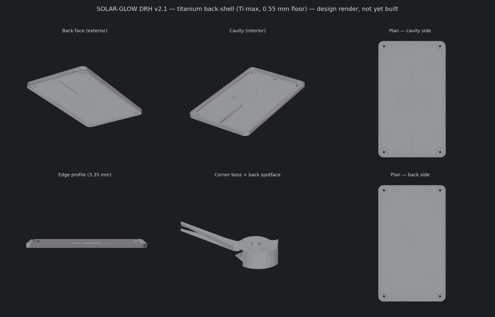
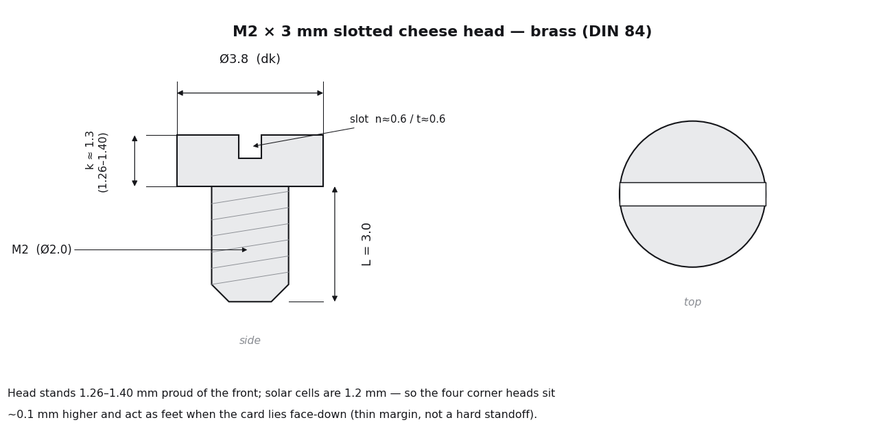

# SOLAR-GLOW DRH v3.0 — Titanium Back-Shell (enclosure)

Back-only titanium shell for the SOLAR-GLOW DRH PCB. It drops over the populated back of the
board and is held by four corner M2 screws; the bare show-front (two solar cells + the backlit
DRH monogram window) stays exposed. Retention is the four screws clamping, not a press fit.

This shell is **aligned to `PCB/solar-glow-drh-v3_0.kicad_pcb`** — the four mounting bosses sit on
the v3.0 hole pattern (concentric with the r3.0 board-corner fillets). It also carries the
enclosure decisions taken since the earlier revisions: the window braces are **removed**, the
floor is run to **0.75 mm** as back-engraving stock, and a small **U2 relief pocket** keeps the
tallest part clear. See *Design lineage* at the bottom.

> **Source of truth.** `solar-glow-drh-v3_0-backshell-cad.py` is authoritative for all geometry —
> it prints the full Z-stack when run and regenerates the STEP/STL from the PCB anchors. Every
> number in this README is echoed from that generator; if one ever disagrees, re-run the generator
> and trust it. This README is the **fab + ordering companion**, not an independent spec.

## Views



*Design render of the Ti-max model (0.75 mm floor, braces removed, U2 relief pocket). Not yet fabricated or fit-checked against a real board. Render predates the hole re-symmetrization; the current geometry is the committed STEP.*

## Files

| File | Purpose |
|---|---|
| `solar-glow-drh-v3_0-backshell-cad.py` | Parametric CadQuery generator. **Source of truth** — regenerates the STEP/STL from the verified PCB anchors, on the v3.0 hole pattern. |
| `solar-glow-drh-v3_0-backshell-Ti-max.step` | **Recommended.** 0.75 mm floor + U2 relief pocket + two cap-gap ribs + 1.0 mm walls. This is the file to send the fab. |
| `solar-glow-drh-v3_0-backshell-Ti-max.stl` | Same geometry, for a quick plastic dry-fit print before committing to titanium. |
| `solar-glow-drh-v3_0-backshell-Ti-max-progwindow.step` / `.stl` | Ti-max plus a TC2030 re-flash window over the programming pads. Optional variant; pick this only if in-enclosure re-flashing is wanted. |
| `solar-glow-drh-v2_1-backshell-DRAWING.pdf` / `.png` | **STALE — v2.1 numbers (0.55 floor / 1.90 cavity / 43.80 pitch).** Superseded; see *The 2D drawing* below. Do **not** send this for a v3.0 part. |

The mating PCB and the four M2 screws are separate, customer-supplied parts, not part of this order.

> A conservative thicker-floor variant is **not** pre-baked. If the shop cannot hold the 0.75 mm
> floor, the part is re-issued to whatever minimum they *will* hold (see the thin-wall advisory),
> so a second stored model would be dead weight. (At 0.75 mm the floor is far less marginal than
> the old 0.55 mm, so this is now unlikely to bind.)

## The 2D drawing (read before ordering)

The committed `DRAWING.pdf` is the **old v2.1 drawing** and does not match this shell: it shows a
0.55 mm floor, a 1.90 mm cavity, and a 43.80 mm hole pitch. The v3.0 numbers below are correct;
the drawing has **not yet been regenerated**. Regenerate it (to 0.75 floor / 1.85 cavity / **1.00 lip** /
44.80 × 82.90 pitch / 3.55 overall, with the U2 relief pocket detailed and the reflector frame
noted) **together with the rear engraving**, and only then send it to PCBWay. Until then, the
**STEP governs** and these notes carry the callouts.

## What to send PCBWay

The **Ti-max STEP** + the callouts below (plus the regenerated drawing once it exists). Material:
**Titanium Gr5 (TC4)**. The 3D STEP governs all geometry; the drawing and these notes just flag
the few dimensions that need tighter-than-standard control and the items a titanium shop will
otherwise raise as an engineering query (EQ).

---

## Ordering instructions (PCBWay)

Form settings on the CNC quote page (the on-screen selections override the drawing, so set these to match it):

- **Process:** CNC machining, 3-axis milling.
- **Material:** Titanium → **Titanium Gr5 (TC4)**. **Color:** Silver (natural Ti).
- **Units:** mm. **Quantity:** 1 (prototype).
- **Technical drawing:** attach the regenerated v3.0 drawing (see above); do not attach the stale v2.1 file.
- **Threads / tapped holes: Yes** — specify `4× M2×0.4 tapped through, from the back face`. (M2 is a standard thread, so their non-standard-thread disclaimer does not apply.)
- **Tolerance: leave on standard / ISO 2768** — do **not** enable “Tighter tolerances required.” That toggle trips an automated review gate that rejected the order repeatedly with an identical templated “tighter tolerance not specified at position” message even though the drawing marks it. Marked callouts govern regardless of the toggle: a dimension toleranced ±0.05 is held to ±0.05, and the general 2768 setting applies only to **unmarked** dimensions. Two dimensions are marked **±0.05** at their feature: **C1 cavity depth 1.85 ±0.05** (Section A-A) and **C3 mounting-hole pattern pitch 44.80 / 82.90 ±0.05** (plan). **C1 is the non-negotiable one.** Flatness C2 = 0.05 rides along as a form callout. Paste into the order’s special-request / notes box: *“Two dimensions are marked ±0.05 on the drawing and must be held as marked: cavity depth 1.85 ±0.05 (Section A-A), and mounting-hole pattern pitch 44.80 / 82.90 ±0.05 (plan). All other dimensions per ISO 2768-1 medium.”*
- **Surface finish: Bead blasting** (matte, uniform on the visible back face) — **not Brushed.** The back face is stepped (recessed art field, raised frame and boss annuli), so a brushed grain cannot run continuously across it; bead-blast gives uniform coverage into the corners and better laser-mark contrast. Read the discrepancy warning before submitting.
- **Surface roughness:** 250 µin / 6.3 µm Ra (default; the blast texture dominates anyway).
- **Finished appearance: Standard** for the first article. Premium only on a proven production run.
- **Inspection: Standard Inspection with Formal Report** (you want the measured cavity depth and floor thickness back). CMM-with-report if you also want flatness and hole position verified.
- **Part marking:** none (the reflector frame is laser-marked per note 9; rear branding/art is a later step, added with the engraving).
- **Product description:** DIY / Demonstration model.

Paste into **Other special request**:

```
- Cavity floor is a uniform 0.75 mm (the reflector frame is laser-marked, not cut).
  A single shallow relief pocket under U2 takes the local floor to 0.70 mm over a
  7.8 x 5.4 mm area only. If you cannot reliably hold 0.75 mm titanium over this
  ~48 x 86 mm ribbed pocket, tell us the minimum floor you can hold and we will
  re-issue the STEP.
- 4x M2 x 0.4 tapped through-holes, tapped from the back face. (M2 x 0.4 is a
  standard coarse thread; please tap per this note rather than letting the 0.6 mm
  minimum-pitch auto-checker reject it.)
- All in-pad / blind features to be resin-filled and copper-capped (POFV,
  IPC-4761 Type VII) if any apply; this is a solid milled part, so normally n/a.
- Break all sharp edges ~0.1 mm (titanium).
- Reflector frame (0.25 mm wide outline on the cavity floor) is LASER-MARKED, not
  cut, so the floor stays a uniform 0.75 mm. Do not engrave a groove.
```

Expect the instant price to move: the thin floor still routes this to manual engineering review, which is where the floor answer comes from. That answer is the gate before trusting the assembly.

---

## CNC fabrication notes / drawing callouts

### Title / process

| Field | Value |
|---|---|
| Part | SOLAR-GLOW DRH v3.0 back-shell (single piece) |
| Revision | v3.0 (hole pattern aligned to PCB v3.0; braces removed; 0.75 floor + U2 relief pocket) |
| Material | **Titanium Gr5 (TC4) = Ti-6Al-4V Grade 5** (PCBWay stock) |
| Process | 3-axis CNC milling, 2 setups (cavity face + back face) |
| Finish | Bead-blast matte (recommended, uniform on the stepped back face). Rear art is laser-marked in the recessed field after finishing. |
| Quantity | _[fill in: prototype 1–5]_ |
| Source model | `solar-glow-drh-v3_0-backshell-Ti-max.step` (0.75 floor + U2 pocket) |
| Units | mm |

### 1. Overall dimensions and datum

- Bounding box: **52.70 × 90.80 × 3.55 mm**.
- Datum **Z0 = outer back face** (the largest flat face). +Z is into the part toward the PCB.
- Z stack from the back face:
  - back frame and 4 boss annuli: **proud 0.15 mm** (to Z −0.15)
  - recessed rear art field: at Z 0 (between frame and annuli)
  - cavity floor: at **Z +0.75** (a uniform 0.75 mm of titanium beneath the cavity; the reflector frame is laser-marked, not cut)
  - U2 relief-pocket floor: at **Z +0.70** over a 7.8 × 5.4 mm area only (see note 5b)
  - boss / lip / rib tops (the PCB rest plane): **Z +2.60**
  - PCB recess: Z +2.60 to +3.40 (receives the 0.80 mm board)
- Wall 1.00 mm, perimeter lip **1.00 mm** (was 1.50 — thinned so the interior clears the v3.0 bench pad strip, copper to x 49.25, by **0.50 mm**; the mirrored back frame thins with it), two cap-gap ribs 1.00 mm wide, back-frame step 0.15 mm.
- **No internal braces.** Earlier revisions carried two full-cavity brace posts; they are removed (U2 is supported by the top rib end, and the caps by the ribs + lip). The generator retains the definitions but builds with `braces=False`.

### 2. Critical dimensions — flag these for tighter control

Default everything to ISO 2768-1 general tolerance. Control **only** the items below; each is a
function-critical fit.

| # | Feature | Nominal | Requested tolerance | Why |
|---|---|---|---|---|
| C1 | Cavity depth (boss-top plane → cavity floor) | **1.85 mm** | **±0.05** | Range 1.80–1.90. Sets the air gap over the cavity-setting parts (the four 1.70 mm WS17 supercaps): gap 0.10–0.20 mm. Must not be **under** 1.80 or the floor contacts the caps. |
| C2 | PCB-rest plane flatness (lip + 4 bosses + 2 rib tops, coplanar at Z +2.60) | — | flatness **0.05 mm** | Board must seat flat on all rests so the screws clamp evenly. |
| C3 | 4× mounting-hole pattern (pitch, linear) | 44.80 × 82.90 mm | **±0.05** | Must align with PCB mounts MH1–4 (v3.0 positions). Board clearance holes are ⌀2.2 over M2. |
| C4 | Mounting-hole diameter (tapped) | **M2** (tap-drill ⌀1.6, through) | standard | Thread fit for the M2 screws. |

Everything else — outer profile, recess width, frame, spotfaces, ribs, the U2 relief pocket, the
reflector-frame mark — at **ISO 2768-1 general**. The board-recess width is **not** a critical
press fit (see note 6).

> **Cavity note.** The cavity is **cap-limited**: the four WS17 supercaps (1.70 mm) are the tallest
> *cavity-setting* parts, so the general cavity is 1.85 mm (cap + 0.15 air). U2 (SOIC-8, 1.75 mm) is
> actually the single tallest part, but it sits over the local relief pocket (note 5b), which drops
> the floor 0.05 mm there so U2 still keeps its full 0.15 mm air. This is why the general cavity can
> be 1.85 rather than 1.90.

### 3. Thin-wall advisory (read before quoting)

The cavity floor is a **uniform 0.75 mm** (0.70 mm over the small U2 relief pocket only). The
reflector frame is **laser-marked, not cut**, so there is no thinned section under it. 0.75 mm is
still below the titanium-specific minimum-wall guidance (~1.0 mm, ~1.5 mm ideal), because thin
titanium flexes and chatters during cutting — but it is a healthy step up from the previous
0.55 mm and is expected to machine comfortably given the rib backing.

**The customer is aware the floor is below titanium wall guidance** and has sized it deliberately
(the 0.75 mm carries rear laser-engraving stock). The floor is internally backed by two
full-cavity ribs on solid stock. Please proceed one of two ways and note which on the quote:

- **(A)** Machine the uniform 0.75 mm floor **as-is**; customer accepts the thin-wall risk; **or**
- **(B)** If you cannot reliably hold 0.75 mm, tell us the **minimum floor thickness you will hold** in Ti-6Al-4V for this ~48 × 86 mm pocket given the rib backing, and we will re-issue the model to that value.

There is no separate “conservative” model to quote — the floor is the one variable we will move to
match your capability.

### 4. Threads / tapped holes

- 4× **M2** tapped, **through-holes** (preferred for tapping and chip evacuation), drilled ⌀1.6 then tapped.
- Tap from the **back face**. Engagement is ~2.2 mm of titanium (screw length 3.0 mm − board 0.80 mm; independent of the floor and cavity while the front stays above 3.0 mm).
- M2 coarse pitch is 0.4 mm, below the 0.6 mm minimum-pitch gate on the online quote form. Please tap M2 per this note (or advise) rather than letting the auto-checker reject the thread.
- Holes sit **concentric with the r3.0 board-corner fillets** (v3.0 pattern). Each corner boss (r2.60) now sits a uniform 0.40 mm off the cavity corner wall — a sub-⌀2.0-cutter cusp that fuses into the corner, giving better tap support than the earlier inset position.
- Customer-supplied fasteners: 4× **brass M2 × 3 mm slotted cheese head**, head ⌀ 3.8 mm (DIN 84). Tip seats flush in the back spotface (note 5).



### 5. Spotfaces

- 4× back-face spotface **⌀3.0 mm**, concentric with the mounting holes, depth ~0.2 mm (set so the brass M2×3 screw tip seats flush below the proud boss annulus). Modeled in the STEP.

### 5b. U2 relief pocket (local floor recess)

- A single shallow pocket in the **cavity floor** under U2: **7.8 × 5.4 mm**, centered at board
  coordinate **(28.5, 37.0)**, **0.05 mm deep** (local floor 0.70 mm), R1.0 corners. Modeled in the STEP.
- Purpose: U2 (1.75 mm) is 0.05 mm taller than the cap-limited cavity, so this pocket buys U2 its
  full 0.15 mm air while the general floor stays 0.75 mm and the general cavity stays 1.85 mm. It is
  clear of the ribs (which live in the y33–56 gap), the lip, the bosses, and the reflector frame.
- Non-critical: ISO 2768 general. It is a functional clearance pocket, not a fit surface.

### 6. Press fit — do NOT rely on it

The PCB recess flats are modeled 0.05 mm interference, which is below standard CNC tolerance and is
**not** intended as a working press fit. Treat the recess as a **slip fit**; the four screws provide
retention and clamp. No tight tolerance is needed on the recess width.

### 7. Internal radii and tooling

Internal concave junctions are modeled **sharp**, and a round tool simply leaves its own tool-radius
fillet there — standard practice for a milled pocket, and nothing mates in those corners. They are
left sharp on purpose: pre-modeling the radius could only be done as a polygon offset, which exports
as **faceted faces a CAM seat cannot measure** (it gets the file rejected). The whole solid is
therefore analytic (planes, cylinders, cones) — verified 143 analytic faces, zero spline/Bezier.
The finisher radii are called out only for reference:

- Cavity (1.85 mm deep): boss-to-lip and rib-to-lip junctions take a **⌀2.0 mm** finisher (R1.0 left by the tool).
- Back recessed field (0.15 mm deep) and the U2 relief pocket: **≤⌀1.0 mm** finisher (R0.5; shallow, reach trivial).

Rough the open cavity with a ⌀3–4 mm tool; finish corners/walls with the ⌀2.0. No EDM or square
internal corners required.

### 8. Edge break / deburr (note, do not model)

**Break all sharp edges, ~0.1 mm (titanium).** The outer top and bottom rim carries a modeled
0.20 mm ease; all other exposed edges and hole exits to be deburred per this note. Titanium edges
are sharp and nick easily, so no edge left knife-sharp.

### 9. Marking — reflector registration frame

- A hairline frame, **0.25 mm wide**, **laser-marked** on the cavity floor on the 20.9 × 6.2 mm
  monogram-window outline (centered at the window, board center). It locates an adhesive reflector
  strip; it is **non-structural** and **not modeled in the STEP** (a mark, not geometry).
- Laser-mark only, **do not cut a groove**: zero material is removed, so the floor stays a uniform
  0.75 mm under the window.
- Any rear branding/art (separate) goes in the recessed back field by laser, after finishing — this
  is the step that will also trigger the v3.0 drawing regeneration.

### 10. Setup / fixturing guidance

- Two setups: machine the cavity (front) side, then flip to machine the proud back frame and annuli.
- Drill the 4 mounting holes **through in one setup** so front/back alignment is inherent.
- The 0.75 mm floor wants support during the finish pass (the ribs help); wax or vacuum fixturing of the thin floor, sharp coated carbide, light climb-finish passes, heavy coolant.

### 11. Inspection

- Report the C1–C3 critical dimensions on the FAI.
- Confirm the cavity floor thickness actually achieved (it is the at-risk dimension).

---

## Board-side electrical caveats (grounded shell)

The four M2 screws thread into the titanium body, and the PCB mount pads (MH1–4) are **GND** and
overlap the front-side gold plating frame, so the shell is tied to board GND through the screws.
That is intentional and consistent, but it has two consequences the board must respect in an
enclosed build (full detail in `../solar-glow-drh-v2-mechanical.md` and `../solar-glow-drh-design-notes.md` §7):

- **Edge castellations** (any VS/SDA/SCL at the board rim) would short against the grounded press-fit walls — drop them or add a die-cut ~0.05 mm Kapton isolation layer.
- **Capacitive touch is dead** behind a grounded metal plate — the actuator in the enclosed build is the accelerometer tap, not a self-cap button.

---

## Design lineage

- **v2.1 enclosure** (`solar-glow-drh-v2_1-backshell-*`, still in this folder): the earlier shell —
  0.55 mm floor, 1.90 mm cavity, brace posts present, holes at the old 3.5 mm x-inset. It matches the
  old PCB hole positions (v2.1/v2.2/v2.3) as-is. **Superseded** by the v3.0 shell for the v3.0 board.
- **v3.0 enclosure** (this README, `solar-glow-drh-v3_0-backshell-*`): holes moved concentric with
  the r3.0 fillets to match `PCB/solar-glow-drh-v3_0.kicad_pcb`; braces removed; floor pushed to
  0.75 mm as engraving stock; U2 relief pocket added; general cavity re-based to 1.85 mm (cap-limited).
  Overall height 3.40 → 3.55 mm. The `board_th` in the generator is 0.80 mm; the 0.8-vs-1.0 mm board
  decision is still open and, if taken, changes the recess and overall heights.

---

*Part of SOLAR-GLOW · DRH. © 2026 Devin R. Horowitz. MIT License (see `../LICENSE`).*
