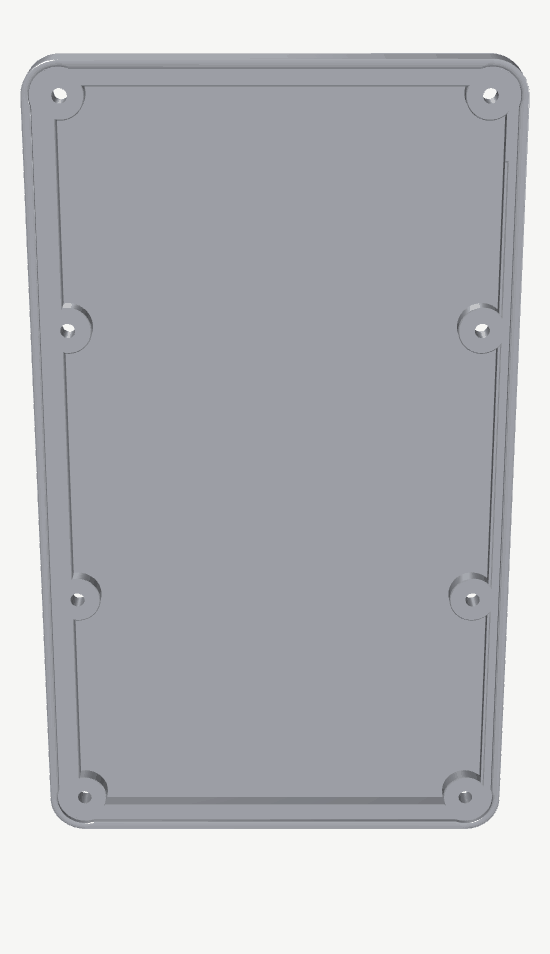
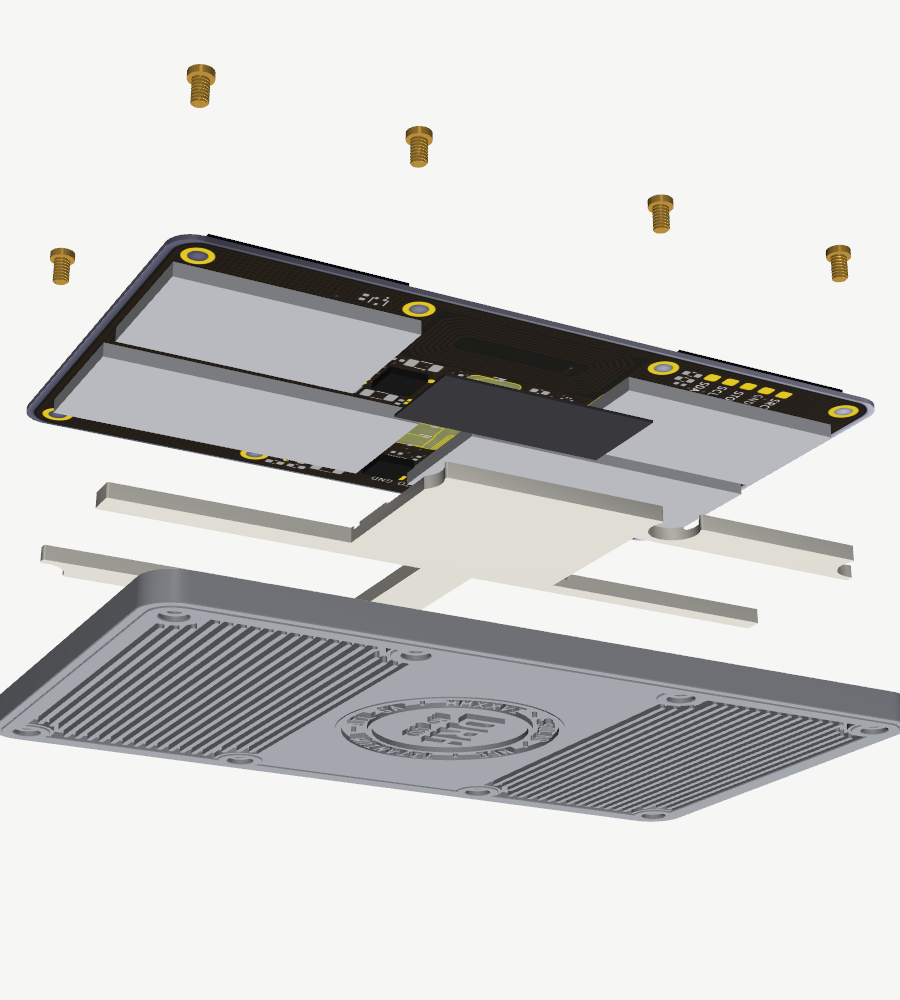
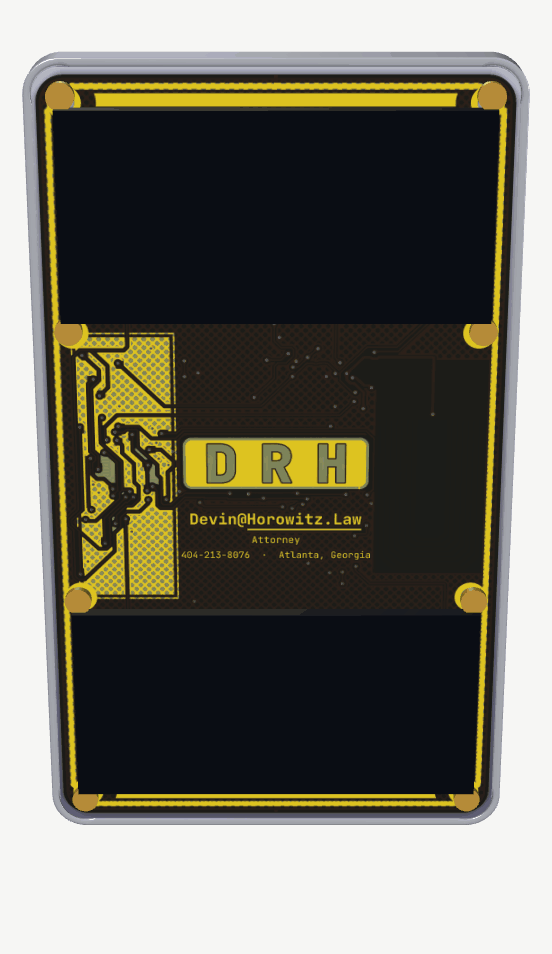
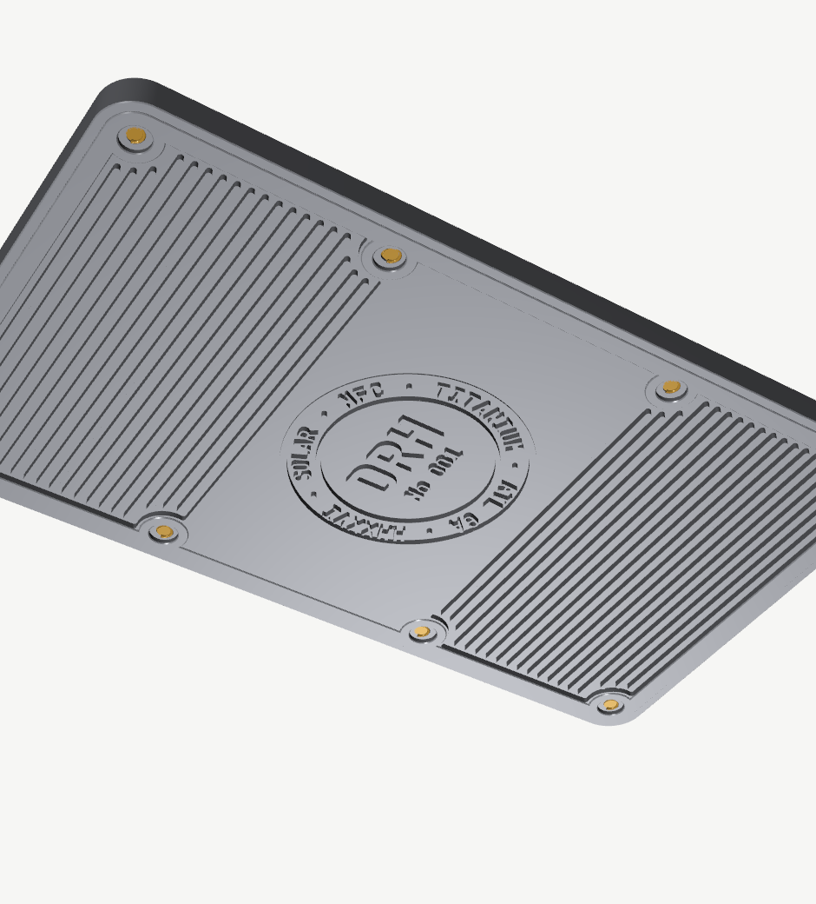

# SOLAR-GLOW DRH v3.0 — Titanium Back-Shell (enclosure)



<sub>The shell on its own, turned about its long axis — the machined cavity with its eight bosses and
the support lip on one side, the bead-blast back with its recessed field and boss annuli on the other.
96 frames, 550×954, rendered from the committed STL by `assembly_render.py` in the same CI job that
rebuilds that STL from the board.</sub>

Back-only titanium shell for the SOLAR-GLOW DRH PCB. It drops over the populated back of the
board and is held by eight M2 screws (four at the board corners + four at the panel inner corners);
the bare show-front (two solar cells + the backlit DRH monogram window) stays exposed. Retention is
the eight screws clamping, not a press fit.

This is the **0.6 mm-board "dumb box"** shell. It reduces to a floor, walls, eight M2 bosses,
no relief pocket -- nothing else. All center support and all
optical/EMI features live in a separate **resin diffuser brace** (see `brace/`), so a PCB layout
change is a brace reprint, never a shell re-machine. The shell is aligned to
`PCB/solar-glow-drh-v4_0.kicad_pcb` (bosses on the 8-hole pattern: four corner bosses concentric
with the r3.0 board-corner fillets, plus four panel-corner bosses).

> _(2026-07-28: this said `v3_0`, whose files have been removed from `PCB/` — see `PCB/README.md`.
> Repointing it is safe and was **verified, not assumed**: the v4 board's eight holes measure
> x 3.00 / 47.80 and y 3.00 · 28.50 · 60.40 · 85.90, which is exactly the C3 pattern below. The
> generator already agrees — its own header says it is "aligned to
> `PCB/solar-glow-drh-v4_0.kicad_pcb` … geometry identical to v3" —
> and it hardcodes its geometry rather than reading any board file, so nothing here ever loaded the
> v3 PCB.)_

> **Source of truth.** `solar-glow-drh-v3_0-backshell-0p6b-brace-cad.py` is authoritative for all
> geometry — it prints the full Z-stack when run and regenerates the STEP/STL from the PCB anchors.
> Every number in this README is echoed from that generator; if one ever disagrees, re-run it and
> trust the generator. This README is the **fab + ordering companion**, not an independent spec.

## The 2026-07-29 respin — measured against the real board

Both parts were checked against the committed board for the first time, and **neither would
have assembled.** Everything below is measured, not asserted; the numbers are reproducible
with `python3 scripts/check_consistency.py` (check **[8]**).



### What was wrong

| | before | after |
|---|---|---|
| brace resin inside a supercap | **593 mm³** across SC1/SC3/SC4 | **0** |
| brace that actually fits | 1296.75 mm² (33.4% of cavity) | **1385.1 mm² (34.6%)** |
| B-side parts under the support lip | **9**, incl. **4.17 mm² of live pad** | **0** |
| parts inside an M2 boss | 7 intrusions across 5 bosses | **0** |
| NFC coil standoff (grounded Ti) | **−0.15 mm (overhang)** | **+1.00 mm** |

Three findings deserve naming, because none was visible by eye:

1. **The brace could not be installed.** Its middle band was a literal rectangle sized for
   supercap bays ending at y31.15 / y57.75 — the **28.5 mm WS17** length. SC1/SC3 are
   **39 mm SS17** cells. Commit `bdaef17` reconciled the hybrid tank across *docs + sch + BOM*;
   the enclosure was not in that change, and nothing in CI triggered on `enclosure/`. SC2 is
   clear precisely *because* it really is a WS17 — the one cap the assumption fit.
2. **The shell shorted the storage rail.** The board sets `pad_to_mask_clearance = 0`, so every
   B-side pad is bare copper, and the lip is grounded titanium. 4.17 mm² of **live** pad sat
   under it: U6 `VS`/`NFC_EN`, C27 `STO`, FB1 `STO`/`STO_LDO`, C22 `STO_LDO`, R15 `STO`. Two of
   the five fouled bosses were live too (R14 pad 1 `NFC_EN`, R5 pad 2 `VSENSE`).
3. **The coil constant was optimistic.** `COIL_EAST` was hardcoded 48.40; LA/LB copper reaches
   **x48.550**, so the lip sized against it overhung the antenna it existed to avoid.

### The fix: derive, don't assert

`enclosure/fit_rules.py` is now the single home for the geometry both generators obey, reading
part positions from `enclosure/board_parts.py` (true 3D body ∪ pads, with the model's own
`rotate`/`offset` applied on top of the footprint's `at x y rot`).

- **Brace** — `footprint = cavity − blockers(+CLR) − boss reliefs`, morphologically opened at
  `SLA_WALL`. A part is coverable only if the resin above it still prints
  (`web = GAP − (h + AIR) ≥ SLA_WEB`, i.e. `h ≤ 1.28`); anything taller is *subtracted* rather
  than pocketed. Interference is structurally impossible — the thing that would collide is the
  thing removed. Ceiling is 38.5%: the caps are 1.70 mm in a 1.80 mm cavity and occupy 58.8% of
  the floor, so nothing can ever span them.
- **Lip** — 17 bands computed per edge, backed off `LIP_CLR` from the nearest part body-or-pad
  and never overhanging the coil. Wide wherever nothing is in the way, because it supports a
  0.60 mm board. A Ø2.0 finisher cannot reach the corners a band step leaves, so five parts get
  local reliefs dilated by the tool radius (48.89 mm² of lip, the price of clearing them at all).
- **Bosses** — scalloped clear of whatever fouls them. Worst case (3.0, 60.4), fouled by
  C22+C23+C24, keeps **92.3%** of the r0.80–r2.60 annulus at a minimum radius of 1.80 mm, well
  outside the 1.30 mm M2 thread keep-out.

**No board change was required for any of it.**

### Decisions taken, and what they cost

- **Single piece.** The computation also yields an ~85 mm² island east of SC4 that cannot reach
  the main body without crossing SC4. Dropped: a loose part in an assembly that comes apart for
  C9 NFC rework (the enclosed-check ladder swap; "trim" in the old plan) is a thing to lose.
  `fit_rules.DROPPED_AREA` records the 2.1 points of coverage
  given up rather than hiding it.
- **1.00 mm coil standoff.** Costs east lip width; the tradeoff is linear and on one line —
  `0.30 → 1.95 mm lip / 490 mm²`, `1.00 → 1.25 / 463`, `1.25 → 1.00 / 442`. At 1.00 the east lip
  is a single 1.25 mm band, still wider than the flat 1.0 the original design used.

### Assembly and the Z stack



<sub>One seamless revolution of the closed assembly, turned about its long axis the way a hand turns a
card over — front, edge, back, edge, front — 96 frames, 552×954. This is the root README's hero.
`solar-glow-drh-assembly-hero.png` is a still from the *exploded* sequence's camera, not this one, and
`solar-glow-drh-assembly.gif` is the exploded-to-closed sequence — since 2026-07-31 it holds **one
fixed camera, pitched below the horizon**: the parts do the moving, the explode gap opens straight
onto the brace's pockets meeting the PCB's B-side parts, and the closed hold presents the medallion
face. The show face is
`Generated/docs/…-card-face.png` textured on, so the monogram, cartouche and contact line are the
board's real artwork.</sub>

> **Everything generated in this directory is CI-owned — don't commit a hand-run rebuild.** The
> PCB CI job rebuilds the whole chain in dependency order on any board change: both CAD generators
> (STEP/STL), both dimensioned drawings, then `assembly_render.py`, which loads those STLs and
> textures the card with the raytraced card face. That covers the `.step`, `.stl`, `*DRAWING.pdf|png`,
> the pocket map, the six renders — everything here except the `.py` sources, the READMEs and the
> fonts. (This list used to carve out `solar-glow-drh-brace-fit.png`, a hand-made photo; it was
> deleted as unreferenced and nothing hand-made remains in this directory.)
>
> Move a part on the board and you get new gerbers, a new brace and shell, new drawings and new
> imagery in **one commit** — nothing can be a revision behind anything else. Run any generator
> locally to check a change by all means, but VTK does not produce identical pixels across GL
> stacks, so committing a local render starts a churn war with CI.
>
> It also means the renderer has a **CI-generated input**: a clone that has never run the workflow
> has no `card-face.png` to texture with, and the script says so and exits rather than shipping a
> blank card.



```
 0.00 .. 1.00   Ti floor
 1.00 .. 2.80   cavity — brace + B-side parts
 2.80 .. 3.40   board recess — 0.60 mm PCB          (3.55 at the 0.15 back frame)
```

**M2×3 slotted brass**, head Ø3.0 (matched to `CBORE_D`, the back spotface), shank Ø2.0.

> **Head-vs-cell, measured (2026-08-03, after a bench fit).** The old "Ø4.0, cell-limited"
> figure was close but a little generous; the true cap is **Ø3.754**. The constraint is
> *diagonal*: the cell body is **42 × 23** (`SM141K06TF`), so PV1 occupies x 4.40–46.40,
> y 4.25–27.25, and each screw sits **outside its nearest cell corner**, 1.40 mm out in x and
> 1.25 mm in y — 1.8768 mm centre-to-corner, all eight identical.
>
> _(An earlier revision of this note claimed the cap was Ø2.5 and that Ø3.0 overran the cell by
> 0.25 mm. That was wrong: it used `board_parts`' **46.20 × 23.00 courtyard** as the cell body.
> The 46.20 is the span of the four solder **tabs**, which live in the y 14.00–17.50 band, 11 mm
> clear of any screw — not the cell outline. Take cell dimensions from the datasheet, not from a
> footprint extent.)_
>
> At the specified Ø3.0 the head cleared by 0.377 mm even before the nudge. The problem is that
> **no stock M2 screw has a Ø3.0 head** — ISO 7380 button is Ø3.5, DIN 84 / ISO 4762 is Ø3.8 —
> and Ø3.8 was *touching*, by 0.023 mm. That is the "fits exactly, almost too exact" a bench fit
> found. **The 0.13 mm diagonal mount nudge fixes it**: centre-to-corner goes 1.8768 → 2.0604,
> so the cap rises to **Ø4.121** and a Ø3.8 head now clears by **0.160 mm**. Note the nudge buys
> **0.1836 mm**, not 0.13 — the move is along the diagonal the constraint is measured on.
>
> | head | before | after |
> |---|---:|---:|
> | Ø3.0 (spec, `CBORE_D`) | +0.377 | +0.560 |
> | Ø3.5 ISO 7380 button | +0.127 | +0.310 |
> | Ø3.8 DIN 84 / ISO 4762 | **−0.023** | +0.160 |
> | Ø4.0 | −0.123 | +0.060 |
>
> No cell modification is needed. Rounding or notching the cell corners was considered and is
> not required at any of these head sizes. The head seats on the board *front*; the tip reaches **z 0.40**
against a spotface floor cut to `3.40 − 3.00 = 0.40`, so it sits **flush** and nothing stands
proud of the back face. Engagement is 2.40 mm — more than the 1.80 mm boss, so the screw
deliberately continues into the floor, whose pilot is tap-drilled clean through.

Views regenerate with `python3 enclosure/assembly_render.py`. They are a **fit and material
check, not the raytraced article** — B-side parts are drawn as bounding boxes (exact for the
supercap cans, conservative for small passives), and the photographic renders come from
`scripts/render.py` into `Generated/docs/`.

### The gate

`check_consistency` **[8]** asserts all of this on every push touching `enclosure/**`. It is
deliberately written against *physics and the board*, not against `fit_rules`' own output — a
first cut compared the module to itself and passed `SPAN_LIMIT = 1.75` and `LIP_CLR = −0.50`
without complaint. Verified falsifiable by injection: those two now raise 2 and 11 errors,
`COIL_CLR = −0.60` raises 4, `BOSS_CLR = 2.00` raises 5, and the unmodified tree is clean.

---

## The three variants (2026-08-07)

One generator, one variants table (`fit_rules.VARIANTS` — the single home; every number
below is derived there, with its limiter rule beside it), three shells out of every run:

| | **max** | **lite** | **air** |
|---|---|---|---|
| Supercaps | 1.70 (SS17/WS17, the shipped board) | 1.00 thin — **MPN pending, height PROVISIONAL** (`part_heights.SUPERCAP_H_THIN`) | 1.00 thin, as lite |
| Cavity / depth | 1.80 — cap-limited (1.70 + 0.10) | 1.22 — **component-limited** (U1/L2 1.00 + AIR 0.22; the smallest cavity whose 0.60 span still lets the brace cover the passive field) | 1.20 open — resting clearance (1.00 + 2×0.10) |
| Floor | 1.00 | 0.60 thinned (shop-minimum conversation) | **none — open frame** |
| Total stack | 3.40 (3.55 at frame) | 2.42 (2.57 at frame) | **1.80** |
| Screws | M2×3 (HW1) | **M2×2** (HW2 — an M2×3 stands 0.58 proud) | **M2×1.6** (HW3 — tip hides 0.20 in the boss spotface) |
| Brace | yes (35% coverage) | yes, own build (23% — see TODO's relocation plan) | none (nothing retains it) |
| Medallion / fins | yes | **no — physics**: fin valleys (0.60) and coin floors would cut the 0.60 floor through | no back face at all |
| Material | Ti Gr5 reference; brass or 6061 fine | Ti Gr5 | **316L stainless only** — austenitic, µr≈1.02. Carbon/martensitic steel beside the NFC coil adds hysteresis loss the (absent) ferrite can't shield: the ENIG-over-coil lesson, one material over |
| Ferrite | in the brace channel | in the brace channel | **adheres to the board** — and the open back removes the titanium the ferrite partly shields against, so **C9's 47 pF does not carry over: bench re-tune required** |

Artifacts: lite is `solar-glow-drh-shell-lite-Ti.*` + `brace/solar-glow-drh-diffuser-brace-lite.*`,
air is `solar-glow-drh-frame-air-316L.*` (the name dodges the `backshell` substring on purpose —
`ref_figures.py` asserts exactly one of those). CI builds and commits all of them on the next
generator/board push, same as every solid here; the gates loop all variants
(`check_mesh` per-file ledger, `interference_drc` per brace, `assembly_drc` per shell,
consistency [8] per-variant webs + a coverage floor).

## Files

| File | Purpose |
|---|---|
| `solar-glow-drh-v3_0-backshell-0p6b-brace-cad.py` | Parametric CadQuery generator, **all three shells per run**. **Source of truth** — regenerates the STEP/STLs from the PCB anchors + `fit_rules.VARIANTS`. |
| `solar-glow-drh-v3_0-backshell-0p6b-brace-Ti-max.step` | **Send this to the fab for a MAX build.** 1.00 floor (**true uniform** — the U7 relief pocket was removed 2026-07-28), 1.80 cavity, 0.60 board recess, no ribs, no locator pillars, 1.0 walls, asymmetric lip (W2.5/N2.0/S2.0/E1.0), 8 M2 bosses, 3.55 overall. Lite/air fab files: the variant STEP + its own drawing, same rule. |
| `solar-glow-drh-v3_0-backshell-0p6b-brace-Ti-max.stl` | Same geometry, for a quick plastic dry-fit print before committing to titanium. |
| `solar-glow-drh-v3_0-backshell-0p6b-brace-DRAWING.pdf` / `.png` | 2D dimensioned drawing (plan + Section A-A + Detail B + critical dims + notes + title block). **Regenerated by CI with the CAD in the same commit** on any board or generator change (`kibot.yml`; the generators themselves are triggers since 2026-07-31), so it cannot lag the STEP — the 2026-07-28 stale-pocket episode (§7) is the failure that arrangement closed. The current sheet carries the medallion-era rear-art block. |
| `brace/` | The resin diffuser brace — separate printed part. Has its own README, generator, STEP/STL, and drawing. |

The mating PCB, the resin brace, and the eight M2 screws are separate parts, not part of this CNC order.

## The pogo test plate — face-up, in-frame bring-up

| File | Purpose |
|---|---|
| `solar-glow-drh-pogo-testplate-cad.py` | Parametric CadQuery generator. **Source of truth** — probe positions and net labels are parsed from the committed board, tooling-hole/rail geometry imported from `scripts/panelize.py`, cavity depth from `part_heights.py`. CI regenerates the STEP/STL/drawing on any board change. |
| `solar-glow-drh-pogo-testplate.stl` / `.step` | Print the STL (resin). CI-owned — don't commit a local run. |
| `solar-glow-drh-pogo-testplate-DRAWING.pdf` / `.png` | Top view + Z stack + build notes. |
| `solar-glow-drh-pogo-testplate-channels.json` | Generated monitor channel map (tail → ADC channel / front-end / scale + the I²C device roster). Consumed by `bench/monitor/` — the live dashboard that turns the plate into a UI. |

All seven test pads and the JP1 bench strip are on the **back** of the card, and the solar
cells are on the front — probing face-down would leave the cells in the dark, and the one
measurement the project is gated on (harvest under real indoor light) needs light on the
cells *while* the harvest chain is probed. So the plate holds P75 pogo pins pointing **up**:
the PCBWay panel drops on face-up, registered by two Ø1.5 dowels through its asymmetric
TH1/TH2 tooling holes (a backwards panel refuses the pins), the rails rest on the plate's
ledge, the B-side parts hang into a cavity sized off `part_heights.py`, and fourteen
receptacles land on TP1–TP7, the JP1 strip, **and the J1 UPDI column** — three more bare
B-side pads (`UPDI`/`STO`/`GND`), so programming comes through the plate too. The card
face — cells included — looks at the ceiling. Test as delivered, then depanel.

Hookup, from the wire-wrap tails below the plate:

| Function | Tails | Notes |
|---|---|---|
| UPDI programming | `UPDI` + `GND` (J1 column), VTG ref → `VS` | SNAP / PICkit / Atmel-ICE; TC1 from the top stays the alternative |
| I²C tap | `SCL` / `SDA` / `GND` (JP1 column) | bus pull-ups (RN2, 2×4.7 k array → VS) are on-board |
| Bench power injection | `STO` (either column) + `GND` return | two STO landings = a free Kelvin pair (force one, sense the other) |
| Harvest chain scope | `SRC`, `MID`, `LX_LOUT`, `VINT`, `BUFSRC`, `STO_LDO`, `VS` | the bring-up order from the test-pad audit |

Hardware: generic **P75-E2** probes in **R75-3W** wire-wrap receptacles, both parametrised
at the top of the generator. Two numbers must be tuned per printer/parts batch before the
first real print, and the plate is built to make that cheap: `RECEPT_BORE` is set from the
five-bore **fit coupon** (Ø1.25–1.45) printed into the plate's front band, and
`EXPOSED_FREE` (probe tip above the seated receptacle collar — no vendor publishes it) is
measured on one real probe+receptacle pair and typed in. Set **SW2** before seating the
panel; the switch faces the plate.

## What changed from the earlier shells

- **Floor 0.75 → 0.95 → 1.00 (true 1 mm)**, on a **0.60 mm board** (was 0.80). Same 3.55 overall. The final 0.95 → 1.00 step comes from trimming the cavity 1.85 → 1.80 (cap air 0.15 → 0.10): the brace and the solar-cell sandwiches carry the board, and the WS17 datasheet confirms 1.70 mm is the cap **max** height (worst-case gap 0.05 mm). A true 1.00 floor also clears aluminium / copper / stainless, not just Ti.
- **Ribs and locator pillars removed.** The old cap-gap ribs and window posts are gone, and the locator pillars are retired — the resin brace carries center support and registers to the shell by fitment (its computed footprint + the component pockets + the board press-fit). The cavity floor stays a full 1.00 everywhere.
- **The support lip is per-band, computed from the board** (`enclosure/fit_rules.py`), not four scalars. The flat 2.5/2.0/2.0/1.0 lip landed on **nine** B-side parts, including **4.17 mm² of live pad** (`STO`, `STO_LDO`, `VS`, `NFC_EN`) under grounded titanium — fitting it shorted the storage rail. 24 bands now clear every part while supporting *more* edge than the flat lip did. The east lip is bounded by NFC coil copper **measured** at x48.550 — the old hardcoded 48.40 was 0.15 mm optimistic, so the lip *overhung* the antenna. It now stands off by a full **1.00 mm** (`COIL_CLR`), leaving a 1.25 mm east lip: still wider than the flat 1.0 the original design used, and 3.3× the standoff of the first fix. The tradeoff is linear — 0.30 → 1.95 mm lip / 490 mm², 1.00 → 1.25 / 463, 1.25 → 1.00 / 442.
- **The eight M2 bosses are scalloped** clear of anything that fouls them — five of eight did, two on live nets. The worst keeps 92.3% of its r0.80–r2.60 annulus at a minimum radius of 1.80 mm, well outside the 1.30 mm M2 thread keep-out. No board change was required.
- **Support lip widened and made asymmetric.** The old uniform 1.00 lip is now **W 2.5 / N 2.0 / S 2.0** for a stiffer PCB (widths bounded by the nearest B-side part on each edge). **East stays 1.0** through the JP1/TP1 pads, over the NFC coil (a grounded Ti lip would detune it), and past C7 (x49.55, the one east-edge part left after v4 removed the Q1/U4/R7/R9 clamp cluster and the D9/D10/D11 diodes), which overhangs a wider lip, **widening to 2.5 only at the y0–10 end** clear of them. The exterior back border is independent of the lip and **uniform 2.0 on all 4 sides**.
- **Reflector frame + floor tape dropped.** The monogram window is now backed by the brace's white LED-hug diffuser face, so the laser-marked reflector frame and the adhesive floor strip are no longer used.

## The 2D drawing

`solar-glow-drh-v3_0-backshell-0p6b-brace-DRAWING.pdf` matches the committed STEP on every headline
dimension (1.00 floor / 1.80 cavity / 0.60 board recess / 8-hole mount pattern [x 45.06; y rows
2.87/28.63/60.27/86.03] / 3.55 overall). **The U7-pocket discrepancy is closed as of 2026-07-29**: the
drawing showed a relief pocket the STEP had stopped containing on 2026-07-28, and the sheet has been
regenerated — its note 7 now reads "NO U7 RELIEF POCKET" and the pocket outline is gone. It is
derived from `enclosure/part_heights.py` rather than written on the sheet, so it cannot fall out of
step with the STEP again. (The old `v2_1` drawing this note used to warn against sending has left
the tree entirely — git history only.) The drawing and the notes below flag the few dimensions that need tighter-than-standard
control.

## What to send PCBWay

The **`...-0p6b-brace-Ti-max.step`** + the **`...-0p6b-brace-DRAWING.pdf`** + the callouts below.
Material: **Titanium Gr5 (TC4)**. Add one line to the order: *"The STEP governs."* (An earlier
version of this note explained away a Detail-B relief pocket the drawing no longer shows — the
sheet has derived the pocket from the same arithmetic as the CAD since 2026-07-29, and that
arithmetic now yields none. The drawing and STEP agree; there is no discrepancy to pre-empt.)

## Ordering instructions (PCBWay)

Form settings on the CNC quote page (the on-screen selections override the drawing, so set these to match it):

- **Process:** CNC machining, 3-axis milling.
- **Material:** Titanium → **Titanium Gr5 (TC4)**. **Color:** Silver (natural Ti). *(Bare metal — the shell ties to board GND through the eight screws; do not anodize/plate.)*
- **Units:** mm. **Quantity:** 1 (prototype).
- **Technical drawing:** attach `...-0p6b-brace-DRAWING.pdf`; do not attach the stale v2.1 file.
- **Threads / tapped holes: Yes** — `8× M2×0.4 tapped through, from the back face`.
- **Tolerance: leave on standard / ISO 2768** — do **not** enable "Tighter tolerances required." That toggle trips an automated review gate that rejects the order with a templated "tighter tolerance not specified at position" message even though the drawing marks it. Marked callouts govern regardless of the toggle. Two dims are marked **±0.05**: **C1 cavity depth 1.80 ±0.05** (Section A-A) and **C3 mounting-hole pattern pitch (x 45.06; y rows 2.87/28.63/60.27/86.03) ±0.05** (plan, 8 holes). **C1 is the non-negotiable one.** Flatness C2 = 0.05 rides along as a form callout. Paste into the notes box: *"Two dimensions are marked ±0.05 and must be held as marked: cavity depth 1.80 ±0.05 (Section A-A), and the 8-hole mounting pattern pitch x 45.06 / y rows 2.87/28.63/60.27/86.03 ±0.05 (plan). All other dimensions per ISO 2768-1 medium."*
- **Surface finish: Bead blasting** (matte, uniform on the stepped back face) — **not Brushed.** The back face is stepped (recessed art field, raised frame, boss annuli and the medallion crests), so a brushed grain cannot run continuously; bead-blast covers into every recess. The two-texture finish is **not** ordered from the shop: after the blast, the bearing plane (frame + medallion crests, coplanar at −0.15) is hand-lapped bright on a plate at the bench — the plate cannot touch anything else, by geometry (engraving-studies spins 6–8; the studies were culled 2026-08-02 and live in git history).
- **Surface roughness:** 250 µin / 6.3 µm Ra (default).
- **Finished appearance: Standard** for the first article.
- **Inspection: Standard Inspection with Formal Report** (you want the measured cavity depth and floor thickness back). CMM-with-report if you also want flatness and hole position verified.
- **Part marking:** none to order — the rear medallion (ring text, monogram, serial) is **machined geometry in the model**, not a marking service. (The laser-step plan was retired 2026-07-31 when the Z9F medallion graduated into the CAD.)
- **Product description:** DIY / Demonstration model.

Paste into **Other special request**:

```
- Cavity floor is a uniform 1.00 mm with no local relief anywhere. If you cannot
  reliably hold 1.00 mm titanium over this ~48 x 86 mm pocket, advise the minimum
  floor you can hold and we will re-issue the STEP.
- No locator pillars: the resin H-brace registers by fitment (4 outboard rails +
  component pockets + board press-fit). Cavity floor is a full 1.00 everywhere.
- 8x M2 x 0.4 tapped through-holes, tapped from the back face. (M2 x 0.4 is a
  standard coarse thread; please tap per this note rather than letting the 0.6 mm
  minimum-pitch auto-checker reject it.)
- Break all sharp edges ~0.1 mm (titanium).
```

Expect the instant price to move: the thin floor routes this to manual engineering review, which is where the floor answer comes from.

---

## CNC fabrication notes / drawing callouts

### Title / process

| Field | Value |
|---|---|
| Part | SOLAR-GLOW DRH v3.0 back-shell — 0.6 mm-board dumb box (single piece) |
| Revision | v3.0 (0.6-board dumb box: 1.00 floor, 1.80 cavity, no ribs, no locator pillars) |
| Material | **Titanium Gr5 (TC4) = Ti-6Al-4V Grade 5** (PCBWay stock) |
| Process | 3-axis CNC milling, 2 setups (cavity face + back face) |
| Finish | Bead-blast matte; bearing plane (frame + medallion crests) hand-lapped bright at the bench afterward. Rear art is machined-in (the medallion), not marked. |
| Source model | `solar-glow-drh-v3_0-backshell-0p6b-brace-Ti-max.step` |
| Units | mm |

### 1. Overall dimensions and datum

- Bounding box: **52.70 × 90.80 × 3.55 mm**.
- Datum **Z0 = outer back face**. +Z is into the part toward the PCB.
- Z stack from the back face:
  - back frame, 4 boss annuli **and the medallion crests**: **proud 0.15 mm** (to Z −0.15
    — the bearing plane; `medallion.py`)
  - recessed rear art field: at Z 0; fin rib tops proud 0.10 (Z −0.10), fin groove
    floors at **Z +0.60** (`FIN_VALLEY` — 0.40 web under each groove, see §3 addendum)
  - medallion coin floor **Z +0.45** (Ø0.4 end mill), counter/rest floors **Z +0.25**
    (Ø0.3 rest pass) — both within the 0.60 fin-valley ceiling, no new thin section
  - cavity floor: at **Z +1.00**, uniform (the 0.95 local U7 pocket was removed 2026-07-28)
  - boss / lip tops (the PCB rest plane): **Z +2.80**
  - PCB recess: Z +2.80 to +3.40 (receives the 0.60 mm board)
- Wall 1.00 mm. **Asymmetric perimeter lip: W 2.5 / N 2.0 / S 2.0 / E 1.0 mm (E widens to 2.5 at the N/S ends).** Exterior back border is **uniform 2.0 on all 4 sides** (independent of the lip).** Back-frame step 0.15 mm. **No internal ribs or posts.**

### 2. Critical dimensions — flag these for tighter control

Default everything to ISO 2768-1 general. Control **only** the items below.

| # | Feature | Nominal | Requested tolerance | Why |
|---|---|---|---|---|
| C1 | Cavity depth (boss-top plane → cavity floor) | **1.80 mm** | **±0.05** | Range 1.75–1.85. Air gap over the four 1.70 mm WS17 supercaps (datasheet **max** height): 0.05–0.15 mm. Must not be under 1.70 or the floor contacts the caps. |
| C2 | PCB-rest plane flatness (lip + 8 bosses, coplanar at Z +2.80) | — | flatness **0.05 mm** | Board must seat flat so the screws clamp evenly. |
| C3 | 8× mounting-hole pattern (pitch, linear) | x 45.06 / y rows 2.87·28.63·60.27·86.03 mm | **±0.05** | Must align with the PCB's 8 M2 holes (MH1–4 corners + 4 panel-corner). |
| C4 | Mounting-hole diameter (tapped) | **M2** (tap-drill Ø1.6, through) | standard | Thread fit for the M2 screws. |

> **Cavity note.** The cavity is **cap-limited**: the four WS17 supercaps set it. The SCHURTER SCPC datasheet (Case WS17) gives height **max 1.7 mm** and body 28.5 +0.5/−0.0 long, so the general cavity is **1.80 mm** (0.10 nominal air; worst-case 1.75 − 1.70 = 0.05, non-contact). ~~U7 (FRAM, SOIC-8, 1.75 mm) is the single tallest part but sits over the local relief pocket (note 7), which drops the floor 0.05 mm there so U7 keeps a 0.10 mm air gap.~~ The freed 0.05 mm went into the floor (0.95 → 1.00).
>
> **⚠ Superseded 2026-07-28 — U7 is no longer a tall pole, and this was written when it was.** The v4
> board carries the **DFN-8**, not a SOIC-8: `PCB/solarglow.pretty/U7_DFN8.kicad_mod` `descr` quotes
> RAMXEED DS501-00087-1v0-E p.21 for a **5.00 × 6.00 mm body, 0.90 mm MAX** height, and
> `PCB/README.md` agrees. That is **0.85 mm shorter** than the 1.75 assumed here, and well under the
> 1.70 mm the supercaps already demand — so U7 clears the uniform 1.00 mm floor with 0.80 mm to
> spare and the note-7 relief pocket is **not needed for clearance**. The cavity stays cap-limited
> at 1.80 either way, so nothing here is unsafe; the pocket is simply machining that buys nothing.
> **Decide before the next fab order** whether to keep it (harmless, already modelled and quoted) or
> drop it and take the floor back to a true uniform 1.00 mm. Tracked in `TODO.md`.

### 3. Thin-wall advisory (read before quoting)

The cavity floor is a **true uniform 1.00 mm** (no local relief since 2026-07-28). That is
still below the titanium min-wall guidance (~1.0 mm) but a healthy step above the earlier 0.55/0.75.
The floor no longer has ribs behind it (the resin brace carries center support in service, but is
not present during machining). Please proceed one of two ways and note which on the quote:

- **(A)** Machine the uniform 1.00 mm floor **as-is**; or
- **(B)** If you cannot reliably hold 1.00 mm, advise the **minimum floor you will hold** in Ti-6Al-4V for this ~48 × 86 mm pocket, and we will re-issue the model.

**Fin-relief addendum (2026-07-30).** The back's two reeded fields cut `FIN_VALLEY = 0.60`
into the 1.00 floor, leaving a **0.40 mm web under each groove**. Three conditions make
this sound, and all three are requests to the shop, not hopes:

1. **Operation order: cut all back-face features (fins, medallion, frame) BEFORE hollowing
   the cavity.** On solid stock the grooves machine on 3.4 mm of metal; after hollowing,
   the floor is a diaphragm and the fine grooves will chatter. This ordering is
   load-bearing, not stylistic.
2. **Stress-relieved Ti-6Al-4V stock.** The fin pass removes ~2 g asymmetrically from one
   face of a 43 mm field; unrelieved plate can bow. Mill-annealed / stress-relieved
   condition, please state on the quote.
3. **The groove network is Ø0.6 end-mill work exclusively** (grooves are 0.79 wide;
   nothing larger enters). Depth 0.60 = 1×D — expect **two passes**. The web is a waffle
   (0.79 spans between 0.6 ribs, brace-backed in service), so 0.40 local web is stout;
   the risks are the two named above, and they are handled by 1 and 2.
4. **The medallion is island work: Ø0.4 + Ø0.3, vertical walls** (`medallion.py`). The
   Ø0.4 clears the open coin to 0.45 below the field; the Ø0.3 rest-machines only what
   the Ø0.4 cannot enter, stopping at 0.25. The crests (ring text, rim, hoop, monogram,
   serial) are left standing to the **frame's own −0.15 plane** — they are made exactly
   the way the frame is made, and the generator **asserts** no detached island under
   0.55 mm exists before it will emit a STEP. Serial (`No 001`) is variable data: one
   text substitution per unit in `medallion.SERIAL`.

### 4. Brace registration (no locator pillars)

- **Retired.** The resin H-brace registers to this shell by **fitment** — its four outboard rails run into the cavity beside the supercaps, the component pockets key it to the board, and the board press-fits into the recess. No pillars, no recesses, no locating holes; the cavity floor is a full **1.00 mm** everywhere.

### 5. Threads / tapped holes

- 8× **M2** tapped, **through-holes**, drilled Ø1.6 then tapped, from the **back face**. Engagement ~2.2 mm.
- M2 coarse pitch is 0.4 mm, below the 0.6 mm minimum-pitch gate on the quote form — tap per this note.
- Bosses (r2.60): the four **corner** bosses sit a uniform 0.40 mm off the cavity corner wall (a sub-Ø2.0-cutter cusp that fuses into the corner); the four **panel-corner** bosses stand in the west field / merge into the pinched east lip.
- Customer-supplied fasteners: 8× **brass M2 × 3 mm slotted cheese head**, head Ø3.8 (DIN 84). Tip seats flush in the back spotface (note 6).

### 6. Spotfaces

- 8× back-face spotface **Ø3.0 mm**, concentric with the mounting holes, depth ~0.2 mm (screw tip seats flush below the proud boss annulus). Modeled.

### 7. U7 relief pocket — REMOVED 2026-07-28

- **There is no relief pocket.** The cavity floor is a true uniform 1.00 mm.
- What it was: 7.8 × 5.4 mm, centred at board (28.1, 37.3), 0.05 mm deep (local floor 0.95), R1.0
  corners — cut so a **1.75 mm SOIC-8** U7 would keep 0.10 mm of air under the cap-limited 1.80 cavity.
- Why it went: the v4 board carries the **0.90 mm MAX DFN-8** (`PCB/solarglow.pretty/U7_DFN8.kicad_mod`
  `descr`, RAMXEED DS501-00087-1v0-E p.21). U7 clears the uniform 1.00 mm floor by **0.80 mm**, so the
  pocket cleared nothing. It was machining that bought nothing.
- The generator removes it by **arithmetic, not deletion**: `U7_H` is now 0.90, so
  `U7_POCKET = max(0, U7_H - cap_H)` evaluates to 0 and the cut is skipped. The mechanism stays in
  place for the next part that genuinely needs local relief.
- **Verified on the regenerated solid**, not assumed: volume went from 6524.4817 to 6526.5447 mm³,
  **+2.0631 mm³** of material back. The nominal pocket is 7.8 × 5.4 × 0.05 = 2.1060 mm³; the 0.043
  mm³ difference is exactly the R1.0 corner fillets. Bounding box unchanged at 52.700 × 90.800 × 3.550.

> **Resolved 2026-07-29 — the drawing has been regenerated and agrees with the STEP.** It is safe
> to send as-is. The pocket outline and its callout are now drawn only when `U7_POCKET > 0`, and
> note 7 is generated from the same arithmetic the CAD uses, so the sheet and the model derive the
> feature from one number (`enclosure/part_heights.py`) instead of asserting it separately. The
> generators also no longer write to a hardcoded `/mnt/user-data/outputs/` — they write beside
> themselves, overridable with `$OUT_DIR`, so a plain checkout can regenerate both sheets.

### 8. Press fit — do NOT rely on it

PCB recess flats are modeled 0.05 mm interference (below CNC tolerance) — treat as a **slip fit**; the eight screws retain and clamp.

### 9. Internal radii and tooling

Internal concave junctions are modeled **sharp**; a round tool leaves its own fillet (standard for a milled pocket). The whole solid is analytic (planes, cylinders, cones) — verified 167 analytic faces, zero spline/Bezier. Rough the cavity with a Ø3–4 mm tool; finish corners/walls with a Ø2.0.

### 10. Edge break / deburr (note, do not model)

**Break all sharp edges ~0.1 mm (titanium).** All exposed edges are broken 0.10 × 45°, meant to be felt but not seen (modeled). The named breaks called out on Section A-A / Detail B are: the outer rim (top and bottom), the recess mouth around the board, the inner (cavity-side) lip edge, the proud back-frame bottom edges, and the boss/spotface bottom edges. The concave seat and junction corners are left sharp in the model and take the tool's own radius. Deburr all other exposed edges and hole exits.

### 11. Inspection

- Report C1–C3 on the FAI. Confirm the achieved cavity floor thickness (the at-risk dimension).

---

## Board-side electrical caveats (grounded shell)

The eight M2 screws thread into the titanium body, and the PCB mount pads (the four MH1–4 corners plus
the four panel-corner holes) are **GND** and overlap the front-side gold plating frame, so the shell is
tied to board GND through the screws. Two
consequences the board must respect in an enclosed build:

- **Edge castellations** (any VS/SDA/SCL at the board rim) would short against the grounded press-fit walls — drop them or add a die-cut ~0.05 mm Kapton isolation layer.
- **Capacitive touch is dead** behind a grounded metal plate — the actuator is the accelerometer tap, not a self-cap button.

## Design lineage

- **v2.1 shell** (`solar-glow-drh-v2_1-backshell-*`): 0.55 floor, 1.90 cavity, brace posts, old 3.5 mm hole inset. Matches the old PCB hole positions. **Superseded** — its files (drawing included) are no longer in the tree; git history only.
- **v3.0 0.75-floor ribbed shell** (interim, not in this folder): floor pushed to 0.75, braces removed, two cap-gap ribs added, U2 pocket added, holes re-symmetrized to the v3.0 pattern. **Superseded** by the dumb box.
- **v3.0 0.6-board dumb box** (this README, `...-0p6b-brace-*`): 0.60 board frees the floor to 1.00 (cavity 1.80); ribs and locator pillars removed; the resin H-brace (`brace/`) carries center support and registers by fitment, and the window/EMI features; reflector frame and floor tape dropped. Overall stays 3.55.

---

*Part of SOLAR-GLOW · DRH. © 2026 Devin R. Horowitz. MIT License (see `../LICENSE`).*
