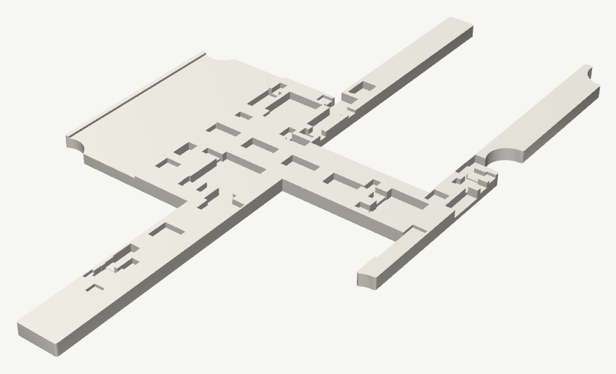

# SOLAR-GLOW DRH — Resin Diffuser Brace

A printed resin insert that drops into the titanium back-shell cavity, on top of the populated back of
the PCB. It is **not fastened and not bonded** — it is held by the shell clamping down, and it lifts
straight out. Its footprint is **computed from the board** (`enclosure/fit_rules.py`), not hand-placed: it was
a middle band plus two full-length outboard rails until 2026-07-29, when measurement showed that band drove
**593 mm³ of solid resin through SC1, SC3 and SC4** — it was sized for 28.5 mm WS17 cells and SC1/SC3 are
39 mm SS17. The footprint now subtracts every part it cannot span, sized so all
**four flat cavity walls are contacted** (~0.05 mm) for a no-rattle seat. The four corner bosses and the
rounded corners are **relieved** (cut clear — the brace need not fit them). It does four jobs:

1. **Center + outboard support** — the brace props the thin board wherever a part does not stand in the way (so the shell floor can be a true 1.00 mm with no internal ribs). It reaches **1470 mm², 36.8% of the cavity floor**, against a hard ceiling of 38.5%: the supercaps are 1.70 mm tall in a 1.80 mm cavity and occupy 58.8% of the floor, so nothing can ever span them. It prints as **two pieces** — the ~85 mm² island east of SC4 cannot reach the main body without crossing SC4.
2. **Panel-tab backing** — the rails sit directly behind the four solar-cell solder tabs, so pressing a cell down lands cell → board → brace → titanium instead of flexing the bare 0.6 mm FR4.
3. **Window backing** — a solid white face behind the FR4 monogram window turns the four reverse-mount LEDs into an even amber lightbox.
4. **NFC ferrite carrier** — an open channel over the coil holds a ferrite strip that lifts the antenna off the grounded titanium.

> **Source of truth.** `solar-glow-drh-diffuser-brace-cad.py` is authoritative. It reads
> `PCB/solar-glow-drh-v4_0.kicad_pcb`, subtracts every B-side footprint at its verified height, and
> writes the STEP/STL. Re-run it if the board **or the shell cavity** changes; the brace is a reprint.

## Files

| File | Purpose |
|---|---|
| `solar-glow-drh-diffuser-brace-cad.py` | Parametric CadQuery generator. **Source of truth.** |
| `solar-glow-drh-diffuser-brace.step` | Solid model. |
| `solar-glow-drh-diffuser-brace.stl` | **Print this.** SLA mesh. |
| `solar-glow-drh-diffuser-brace-DRAWING.pdf` / `.png` | Print/spec sheet: board-facing plan + Section B-B + material, ferrite, fit, and assembly notes. |
| `solar-glow-drh-diffuser-brace-pocket-map.png` | Debug map: every pocket over the board outline, the tab-backing targets, and the merged thin-wall bridges. |

## Material and printing

- **Process:** SLA / resin print. **Material must be opaque-white and non-conductive** — no carbon- or graphite-filled resin (the brace rests directly on GND / VS / signal copper, and white drives the window backing).
- **Height fit:** print ~0.1 mm proud, then **sand the flat bottom (the datum)** to a zero-air fit in the 1.80 mm cavity. Every pocket is on the **top** face, so the bottom laps flat on glass. **Do not sand the top** — it sets the pocket depths.
- **Wall fit:** the four outer edges are sized **0.05 mm inside the cavity walls** (contact, no rattle). If the print comes out tight, lightly sand the outer edges the same way as the bottom — **do not touch the four corner reliefs**.
- Envelope **47 × 85 × 1.80 mm**; volume ~2.6 cm³, mass ~3.0 g (tough white SLA).

## Geometry — precision fit

- **Contacts all four flat walls at ~0.05 mm.** West edge x2.60 (wall x2.55), south edge y2.10 (wall y2.05), north edge y86.80 (wall y86.85). The **east edge follows the shell's stepped east wall**: x49.70 through the pinched middle **and north end** (y10–86.80, wall x49.75) and x48.20 at the one widened-lip end (y0–10 south, wall x48.25).
- **Corner bosses relieved.** A circular relief (r3.0) at each of the four M2 bosses (r2.6) clears the boss **and** the rounded cavity corner; the brace does not seat on them, only on the flat walls.
- **Rails run the full length (y2.10–86.80)** outboard of the supercaps (SC1/SC3 x7–24, SC2/SC4 x26.8–43.8, 0.25 mm gap). The caps sit in the two open bays; the rails back the four PV solder tabs.
- **Band fills the cap gap** (y31.15–57.75), full width x2.60–49.70, carrying the window backing and the ferrite channel.
- **Corners relieved to the as-milled radius.** The shell is milled, so its internal concave corners (the 4 boss-to-wall junctions and the 2 east pinch/widen steps) carry the finisher's R1.0 radius, which the sharp STEP does not show. The brace footprint is clipped to the tool-reachable cavity, backing each of those corners off by R1.0 so it clears the real metal while the flat-wall contact stays at 0.05 mm.

## Key features

- **Flat bottom = datum.** The board-facing (top) face carries all the pockets; the shell-facing (bottom) face is flat and is the sanding reference.
- **Ferrite channel** over the NFC coil: an **open-ended** channel — walled on the **12 mm width** (edge-limited by the coil/board east edge), **open at both ends** (length is forgiving), **0.33 mm** deep. Takes a Würth WE-FSFS 364006 ferrite, nominal **12 × 26 mm**, PSA'd in; it may overhang the ends slightly.
- **Window = LED-hug diffuser backing:** solid white resin fills the monogram-window footprint behind the FR4, minus tight D2–D5 LED pockets. No aperture, no floor tape.
- **U6 is a through-pocket.** U6 (1.45 mm) is forced through because a blind pocket would leave a sub-0.4 mm resin ceiling; through, its body faces the shell floor with 0.35 mm of air. Everything else sits in blind pockets at its verified height.
- **Thin-wall bridges.** Where two pockets would leave a resin wall thinner than 0.40 mm, the generator merges the pair into one recess. It prints the merged-pair count when run (they cluster in the dense areas); the regenerated STEP/STL reflect the current board (the count shifts as parts move - C10 was removed and the v3 clamp cluster deleted).

## Removable — keep it that way during bring-up

The brace must lift out for NFC **C9 trim** during bench bring-up (bare-card first, then re-trim after the
titanium shell is on). Keep it a **dry fit** while iterating; add any optical gel only on the final card,
and re-apply it on every removal.

---

*Part of SOLAR-GLOW · DRH. © 2026 Devin R. Horowitz. MIT License (see `../../LICENSE`).*
