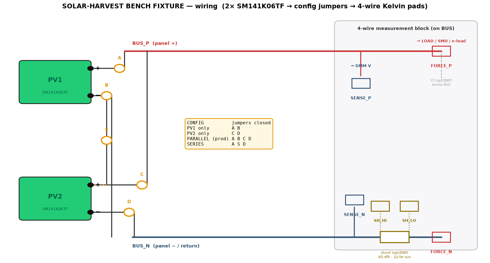
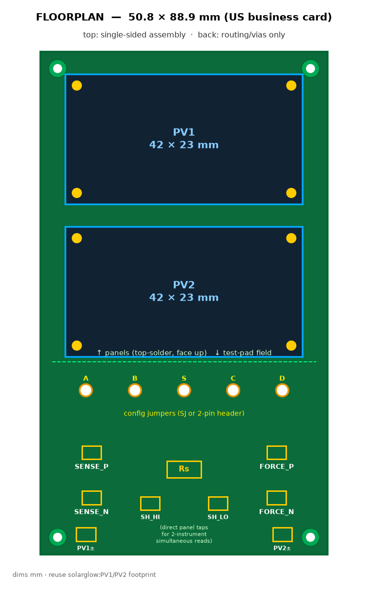

# Solar-harvest bench test fixture -- design handoff

**Status: design spec / handoff -- not yet laid out.** This document specifies a small,
simple, single-sided PCB whose only job is to let you bench-measure the real electrical
output of the SOLAR-GLOW panels under whatever light you point them at. It is a
*characterization tool*, not part of the product: no MCU, no harvester, no firmware. Hand it
to KiCad and lay it out from the tables below.

Companion figures (wiring diagram + floorplan) were delivered alongside this doc; the tables
here are the authoritative source if the two ever disagree.

---

## 1. Why this board exists

The project's **#1 open gate** (README / CLAUDE.md): *harvest vs. LED draw under real indoor
light has never been measured.* Every provisional number downstream depends on it:

- The entire case for the v4 active PMIC (AEM10300) is **MPPT-in-dim-light beating the passive
  diode feed by ~1.3-2.2x** -- an estimate, never measured on these panels.
- The AEM10300 MPPT config `R_MPP[2:0]=HLL` assumes the maximum-power point sits at **80% of
  Voc**. That ratio is a silicon rule of thumb that *shifts at low light* and has not been
  checked for these cells indoors.
- The firmware glow / duty-cycle constants (taps/day sustainable) are guesses until we know
  the actual harvested power at a desk.

This fixture turns all three from guesses into measured numbers. It is the cheapest, fastest
way to retire the open gate before committing the v4 respin.

---

## 2. Panel under test -- ANYSOLAR SM141K06TF (IXOLAR SolarMD)

From `datasheets/PV1,PV2  SM141K06TF  $6.98.pdf`, at 1 sun (1000 W/m^2, AM1.5, 25 C):

| Symbol | Parameter | Typ |
|---|---|---|
| Voc | open-circuit voltage | **4.15 V** |
| Isc | short-circuit current | **58.6 mA** |
| Vmp | voltage at max-power point | **3.35 V** |
| Imp | current at max-power point | **55.1 mA** |
| Pmax | peak power | **184 mW** |
| FF | fill factor | > 70 % |
| eta | cell efficiency | 25 % |
| dVoc/dT | Voc temp coefficient | **-10.4 mV/K** |
| dIsc/dT | Isc temp coefficient | **+26.5 uA/K** |
| size | W x L x H | **42 x 23 x 1.2 mm**, 2.0 g |

Two of these on the board (PV1, PV2), matching the product.

**The central measurement challenge -- ~4 decades of current.** Isc scales roughly with
irradiance, so panel current runs from **tens of uA at a desk to ~60 mA in direct sun**. No
single fixed shunt spans that; the board must give clean access for an instrument that does
(SMU / uA-capable DMM) and optionally a *selectable* shunt. See section 8.

**Handling caveats (drive the footprint + assembly notes):**
- **Manual solder only**, <= 260 C for 2 s. The cell is EVA/polymer laminated and
  moisture-sensitive: **no reflow**. If it blisters, prebake 140 C / 1 h. (Same part, same
  rule as the product board.)
- Voc drifts **-10.4 mV/K** -- log panel temperature with every reading or the numbers are not
  comparable run to run.

---

## 3. What to measure, and why each number matters

For each light condition and each panel configuration (PV1 alone, PV2 alone, the product
**parallel** pair):

1. **Voc and Isc** -- the fast bracket of the curve. Voc alone already reveals the low-light
   knee; Isc alone tracks irradiance.
2. **The full I-V curve** -> **Pmax, Vmp, Imp, FF.** This is the real deliverable.
3. Three derived numbers feed v4 directly:
   - **Pmax at desk light (absolute)** -> sets the firmware sustainable-glow budget
     (taps/day). This is the open-gate answer.
   - **MPPT gain = Pmax / P_passive**, where `P_passive` is the power the panel delivers when
     pinned near Voc (where the passive diode feed parks it once the cap is charged). The
     ratio, measured per light level, **validates or kills the active-PMIC case**.
   - **Vmp / Voc indoors** -> checks the AEM10300 **80%-of-Voc** MPPT assumption at the light
     levels that matter.

---

## 4. Measurement methods the board must support

Listed best-to-simplest; the pad set in section 5 supports all of them with no rework.

- **A. SMU / source-measure / electronic load (best).** Instrument connects 4-wire across the
  selected configuration and sweeps V while reading I -- full I-V curve automatically, with
  microvolt burden. Uses FORCE_P/FORCE_N (force) + SENSE_P/SENSE_N (sense). Zero populated
  components beyond the panels and the config bridges.
- **B. Manual load sweep + 2 DMMs (budget).** External variable load (10-turn pot, rheostat,
  or resistor decade box) across FORCE_P/FORCE_N; DMM #1 reads panel voltage on
  SENSE_P/SENSE_N; DMM #2 reads current, either in series on the FORCE leg or as voltage across
  the populated shunt Rs. Sweep the pot, record points, plot the curve by hand.
- **C. Spot Voc / Isc.** Voc = DMM across SENSE with the FORCE pads open. Isc = DMM in current
  mode across FORCE (a near-short).
- **D. Datalog over time.** Populate Rs, log its Kelvin voltage + the panel voltage with a
  2-channel logger/ADC to watch harvest track daylight across hours.

> **Burden-voltage pitfall -- the reason this board is 4-wire.** Measuring tiny PV currents
> through a cheap DMM's uA range (or a too-large shunt) drops enough voltage to *move the
> panel's operating point*, and you unknowingly measure the wrong spot on the curve. The
> separate **SENSE** pads read the panel's *true* terminal voltage independent of the load/shunt
> drop, so you always know where on the I-V curve you actually are. Prefer an SMU or a
> low-burden ammeter for the sub-mA (indoor) regime; the shunt is for the bright/high-current
> regime where its drop is negligible.

---

## 5. Electrical design (the wiring)

Fully passive: two panels, five configuration bridges, one 4-wire measurement block with an
optional shunt and filter cap. Nothing else.

### 5.1 Simplified wiring



*Panels -> A/B/C/D/S config jumpers -> BUS_P/BUS_N -> the 4-wire Kelvin measurement block
(SENSE = voltmeter, FORCE = load/SMU, Rs shunt with SH_HI/SH_LO taps).*

```
 PV1 + --[A]--.                               .--- SENSE_P   (DMM V +, ~0 current, Kelvin @ panel +)
 PV1 - --[B]--|--------> BUS_P (panel +) -----+
              |                               '--- FORCE_P   (load / SMU +, carries current)
     [S] series link (PV1- <-> PV2+)
              |
 PV2 + --[C]--'
 PV2 - --[D]-----------> BUS_N (panel -) --.--+--- SENSE_N   (DMM V -, Kelvin @ panel -, = shunt HI tap)
                                           |  |
                                          [Rs] 0 ohm link default; 1 ohm for sun/high-I
                                           |  |
                                           |  '--- SHUNT_LO  (shunt current LO tap)
                                           '------ FORCE_N   (load / SMU -, carries current)
```

- **4-wire panel voltage** = SENSE_P - SENSE_N (taps at the panel lands, carry ~no current).
- **Panel current** = |SENSE_N - SHUNT_LO| / Rs (Kelvin across the shunt), *or* read directly
  by the SMU / series ammeter with Rs = 0 ohm.
- Load / instrument current always flows FORCE_P -> (external load) -> FORCE_N -> Rs -> panel-.

### 5.2 Nets

| Net | Meaning |
|---|---|
| PV1_P, PV1_N | PV1 + / - terminals |
| PV2_P, PV2_N | PV2 + / - terminals |
| BUS_P | selected-config positive (panel +) |
| BUS_N | selected-config negative (panel -, panel side of Rs) |
| FORCE_N_C | cold return, load side of Rs (= SHUNT_LO node) |

### 5.3 Configuration bridges (solder-jumper default, or 2-pin header for tool-free swap)

| Bridge | Connects | |
|---|---|---|
| A | PV1_P -> BUS_P | |
| B | PV1_N -> BUS_N | |
| C | PV2_P -> BUS_P | |
| D | PV2_N -> BUS_N | |
| S | PV1_N -> PV2_P | series link only |

| Configuration | Close | Opens | Result |
|---|---|---|---|
| **PV1 only** | A, B | C, D, S | BUS = PV1 (~4.15 V Voc) |
| **PV2 only** | C, D | A, B, S | BUS = PV2 |
| **Parallel (product)** | A, B, C, D | S | PV1 \|\| PV2 (~4.15 V, ~2x current) |
| **Series** | A, D, S | B, C | PV1 + PV2 (~8.3 V Voc) |

Parallel is the configuration the product actually uses (both panels merged directly into one
source node, SRC -- the v3 per-panel blocking diodes are gone in v4); measure it as the primary
case, the singles to see panel-to-panel spread and partial shading, series only if a boost-input
experiment interests you.

### 5.4 Measurement-block pads (top side, sized for probe clips)

| Pad | Node | Carries current? | Use |
|---|---|---|---|
| FORCE_P | BUS_P | yes | load / SMU force + |
| FORCE_N | FORCE_N_C | yes | load / SMU force - |
| SENSE_P | BUS_P @ panel | no | voltmeter / SMU sense + |
| SENSE_N | BUS_N @ panel | no | voltmeter / SMU sense - (= shunt HI) |
| SHUNT_LO | FORCE_N_C | no | shunt current LO tap |
| PV1+/PV1-, PV2+/PV2- | panel terminals | -- | direct taps for 2-instrument simultaneous reads |

### 5.5 Optional / DNP parts

- **Rs (shunt):** footprint in the BUS_N return leg with Kelvin taps. **Default = 0 ohm link
  (or a solder bridge)** so the FORCE path is clean for an SMU/ammeter. Populate **1 ohm** for
  the sunny/high-current regime (58 mA -> 58 mV, ~3 mW; a 0603/0805 handles it). Optionally
  keep a couple of spare-value pads (e.g. 100 ohm, 10 k) if you want scope/logger current
  readout indoors, accepting the burden-voltage tradeoff.
- **Cf (filter cap):** footprint across BUS_P/BUS_N, DNP. Populate a ~1 uF film/ceramic to
  average 100/120 Hz flicker from fluorescent/LED room light when you want *mean* power, or to
  stabilize a fussy electronic load.

---

## 6. Bill of materials (minimal)

| Ref | Part | Qty | Note |
|---|---|---|---|
| PV1, PV2 | ANYSOLAR SM141K06TF | 2 | reuse `solarglow:PV1/PV2` footprint; manual solder |
| A-D, S | solder jumper *or* 2-pin 2.54 mm header + shunt | 5 | config select |
| Rs | 0 ohm 0805 (default) / 1 ohm for sun | 1 | optional; Kelvin-tapped |
| Cf | 1 uF film/ceramic | 1 | DNP option |
| pads / TPs | plated probe pads or loop test points | ~10 | 2.0-2.5 mm for mini-grabbers |
| (opt) J1/J2 | SMD banana jacks or 2-pos screw terminal | -- | solid FORCE connection for repeatable low-I |
| H1-H4 | mounting holes | 4 | stand it flat at a repeatable angle |

No active components. No backside components.

---

## 7. Layout constraints and floorplan



*Floorplan: PV1/PV2 stacked (top-solder, face up), the test-pad field below, single-sided
assembly with a flat back (routing/vias only).*

- **2-layer.** All assembly + all test pads on **top**. Backside is **routing and vias only**
  (no components), per the request -- keeps the back flat for bench handling and lets the
  panels/pads face the light.
- **Outline: 50.8 x 88.9 mm** (US business card, portrait) -- reuse the SOLAR-GLOW v4_0
  Edge.Cuts so it feels like the product and any future enclosure ideas transfer. Free to
  shrink; the two 42 x 23 mm panels are the size floor.
- **Footprint reuse:** pull `solarglow:PV1` / `solarglow:PV2` straight from
  `PCB/solar-glow-drh-v4_0.kicad_pcb` -- do **not** re-derive the electrode land geometry
  (the datasheet front/back view has it, but the existing footprint is the source of truth).
- **Floorplan (portrait):**
  - PV1 top, PV2 below it, both centered in width (4.4 mm side margins), faces up.
  - Bottom ~34 mm strip = the test-pad field: config bridges row, then SENSE/FORCE/SHUNT
    Kelvin pads, then the direct PV1+/PV2+ taps, with the shunt Rs central.
- **Routing for 4-wire integrity:**
  - Tap **SENSE** traces right at the panel lands (true Kelvin); route them as their own pair,
    away from the FORCE traces.
  - **FORCE** traces short and wide (they carry up to ~60 mA -- trivial for copper, but keep
    the loop tight and the drop off the sense nodes).
  - Single-point (star) tie at BUS_N to avoid ground loops in the measurement.
- **Silkscreen earns its keep on a bench tool.** Label every pad; print the config truth table
  (A/B/C/D/S -> configuration); and add a one-line cheat sheet of the datasheet anchors (Voc
  4.15 V, Isc 58.6 mA, Vmp 3.35 V @ 1 sun) so the expected numbers are in front of you.

---

## 8. Bench procedure

**Setup:** a lux meter (or phone lux app as a rough proxy) read *at the panel plane and
angle*, and a thermometer on/near the panel (Voc tempco is -10.4 mV/K). Keep panel angle and
distance-to-source fixed within a light condition.

**Expected current / range-setting** (linear-from-lux anchored at the 1-sun Isc; **artificial
indoor light will read LOWER** because it delivers less broadband power per lux to silicon than
sunlight -- pinning that gap down is the whole point):

| Condition | approx lux | ~% of 1 sun | Isc (linear est.) | suggested method |
|---|---|---|---|---|
| dark drawer | ~0 | 0 | ~0 (leakage floor) | SMU / electrometer |
| dim room / evening | ~75 | 0.07 % | ~40 uA | SMU or uA DMM, Rs = 0 |
| **typical desk** | ~400 | 0.4 % | ~230 uA | SMU or uA DMM, Rs = 0 |
| bright office / task | ~900 | 0.9 % | ~530 uA | SMU or uA-mA DMM, Rs = 0 |
| near window (indirect) | ~3500 | 3.5 % | ~2 mA | mA DMM or 100 ohm-1 k Rs |
| sunny window (indirect) | ~15000 | 15 % | ~9 mA | 10-100 ohm Rs or mA DMM |
| direct morning sun | ~75000 | 75 % | ~44 mA | 1 ohm Rs / A range |
| full 1 sun (ref) | ~100000 | 100 % | ~59 mA | 1 ohm Rs / A range |

**Per condition:**
1. Set the config bridges; record lux, temperature, panel, and configuration.
2. **Voc:** open FORCE, read SENSE. **Isc:** ammeter across FORCE.
3. **Sweep** the load (SMU auto-sweep, or pot by hand) from open to short; at each step record
   panel V (SENSE) and I (SMU / series ammeter / shunt). ~10-20 points captures the knee.
4. Compute **P = V x I** at each point; the peak is **Pmax (Vmp, Imp)**; **FF = Pmax /
   (Voc x Isc)**.
5. Note the **Vmp / Voc** ratio and the value of **P at ~Voc** (the passive-feed operating
   region) for the MPPT-gain comparison.

**Then:**
- **MPPT gain (per light)** = Pmax / P(near Voc). This is the real, measured version of the
  1.3-2.2x estimate the v4 case rests on.
- **Absolute Pmax at desk** -> feed the firmware duty-cycle model (taps/day sustainable).
- **Vmp/Voc indoors** vs the assumed 0.80 -> confirm or retune the AEM10300 `R_MPP` strap.

---

## 9. How the results settle v4

| Measured outcome | Decision |
|---|---|
| Desk-light Pmax and MPPT gain both healthy | commit the AEM10300 respin; set glow budget from the number |
| MPPT gain ~1x at indoor levels | the active PMIC buys little -- reconsider vs. staying passive |
| Vmp/Voc != ~0.80 indoors | change the `R_MPP[2:0]` strap to match the measured ratio |
| Desk Pmax below idle+glow draw | the card is not self-sufficient at a desk -- rethink duty cycle / panel area |

---

## 10. Open choices for you

- **Config bridges: solder-jumper vs. 2-pin header.** Solder jumpers are smaller/flatter and
  match the product's `SJ` style; **headers + shunts let you reconfigure without a soldering
  iron between every light condition** -- worth it on a tool you will re-jumper dozens of
  times. Recommend headers here; height does not matter on a bench fixture.
- **FORCE connection: probe pads vs. SMD banana / screw terminal.** For the sub-mA indoor
  regime, clip contact resistance and drift matter; a solid screw/banana connection to the SMU
  is more repeatable. Keep the SENSE taps as plain pads.
- **Simultaneous dual-panel reads:** the direct PV1+/-, PV2+/- taps let you hang two
  instruments on the two panels at once (useful if the light source drifts). The shared BUS
  block handles the sequential case.
- **Future "live harvest" variant:** a second board that drops the actual AEM10300 + a cap in,
  to measure end-to-end harvested energy into storage, is the natural follow-on once these
  panel-level numbers are in hand. Out of scope here -- this board isolates the panel so the
  harvester's behavior does not confound the measurement.
