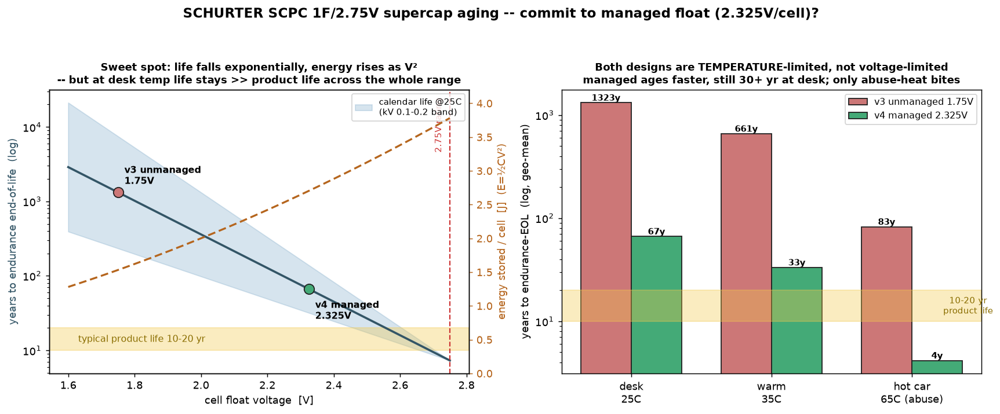
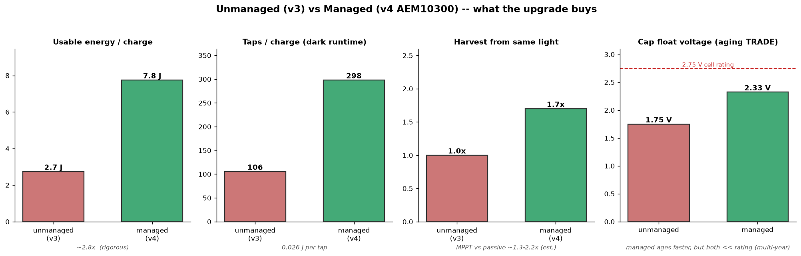

# SOLAR-GLOW · DRH — design notes & posterity

Durable engineering rationale, hard-won findings, and future-variant ideas, distilled from the v0/v1 planning docs (since retired).

**Authority order.** For the *current* design, the committed `solar-glow-drh-v4_0.kicad_pcb` /
`.kicad_sch` (v4.0, 2-layer) plus `README.md`'s current-revision table are ground truth; the 4-layer v2.3
(in git history) is the fallback design. This file is the *reasoning archive* — the
"why" and the "don't do that again" — with the **v3.0 deltas collected in §12**. Where an as-built
doc already owns a topic, this points at it rather than duplicating. (The `solar-glow-drh-v2-*` docs
are v2-era; their v3.0 deltas are banner-noted at their tops.)

---

## 1. The supercap land — the landmine (never reintroduce the old one)

**The v0/REV-J supercap land was WRONG — confirmed against physical parts.** It placed two
3.5 × 3.5 mm pads on a diagonal (36.5 × 16 pattern, centres ±16.5 / ±6.25) that land on the cell's
folded **end tabs**. Those tabs are coated, **non-solderable** mechanical locators, so a board built
to that land makes **zero electrical contact**. The root cause: the datasheet's single generic
"Soldering pads to Case WS10/13/17" diagram (`datasheets/SC1-SC4  SCHURTER 3-153-438  $15.48.pdf`) was misread as the WS17
land.

**The correct land (LOCKED).** The real solderable terminals are flat pads **under the body**:

- **P (positive) pad: 7.8 × 3.5 mm**
- **N (negative) pad: 12.2 × 3.5 mm** — the asymmetric widths are the **polarity key**
- Both centred on the cell axis at **±11 mm** from cell centre, ~1.5 mm in from each end, inside the
  39.0 × 17 mm body (SS17 can, per the datasheet drawing; the earlier 28.5 was the solar-cell length,
  mistakenly carried over -- both parts share the 17 mm width, which is what confused it).
- Protruding end tabs are finish-coated locators only — **not** solder pads.
- Placement rotations as built: SC1/SC4 → 90°, SC2/SC3 → 270°.

Part: a **hybrid tank** -- **SC1/SC3 = SCHURTER SCPC 3-153-440** (SS17 housing, 1.8 F, 2.75 V, ESR 30 mΩ,
1.7 mm, 39 mm land) and **SC2/SC4 = 3-153-438** (WS17 housing, 1.0 F, 2.75 V, ESR 40 mΩ, 1.7 mm, 28.5 mm
land). The larger SS17 cans go where the board has room, the WS17 where it is tight -- maximizing farads
in the irregular free area; both are the same 1.7 mm height, so the cavity budget is unaffected. The
unequal series stages (SC1/SC3 pair > SC2/SC4 pair) rely on the AEM10300 BAL pin holding MID at V/2. The
diagonal end-tab land **must never be reintroduced**.

---

## 2. Power-budget model (the framework + the one open gate)

The honest energy model, and the reason a bench bring-up gates any feature decision:

- **Continuous sustainable average draw ≤ harvest.** This — not the cap size — sets the brightness
  you can hold *forever*. Indoor harvest is roughly **0.1–0.5 mA at the rail** (the SM141K06x panel
  is ~185 mW at 1 sun; ordinary office light is 100–500× less).
- **The reserve buys excursions, not steady-state.** The ~21 J tank is how long/bright you can
  *exceed* harvest before it drains, and how long the glow rides through darkness. Recharge scales
  with it: ~21 J / ~1.6 mW ≈ **hours** to refill from empty on office light. A bigger tank = longer
  dark glow **and** longer cold-start. This is the "diminishing returns" point: a 2× bucket buffers
  dark ~2× longer but cold-starts ~2× slower — it **buffers a deficit, it does not cure** the
  harvest-vs-draw ratio.

| reserve | sustained draw it supports |
|---|---|
| v0: 2× WS10, ~150 mF, ~2.3 J | ≤ harvest; ~40–60 s breathing / ~10–15 min refill |
| v2.1-on: 2× SS17 + 2× WS17 (hybrid), ~1.3 F @ 5.5 V, ~21 J | ≤ harvest; minutes of breathing per charge; refill ~hours |

**Draw line items** (budget against harvest): accel ≈ **0.89 µA** (an ADI ADXL367, always-on at
100 Hz for this figure — the LIS2DH12 it replaced drew ~10 µA click-armed); light-sense divider
sub-µA; MCU sleep ≈ 0.65 µA (AVR-DD power-down, `PMODE=AUTO`). With the accel this low, dark
standby is **~2.7 µA** and no single part dominates. The LEDs are the only mA-scale load. See
`firmware/README.md` "Power notes" for the model.

> **Ballast caveat — re-derive the LED numbers for v2.1.** The LED-draw figures used throughout the
> old docs (≈5 mA for 4 LEDs full-on, ≈3 mA breathing, +1.25 mA per added LED) were computed at
> v0's **1 kΩ** ballast. The v2.1 BOM carries a **different ballast (150 Ω, flagged bench-pending)**,
> which at the same ~3.5 V rail raises per-LED current several-fold. The schematic leaves R1–R4 as a
> "LED ballast" placeholder, so the BOM is the source of truth for the value. **Re-derive draw and
> duty against the final ballast before trusting any duty-cycle percentage below.**

**Conclusion to test (at 1 kΩ; rescale for the final ballast):** continuous full breathing is *not*
sustainable on office light (~10× short). The natural indoor mode is **harvest-and-pulse (~6–10%
duty)** or **continuous dim (1 LED)**. Continuous full breathing needs a windowsill / daylight.

**#1 open empirical gate: measure real harvest.** Use the **VDD-proxy ADC** during bring-up (read
the rail against the internal reference — it charges in light, sags under load), then the real
light-sense divider once characterised. That single measurement sizes the whole feature envelope.

---

## 3. Glow design + the template concept

- **Glow keepout = one rectangle: x 14.95–35.85, y 40.8–47.0** (the DRH window, ≈20.9 × 6.2 mm).
  It **voids every copper layer** so bare FR4 passes diffuse light. Inside it: **tracks allowed, but
  NO vias, NO copper pour, NO footprints.** Plane voids must be deliberate so the window does not
  *fragment* the GND/VS planes — route supercap power **around** the band, never through it. LED
  anodes that sit inside the window trace out (north of y40.8 or south of y47) before via-ing to a
  plane.
- **Light couples into a stroke only within ~0.7 mm on thin FR4.** So the four Ø1.64 mm LED entry
  windows must **nestle a letter boundary** (snug against the strokes, not centred in a wide gap, or
  the LED is buried under copper and that window dies). The initials are track-widened
  (~0.12 → ~0.23, ~2.5 mm inter-letter gaps) to put a stroke edge at each fixed window.
- **The keepaway is a single letter-agnostic box → the design is a TEMPLATE.** Anyone can drop their
  own initials into the box and keep the four fixed centreline windows. (See
  `docs/solar-glow-drh-glow-window.png`.)
- **FR4 thickness drives the look.** Thinner FR4 spreads light *less* → a crisper, more edge-lit
  monogram (brightest at the strokes nearest each window); thicker diffuses more. **Validate the
  *look* on a coupon of the ACTUAL board thickness** — a coupon of a different thickness will not
  predict it. (v2.1 is 0.8 mm, the same as v0, so v0 predicted the v2.1 look — but **v3.0 is now 0.6 mm**,
  thinner than both, so v0 no longer predicts it and the appearance gate **re-opens**: the amber
  glow through 0.6 mm FR4 will read brighter/sharper at the strokes than the 0.8 mm coupons, so
  validate the *look* on a **0.6 mm** coupon before committing the diffuser/window.)
- **A diffuser film is the lever for full-letter evenness** — including lighting the D/R *bowls* —
  not more boundary LEDs.

---

## 4. Rear real-estate constraint + layout strategy

The glow is **central and rear-facing**, which is exactly where the four big cells want to sit:

- 4 × (28.5 × 17 mm) cells = **~43%** of the 50.8 × 88.9 board.
- Decorative silk *can* hide under the cells. The **LEDs are on the same rear side as the cells and
  cannot** — and the monogram tracks the LEDs. So a **protected central glow band (~17 mm)** is
  reserved through the centre, and the cells go around it. This is the first thing to settle in any
  re-spin and the real cost of four cells: the glow and the energy tank compete for the same rear
  centre.
- **Layout strategy: mirror the top supercap pair to the bottom** (reuses the proven footprint and
  its routing). Both pairs join the **same STO / MID / GND nets** (SC3 ∥ SC1, SC4 ∥ SC2) → **1 F @
  5.5 V on a single MID node**, so **the AEM10300 (U8) BAL pin balances the stack - no separate balancer** (v3 used U2 ALD910025, deleted in v4). The MID
  net runs the length of the board (cheap on planes) to tie both midpoints.
- **Mounting holes: four corners + four panel-corner (eight M2 total).** Inboard corner screws leave the ends of the 89 mm card
  unsupported — bad for a stiff metal back-plate. Keep M2 engagement at the corners.

**Routing hotspots (where a re-spin will be slow):** (1) the U1 QFN-28 escape — LDRV1–4, UPDI, SDA,
SCL, BTN, VSENSE all leave the same two edges; fan out in pin order, get the VDD/GND/EP plane vias in
first. (2) The MID bus around the glow void. (3) TC1 threaded under SC1. (4) The BTN-to-switch long
net + its layer change. Hand-polygon routing is fine for a prototype but **final copper sign-off
belongs in KiCad** (push-shove router, real thermal reliefs, exact mask expansion).

---

## 5. MCU selection — AVR64DD28 in 28-VQFN (the rationale)

> **2026-07-23 — superseded by the AVR-EA family swap (v4):** U1 is now **`AVR64EA28-E/STX`**. The
> DD-era rationale below stands as history (MVIO was the draw and was never used — SJ1 tied VDDIO2 to
> VS). The EA drops MVIO (pin 10 becomes PD0; SJ1 goes DNP, copper unchanged — 27/28 pads identical
> per Microchip's atdf pin maps) and adds what this board actually exploits now: differential 12-bit
> ADC + PGA + accumulation behind the 0.1%/25 ppm dividers, VREF ±2% (vs ±4%), 0.08 µA base
> power-down (vs 0.65 µA), 512 B EEPROM (vs 256 B). BOD ladder differs: no 2.45 V level → 2.60 V
> (BODLEVEL2). Firmware port scope + verification detail in `TODO.md`; datasheet in `datasheets/`.

- **Why this part:** **MVIO** (PORTC can run on a separate VDDIO2 — attractive for a mixed-voltage
  rail), **ADC** (light-sense), flexible **TCA/TCB/TCD** PWM (LED breathing / more LEDs), and
  **22 I/O** of headroom. *(As-built, the separate-voltage mode is **not** used: VS is now a regulated
  3.3 V rail from the U9 TPS7A0233 LDO (STO->VS) and VDDIO2 is tied to VS via SJ1, so the accel is protected by
  living on that regulated rail rather than by MVIO. Set the `SYSCFG1.MVSYSCFG` fuse to SINGLE -- see firmware README
  "Fuses".)*
- **LDO input filter (`FB1` / `STO_LDO`):** the AEM10300 charges STO with a >=10 MHz buck-boost
  DCDC, so STO carries switching ripple. Because the 28-pin part has **no AVDD** (the ADC runs off
  VDD/VS), analog cleanliness rides on the VS plane -- so a **0603 ferrite `FB1`** series-filters the
  U9 LDO **input**: `STO --FB1--> STO_LDO`, with `C22` (1 uF) as the filtered input cap on the island.
  U9's IN and EN both sit on `STO_LDO`; everything else stays on raw STO (the LED string, sense
  divider, program pads, tank caps). The ferrite passes DC (sub-ohm DCR) so the LDO never starves
  during LED bursts. *(FB1 originally sat with both pads shorted on STO -- non-functional; the
  `STO_LDO` split makes it a real series element. Board copper re-route is tracked in `TODO.md`.)*
- **Why VQFN, not SSOP-28:** height is irrelevant (U7 (FRAM) at 1.75 mm sets the cavity floor; the QFN is
  0.9 mm). The binding constraint is **X/Y footprint** — with the cells eating ~43% of the board, the
  QFN's ~16 mm² land beats SSOP-28's ~50 mm². Cost: hot-air + paste, EP reflowed to GND (same as the
  v0 QFN-20).
- **Power-down: 0.65 µA typ** (DS40002315 Table 38-5, `VREGCTRL.PMODE = AUTO`, 3 V/25 °C; +0.6 µA
  for a 32 kHz wake source). That is ~6× the old tinyAVR's 0.1 µA, but still sub-µA and swamped by
  supercap leakage (µA-class). **Firmware must-do: `PMODE = AUTO` for sleep -- FULL
  mode is 160 µA (250×) and would dominate the standby budget.**
- **No AVDD on the 28-pin:** the ADC runs off VDD, so analog cleanliness rides on the VS plane +
  decoupling. θJA ≈ 36.5 °C/W.
- **No PTC:** the AVR-DD has no hardware cap-touch — and a grounded metal back-plate would kill
  self-cap anyway — so **the actuator is the accelerometer tap**, not cap-touch.

(Candidates weighed and rejected: tinyAVR-1/-2 and ATtiny1627/3217 all match the old part on power
but are feature *trades* or lack MVIO; the AVR-DD was the only superset that solves the mixed-voltage
I²C cleanly.)

---

## 6. Firmware ideas worth remembering (beyond the bring-up doc)

All firmware-only, no board change:

- **LED hardware-PWM** for brightness / breathing / fade — big supercap-runtime savings at low duty.
- **CCL + EVSYS could run a glow/blink pattern while the CPU sleeps** — autonomous show, CPU stays
  in low power. *(As-built, the firmware instead IDLE-sleeps through the breath while TCA0 runs the
  PWM; a fully autonomous CCL + EVSYS glow remains a v-next idea.)*
- **RTC/PIT off the internal 32 kHz ULP** (no crystal) for periodic wake.
- **EEPROM "times-activated" counter** that survives a full supercap drain.
- **AC0 wake-on-light — *tried, non-viable on this part.*** The idea (AC0 comparator on the sense
  pin, `MUXNEG = DACREF` for the threshold, AC edge wakes from sleep) was checked against the
  datasheet during firmware bring-up and **doesn't work here**: the AC interrupt doesn't update
  with the peripheral clock stopped, and the AC isn't a Standby/Power-Down wake source, so it would
  never fire. Wake-on-light is instead the **RTC-timed ADC poll** (deep Power-Down), and instant
  pickup response comes from the **accelerometer interrupt**. See the corrected
  `solar-glow-drh-v2-hardware.md` §6 and `firmware/README.md`.
- **Internal temperature sensor** is available if wanted -- and by design it is the card's *only*
  thermal sensor (per-cap thermistors are unwarranted, and no spare pin is ADC-capable anyway; see §7
  "Supercap thermal").

Not useful on this part: ZCD (mains only), op-amps (the DD family lacks them), PTC cap-touch (see §5).

---

## 7. Enclosure — board-side rules to honor now (full detail in enclosure/README.md)

The Ti rear-shell is parked, but a few rules must be baked into the board so it never needs a
re-spin for the enclosure:

- **Grounded body → short risk.** In the enclosed variant, **drop the right-edge castellations**;
  land support pillars **only on GND pour**; keep a **die-cut Kapton (~0.05 mm)** blanket isolation
  layer in reserve if a later via audit on the rib lines finds an untented via.
- **General cavity 1.80 mm (cap-limited), plus a relief pocket** -- the four **1.70 mm
  supercaps** (SS17 + WS17, both 1.70 mm) set the general cavity (1.80 = cap + 0.10 mm air, toleranced 1.80 ±0.05). U7
  (MB85RC512TY FRAM, SOIC-8_3.9x4.9mm, 1.75 mm, on B.Cu) is now the single tallest populated part
  (U2/ALD910025 was deleted in v4). _(2026-07-23: superseded — U7 repackaged to the **0.90 mm DFN**
  LCC-8P-M05, so the 1.75 mm premise and the U7 relief pocket are stale; see the TODO geometry items.)_ The **local 0.05 mm relief pocket** (floor 0.95 mm there vs
  1.00 general) was located under U2, so **confirm U7's placement actually sits over the pocket**
  before relying on it; with the pocket it keeps 0.10 mm air while the general cavity stays 1.80. The
  0.9 mm QFN is irrelevant. ("Cells" elsewhere can mean the 1.2 mm **solar** cells on the front — a
  different part; don't conflate the two.)
- **No tall back-side parts.** The cavity budget assumes the tallest *populated* rear part is U7 (MB85RC512TY FRAM, SOIC-8) at
  1.75 mm. _(2026-07-23: stale — U7 is now the 0.90 mm DFN; recompute, the driver likely becomes
  U9 / the 0805 caps.)_ The v2-era 2.54 mm breakout headers (old JP1/JP2) are gone in v3.0; the reused-`JP1`
  bench strip + `TP1` are flat SMD pads (nothing to populate — a soldered header would stop the
  shell closing, same as ever). J1/TC2030 are flat back-side pads.
- **The button is the accel tap** (cap-touch dies behind a grounded plate; the old "snap-dome"
  actuator is superseded).
- **Shell, current approach (v3.0):** Ti-6Al-4V Grade 5, **fully 3-axis CNC-milled** (no etching),
  **bead-blast** finish, with a **1.00 mm floor** (0.95 under the U7/FRAM pocket), **no ribs** -- center
  support comes from a separate resin diffuser brace — and the window is backed by the brace's white
  diffuser face (the laser-marked reflector frame is dropped). Overall height
  3.55 mm; the four bosses sit on the **v3.0 hole pattern** (concentric with the r3.0 fillets),
  retained by eight M2 screws (four corner + four panel-corner, ~2.2 mm Ti engagement). The earlier 0.3 mm-skin / 7075-fallback /
  photochemical-etch plan is dropped. Full CAD, callouts, and fab notes are in `enclosure/README.md`.
- **Supercap thermal -- vulnerability, sensing, and why no per-cap thermistors.** The four
  EDLCs (SS17 + WS17) are the heat-sensitive parts (a 2.75 V cell derates in both working voltage and life with
  temperature; EDLC life roughly halves per ~10 °C, Arrhenius rule of thumb), so "how hot do the caps
  get, and must we measure them *there*?" is a fair question. Answer: **no dedicated per-cap
  thermistors.**
  - *The single internal sensor suffices.* There is no internal heat source of consequence -- the only
    dissipators are the U8 (AEM10300) active-harvest PMIC and the U9 (TPS7A0233) LDO -- both nanopower/low-milliwatt
    in indoor light, even lower than v3's deleted Q1/TLV3011 shunt clamp -- and the brief
    LED breaths -- so in the failure mode that actually matters (hot car / sun-soak) the whole 50.8 x 88.9 mm
    card floats to ambient and sits near-isothermal. Across 0.6 mm FR4 with a thermally-coupled Ti shell,
    any MCU-to-cap gradient collapses well within the max-temp logging timescale. The cap centers are
    25-40 mm from U1 (SC1 24.7, SC3 31.7, SC2 35.2, SC4 40.4 mm), but the long cap bodies reach within a
    few mm of the MCU at their near ends. A max-temp / derating flag needs only coarse accuracy (±5 °C),
    which the AVR internal sensor (§6) meets after a one-point cal.
  - *And an NTC has nowhere to land.* No spare pin is ADC-capable -- the free GPIO (PA4 / PC0 / PC1) are
    not on PORT D/E/F, the only ADC-input ports on this AVR-Dx -- so an analog thermistor cannot be added
    without a re-spin. If a future rev ever needs a genuine per-cap reading, add **one I²C temp sensor**
    on the existing PC2/PC3 bus near the cap cluster, not analog NTCs. Either path: bench-confirm the
    isothermal assumption once (two thermocouples -- a cap can vs the MCU die, under a heat-soak) before
    trusting the single-sensor proxy in firmware.
- **Optional supercap-to-shell thermal-interface material (TIM).** A compliant gap-filler could bridge
  each supercap can to the Ti shell floor across the ~0.10 mm cavity air gap (the caps hang 1.70 mm off
  the B-side into the 1.80 mm cavity; the brace's H-band and edge rails deliberately clear the cap bays,
  so the space directly behind each can is air to the shell floor, *not* resin -- so a TIM there couples
  the cap to the shell, not to the inert brace). A nice-to-have, not a requirement; if ever added, spec
  it against these traps:
  - *Compliant gap-filler, NOT a fixed-thickness pad.* The gap is ~0.10 mm nominal and **0.05-0.15 mm**
    across the cavity tolerance alone (1.80 ±0.05 over the 1.70 mm-**max** WS17 can; `enclosure/README.md`
    C1), and opens further if a production can sits below its datasheet-max height. A hard 0.10 mm pad
    would either float on a tall gap (no contact, useless) or jack the board off its brace/lip seat at
    z2.80 on a tight one. Use a conformal filler that spans the range at low force.
  - *Electrically insulating -- mandatory.* The Ti body is GND (see the "grounded body → short risk" rule
    above); a live cap can shorted to it through a conductive TIM is a dead short. Same reflex as the
    reserved Kapton blanket. **(Superseded -- see the Resolution below: the WS17 can top bench-tested
    non-conductive, so a conductive TIM on the can top is safe and the best-thermal option is now open.)**
  - *Low compression force + serviceable.* Do not preload the board off its z2.80 rest, and keep it
    re-applyable -- the shell opens on eight M2 screws, so a cured RTV is a teardown hazard where a
    re-usable gap pad/putty is not.
  - *What it buys, and what it does not.* Ti-6Al-4V is a poor conductor (~6.7 W/m·K, ~1/20th of aluminium)
    but a real thermal **mass**: the TIM buffers transients (a warm hand, a sun-driven clamp burst) into
    the shell and homogenizes the card -- which usefully tightens the cap-to-internal-sensor coupling and
    makes the single-sensor proxy above a better one. It does **not** lower steady-state temperature under
    sustained hot ambient: there the shell is the heat *ingress*, not a sink, so coupling to it cannot cool
    the caps. Treat it as a transient buffer + sensing aid held in reserve (like the Kapton), not a hot-car
    survival fix -- survival stays the cap's own temperature rating and "don't bake the card."
- **Resolution (2026-07-12) -- TIM adopted: conductive graphite, per-unit fit.** Two of the traps above
  are retired -- one by a bench test, one by the build reality -- so the TIM moves from "held in reserve"
  to the v4 plan, as the thermal-abatement lever (the supercap's 85 °C is the fixed ceiling; the accel is
  a second immovable 85 °C part; no better cap or accel exists -- so managing the heat is the only move).
  - *Insulating is no longer mandatory -- conductive graphite is now the pick.* Bench-tested the actual
    WS17 can: its **top half is non-conductive** (looks like bare foil, reads open to every terminal), so
    a conductive TIM on the can top cannot short -- it only extends the GND shell onto an isolated
    surface. That frees the best-thermal material: **t-Global T62-1 graphite**
    (`datasheets/TIM (SC1-SC4)  t-Global T62-1 graphite  0.16mm.pdf`) -- **15 W/m·K through-plane** and,
    the real prize, **400 W/m·K in-plane**. The in-plane number is the lever: it lets the poor-conductor
    Ti shell (~6.7 W/m·K) still spread heat laterally across the cap face, which is exactly the
    "consolidate the mass / mitigate stagnation" job. (Through-plane k is *not* the lever -- the thin pad
    and the Ti are the series limits -- so a 15 W/m·K pad is not "3x" a 5 W/m·K one here; the graphite is
    chosen for its lateral spread + low contact resistance, not its Z number.) *Placement rule:* pad on
    the non-conductive can top and the GND shell only, clear of the cap terminals / conductive lower body.
  - *Variant: **T62-1**, never T62-2 (the PET trap).* The family: raw **T62** (0.13 mm, 20 W/m·K, no
    adhesive), **T62-1** (0.16 mm, 15 W/m·K, **graphite + one-side adhesive, no carrier**), **T62-2**
    (0.2 mm, 5 W/m·K, **PET | graphite | adhesive**). Use **T62-1**: T62-2's permanent PET layer sits in
    the through-path (PET ~0.2 W/m·K adds as much series resistance as the whole graphite bulk, or more)
    and quietly throttles the cap->shell coupling the TIM exists for. T62-1's integrated thin PSA also
    beats "raw T62 + a separate double-sided thermal tape," which just re-introduces a thicker, more
    resistive adhesive layer plus an extra interface. *Orientation:* bare graphite face to the **cap**
    (clean heat entry), adhesive face to the **Ti shell** (already the Ti-limited side, so the thin PSA
    costs least there). Cut ~14 x 30 mm strips from a 150 mm sheet (`T62-1-150-150-0.16`).
  - *"Compliant filler, not a fixed pad" is met by per-unit fit, not by the material.* Graphite is a firm
    fixed-thickness sheet, which fights the 0.05-0.15 mm gap *spread* in volume production -- but this is a
    **one-or-two-off build**, so the fix is to measure the real can-to-shell gap on the assembled board
    and pick the graphite thickness to match (T62 family **0.13 / 0.16 / 0.2 mm**, custom on request),
    optionally recessed in a shallow milled pocket for a light, defined contact. Per-unit fitting
    sidesteps the tolerance-range trap that would otherwise force a lower-k conformal filler onto a
    volume design.
  - *Pocket plan (shell side; does not touch the resin brace).* The brace deliberately clears the cap
    bays, so a shell-floor pocket over the caps interferes with nothing. Plan: **one "pane" pocket per
    cap-pair** (2 total, simpler to machine than 4 per-can), each **laterally oversized ~0.5-1 mm per
    side** beyond the pad so it drops in without binding on the walls. **Depth D approximately = pad
    thickness - measured gap** (0.16 - ~0.10 -> **~0.05-0.06 mm** at the nominal gap; the range is
    0.01-0.11 mm across the 0.05-0.15 mm gap tolerance). **Bias slightly deep on purpose:** the two
    error modes are asymmetric -- too shallow **jacks the board off its z2.80 seat** (unrecoverable
    without re-machining titanium), while too deep just **floats the pad**, which is recoverable
    *additively* -- shim the pocket floor with **copper-foil tape** (~0.05-0.07 mm/layer, and thermally
    transparent at ~400 W/m·K, so it costs the path nothing but its own thin PSA) or step up the pad
    thickness. So mill ~0.03-0.05 mm **deeper** than the just-fill depth and shim up to a light contact.
    The copper shim rides the shell/adhesive side (on the GND Ti floor, under the graphite) -- no short,
    since the cap top is non-conductive. A 0.05-0.10 mm pocket is negligible against the ~1 mm Ti floor.
    *Caveat for the single pane:* it assumes the two caps in a pair sit coplanar; measure both gaps, and
    if they differ by more than ~0.02 mm, shim the low one or fall back to per-can pockets. Final depth
    + the `enclosure/README.md` pocket spec await the measured gap.
  - *Everything else above still binds:* low preload (do not jack the board off its z2.80 seat),
    serviceable (a dry, re-appliable pad -- no cured RTV), and the honest scope (a transient buffer +
    sensing aid, not a hot-car steady-state cure). **Open input:** the measured can-to-shell gap on the
    built unit, which sets the final pad thickness + pocket depth.

---

## 8. Fab / assembly craft

- **Via-in-pad on small, normally-soldered parts will wick solder** — VIPPO (resin-fill + cap) or
  dog-bone them. From the v0/v1 layout, the genuine at-risk set beyond the existing VIPPO list
  (U2, U4, Q1, TC1.1/2/3, JP2, D9.A, R2.2) was **C6, R1, R3, R4, R5**. Large pads / ICs / EP / flooded
  solder-bridge pads (SB/SJ/SW) / robust header joints (JP/J1) reflow fine and need no fill.
  **Re-confirm the actual in-pad-via set against the committed KiCad board** — the old list was tied
  to the generator's dog-bone routine, not the KiCad layout. **v3.0 resolves this: all in-pad vias are
  resin-filled + copper-capped (POFV) board-wide** (§12), so the point is moot.
- **TC2030 (Tag-Connect) footprint rules:** use the **official KiCad `Tag-Connect_TC2030-IDC-FP`**
  (Connectors.pretty; board-side == TC2030-MCP-FP) — do **not** hand-draw. 6 contact pads
  Ø0.7874 mm at 1.27 mm pitch (pins 1=UPDI, 2=STO, 3=GND, 4–6 NC), F.Cu+F.Mask, **no paste**; 4
  leg-latch holes Ø2.3749 mm NPTH (the hands-free latch); 3 alignment holes Ø0.9906 mm NPTH. **Contact
  pads must stay SOLID for the spring pins** (no hole > 0.008") → VIPPO TC1.1/2/3, or plate the 3
  alignment holes and route STO/GND to them to keep the pads hole-free. Keep-out: no tracks/vias in the
  shaded area, no signal within 0.508 mm of a contact pad. **DNL** in the BOM (pogo connector, never
  soldered).
- **Production Gerbers come from KiCad's own fabrication-outputs exporter**, not from any preview
  emitter. A geometry-derived preview is great for review but lacks thermal-relief spokes, exact mask
  expansion, and real NFPR.

---

## 9. Design evolution (v0 → v1 plan → v2.1 as-built)

Recorded so the history is legible and the dead branches stay dead:

| topic | v0 (REV J) | v1 plan | **v2.1 as-built** |
|---|---|---|---|
| Stackup | 2-layer, 0.8 mm | 4-layer, 0.4 mm | **6-layer, 0.8 mm** (L1 sig · L2 GND · L3–4 sig · L5 VS · L6 sig) |
| Storage | 2× WS10, ~2.3 J | 4× WS17 2P2S, ~15 J | **2× SS17 + 2× WS17 hybrid, 2S2P, ~1.3 F @ 5.5 V, ~21 J** |
| Accel rail handling | n/a | planned LDO (TPS7A02) for the 3.6 V-max accel | **TLV3011 comparator+ref shunt clamp holds VS ≤ 3.60 V worst-case** (no LDO); supersedes the TLV431 divider (Iref over-voltage) |
| Accelerometer | none | BMA400 / LIS2DW12 (candidates) | **ADXL367, I²C addr 0x1D** (swapped from LIS2DH12 on backorder; 0.89 µA vs ~10 µA) |
| Button | snap-dome / cap-touch | dome (cap-touch expendable) | **accel tap-wake** |
| Solar | SM141K06L (1.8 mm) | SM141K06L | **SM141K06TF (1.2 mm)** — electrically identical, thinner |
| LED ballast | 1 kΩ | 1 kΩ | **150 Ω per BOM (bench-pending)** — rescale the energy budget (§2) |
| VSENSE pin | — | PA5, later proposed PC3 | **PD2 (AIN2 + AINP0)** |
| LED timer | TCA0 | TCA0, briefly proposed TCD0 | **TCA0 split, WO0–WO3 = PA0–PA3** |

v0 also carried a dual-coin-cell charging option (BT1/BT2 + diodes); **dropped in v2.1** (solar-only).

**Since v2.1** (placements, BOM, and the glow window are unchanged throughout — only the stackup and
the LDRV fan moved):

| rev | stackup | note |
|---|---|---|
| v2.2 | 6-layer | intermediate |
| **v2.3** | **4-layer** — F · In1 GND · In2 VS · B | **fallback** design (git history) |
| **v3.0** | **2-layer** - F · B | **final unmanaged-solar rev (superseded by v4.0 managed-solar)** - GND = full-board B.Cu pour, VS = routed B mesh (the 4→2 conversion of v2.3). See §12. |

---

## 10. Two corrections worth keeping explicit

- **The "farad" energy myth (and the hybrid).** Quote energy, not farads. The tank is a **hybrid**:
  SC1/SC3 are 1.8 F (SS17), SC2/SC4 are 1.0 F (WS17), all 2.75 V, wired 2S2P. All-parallel at 2.75 V they
  would read 5.6 F, but the 5.5 V rail needs two-in-series, so the pack is **~1.3 F *effective* at 5.5 V**.
  What is fixed is **energy** = the sum of the cells: `2 × ½·1.8·2.75² + 2 × ½·1.0·2.75² ≈` **21 J** (each
  cell held at 2.75 V by the AEM midpoint balancer -- without it the smaller WS pair would take more than
  half the rail and over-volt). Farads at 2.75 V vs 5.5 V are not comparable joules.
- **Pin authority — one source only.** Earlier drafts of this design carried two *different* pin
  assignments (VSENSE on PA5 with BTN on PA7; and the LEDs on PA4–PA7 / TCD0 with VSENSE on PC3)
  — **neither matches the board.** The committed `solar-glow-drh-v4_0.kicad_sch` and
  `solar-glow-drh-v2-hardware.md` are the only authoritative pin reference: LEDs PA0–PA3 / TCA0,
  VSENSE PD2, BTN PA5, I²C PC2/PC3, accel INT PF0/PF1. If anything else disagrees, it is wrong. **v3.0 permuted which LDRV net lands on which of PA0–PA3** (the fan untangle) — the pins are still PA0–PA3/TCA0, but the LDRV↔pin↔LED map changed; see §12 and `firmware/README.md`.

---

## 11. Cost reality

The supercaps dominate the BOM. The WS17 (3-153-438, 1 F) runs ~€6.77 in volume / ~$8-15 per cell; the
two SS17 (3-153-440, 1.8 F) cells are the pricier pair (confirm live price). The four cells push the
supercaps to **two-thirds or more** of the per-board cost -- the single dominant line, and the reason
the hybrid 4-cell array is a deliberate reroute rather than a casual upgrade.

---

## 12. v3.0 - the 2-layer redesign (frozen - final unmanaged-solar revision, superseded by v4.0)

v3.0 re-implements v2.3's 4-layer board on **two layers** (F / B) — same 50.80 × 88.90 card, r3.0
corners, and the **same BOM**. It is now frozen as the final unmanaged-solar revision (superseded by the v4.0 managed-solar redesign - see the 2026-07-15 AEM10300 addendum); **v2.3 (4-layer) is the fallback design, in git history.**

- **GND and VS come off the inner planes.** In1 (GND plane) becomes a **full-board B.Cu pour**
  (`GND_B` zone) plus stitch straps; In2 (VS plane) becomes a **routed mesh on B** (w0.4 trunk).
  Routing added: ~334 segments, **83 vias** (uniform 0.6/0.3).
- **LDRV fan untangle — the pin-map change firmware must track.** Four U1-proximal LDRV labels were
  permuted so the schematic matches the as-routed copper. As-routed:

  | U1 pin | port | TCA0 | net | LED |
  |---|---|---|---|---|
  | 1 | PA3 | WO3 | LDRV1 | D2 |
  | 28 | PA2 | WO2 | LDRV2 | D3 |
  | 27 | PA1 | WO1 | LDRV3 | D4 |
  | 26 | PA0 | WO0 | LDRV4 | D5 |

  (v2.3 was the reverse at the U1 end: pin 26 = LDRV1 … pin 1 = LDRV4.) The **ballast-side labels are
  untouched** — LDRVn still drives Dn+1 through ballast Rn; only the U1-pin end moved. `led.c`'s pin
  table must match this. The port range PA0–PA3 / TCA0 split (§10) is unchanged; the LED *placements*
  (D2–D5) and reverse-mount orientation are unchanged.
- **Mounting holes symmetrized.** MH1–4 moved concentric with the r3.0 corner fillets — MH1 (3.0,
  85.9), MH2 (47.8, 85.9), MH3 (3.0, 3.0), MH4 (47.8, 3.0); pad Ø3.6, drill 2.2, GND; pitch **44.80 ×
  82.90** (was 43.80 × 82.90). The enclosure was aligned to match (`enclosure/README.md`). The **v2.3
  fallback still carries the old 3.5 mm x-inset holes** — only relevant if v2.3 is ever fabbed (its
  v2.1 enclosure matches the old positions as-is; backport is a carried, undecided question).
- **Selective hard gold + plating bus.** Hard electrolytic gold on the DRH field + letters rim, the
  perimeter frame (inset 1.25 mm, w0.5), and 6 edge ornaments. The frame is the plating-bus backbone;
  6 ornament ties + a field→frame east L-tie feed it; **two 0.25 mm stubs cross Edge.Cuts at x=25.4
  (N/S)** to the panel rail and are milled at depanel. The gold set is **GND-referenced** (the four M2
  GND pads overlap the frame at the corners) — consistent with the grounded Ti shell, not floating
  copper. PCBWay special-request text is in `PCB/README.md`.
- **Two real defects found and fixed** in the final audit: an **NFC_EN 0.27 mm open at U6.3** (the
  4→2 conversion dropped an inner link; the kept B stub ended short of the pad — bridged
  (4.7,33.588)→(5.25,33.588) w0.25), and a **VS feed crossing U6's true bottom-row pads** (ripped and
  re-jogged through the inter-row gap at y32.2). Both had been *masked* by a wrong back-side pad model
  — see the trap below.
- **KiCad-2026 pad convention — the trap that hid the defects.** Nets are **name-only** (no numeric
  net table; old regex breaks). Back-side footprint pad position = `fp_at + Rot(−fp_rot)·pad_offset`,
  and the pad's rect angle is written footprint-composed (use it as-is). Getting this wrong axis-swaps
  14 pads, invents phantom shorts, and masks real opens. And a corollary already burned once on this
  project: **ERC/DRC cannot catch a wrong symbol pin-number-to-function mapping** — only a datasheet
  cross-check does.
- **Face-copper verdict — open, Devin's aesthetic call.** The 2-layer face carries ~333 mm of signal
  copper + via rings in the visible band. Under matte-black mask with resin-filled (tented) vias the
  rings mostly vanish and traces read as faint relief, but it is well past the old "10–20 discreet
  jumpers" guess. Options: **ship v3.0** (treat the trace texture as intentional circuit-aesthetic) or
  **fall back to the clean-face 4-layer v2.3**.
- **DRC intentional exceptions** (do-not-fix): LA↔LB coil short (the antenna); MH↔gold-frame contact
  ×4 (GND tie); the 2 plating stubs crossing Edge.Cuts; the illumination copper inside the glow window
  (D2–D5 pads, K2–K5 diagonals, ANODE stubs/vias); LDRV4 via (35.5, 47.55) rim graze; LB bridge via
  (42.9, 38); east L-tie crossing the coil on F. Plus benign `lib_footprint_issues` + the reserved
  `BTN` `track_dangling`.
- **Carried bench items** (not resolved here): NFC coil L + C9 trim (~100 pF; now includes the F L-tie
  crossing and the Ti-shell proximity); scope PA6/FD on a real tap with VCC gated off; **NFC_EN pulldown — resolved this session (R14; see the addendum below)**; LED PWM INVEN polarity in `led.c`; `twi.c` presence; plastic dry-fit;
  **Ti-shell-behind-coil L/Q** — enclosure-relevant: metal behind the NFC coil pulls its inductance
  and Q, and could force a local change over the coil area if it detunes (measurement, not a CAD
  change yet).

## Teardrops enabled + post-teardrop audit (2026-07-02)

- **Settings** (`.kicad_pro`): all teardrop targets on — pads, vias, and track-to-track
  (`td_ontrackend: true`) — with curved edges (`td_curve_segcount: 1` on all three shape targets).
  Size defaults kept: length ratio 0.5 / max 1.0 mm, width ratio 1.0 / max 2.0 mm, filter 0.9.
  Schema verified against kicad-source-mirror 10.0 `board_design_settings.cpp` (flags live in the
  project JSON, not the board file).
- **Generated:** 247 teardrop zones = 236 pad/via + 11 track-end, curved, fills stored in the board
  (file ~613 KB → 1.23 MB). KiCad 10 writes them as `(zone … (attr (teardrop (type …))))`.
- **Same commit, Devin's cleanup:** 45°-corner beautification (FD, LDRV3/4, SDA, VS, TINY elbows;
  28 segments removed / 12 added) and deletion of redundant GND scraps **including both former
  bridge straps** — (36.5, 47.55→49.05) and the (12.45, 16.54) pair with the TC1.3 stub. Independent
  union-graph audit: **GND is a single component on both the pre- and post-cleanup boards**, so the
  straps had become redundant after the round-3 rework (TC1.3 rides its solid zone connect). No
  starved-thermal recurrence.
- **Geometric ledger** (independent Shapely engine, identical code on both boards): pairs < 0.1524 mm
  went 100 → 103; below the 0.126 hard floor there is exactly one item on both boards — the
  intentional LA↔LB coil junction. Deltas: +3 marginal from the FD 45° reroute (FD↔BTN / LDRV1 /
  PA4), −3 removed with the GND scraps (GND↔UPDI, GND↔VS, SCL↔SDA), +4 teardrop-involved (below).
- **Teardrop marginals KiCad cannot see** — KiCad's DRC does not apply clearance rules to teardrop
  zones, so these exist only in this ledger; all PCBWay-legal, no action:
  CLREF-teardrop ↔ VS pad 0.141 @(46.0, 72.0); NFC_EN-teardrop ↔ PC1 pad 0.143 @(7.5, 42.1);
  SCL-teardrop ↔ VDDIO2 pad 0.145 @(9.1, 42.9); UPDI-teardrop ↔ GND pad 0.150 @(10.0, 36.6).
- **DRC row-count jitter caveat:** on the long parallel 0.127 corridors (the SDA/VIN/VS west bus)
  KiCad enumerates one row per segment-pair at minimum distance, and the count oscillates between
  runs and engines on physically identical geometry (CI 50 → GUI 64 → CI 61 clearance rows). Judge
  the marginal ledger by the geometric pair scan, not by row counts.
- **CI on the teardrop board: green.** Errors 0 (+2 excluded plating stubs), warnings 61
  (+1 excluded coil crossing).
- Parser conventions used for the audit are the ones in the "KiCad-2026 pad convention" trap above,
  re-verified this session against the 10.0 parser and `pad.cpp`: pad `(at x y angle)` angle is
  absolute (board frame); position is footprint-relative.

## R14 patch — NFC_EN pulldown + NPTH cleanup (2026-07-02)

- **R14 (1 MΩ, 0402)** added at **(4.39, 29.4)** rot 0, in the north pocket between the MID bus and
  U6's top pad row: pad 1 = `NFC_EN` (3.88, 29.4), pad 2 = `GND` (4.9, 29.4) dropping straight into
  the existing GND via at (4.9, 28.5). `NFC_EN` reaches the U6-side stub through a **new via pair**
  (3.88, 30.6) → F.Cu → (3.88, 33.35); the F crossing threads west of SCL's F column. Why the hop:
  the B-side **VS wall at y = 32.2** (x 3.35 → 7.29, w 0.4) seals the pocket off from the stub, and
  the west GND corridor to J1.3 is fenced by the J1.2 VS feed at y 38.4 and a VS via at (3.6, 40.8) —
  two earlier placements died on exactly those two features.
- **Ø 0.89 mm NPTH at (37.9, 75.4) deleted** — undocumented, under SC4's body, claimed by nothing in
  the repo. One git revert away if it turns out to have had a purpose.
- **Verification** (same engine as the electrical sift, true pad shapes, hole-decoded pour): all nets
  single-component (`NFC_EN` = U1.5 + U6.3 + R14.1); shorts = the intentional LA/LB junction + three
  new-copper-vs-stale-pour overlaps that the zone refill resolves; **min new-copper clearance vs
  foreign non-pour = 0.2197 mm** (via F-ring → SCL) — every new gap ≥ 0.22, so **zero new
  marginal-ledger entries** and the DRC warning count should not move. Counts: 564 → 569 segments,
  87 → 89 vias, 54 → 55 footprints.
- **Schematic:** R14 cloned in the per-ref lib-symbol idiom, placed off-sheet-right at
  (685.8, 69.85) with its own `NFC_EN` / `GND` global labels — reposition freely. If you ever re-run
  update-from-schematic, add R14 to the local `solarglow` footprint lib first (the repo carries no
  `.pretty`; footprints live embedded in the board file).
- **Handoff ritual:** open the board → **refill zones (B.Cu)** → run DRC (expect the same 0 err /
  ~61 warn) → **Tools → Add Teardrops** so R14 *and the reworked U6 area* get their teardrops → commit. The
  U6 pin-map check is **closed** — see the U6 pin-map addendum below.

---

## Addendum — U6 pin-map defect + fix (2026-07-02)

**The check that had been open since U6 landed is closed, and it caught a fabrication-fatal
defect.** The citation of record is TI **SLVSD76C** (`datasheets/U6  TPS22918DBVR  $0.55.pdf` —
TPS22918 Rev C, the doc for the ordered `TPS22918DBVR`). The **SLVSCZ8B** -Q1 automotive twin has an
identical pin table and every §6.5 number (compared and verified at the time); it is not kept in the repo. The DBV pin table reads: **1 = VIN, 2 = GND, 3 = ON, 4 = CT, 5 = QOD, 6 = VOUT.** The board's
symbol had **1 = VOUT, 2 = QOD, 5 = GND, 6 = VIN** — VIN/VOUT and GND/QOD transposed across
the package; only ON (3) and CT (4) were right. As routed, the chip would have had **no
ground** and VS driven into VOUT. Two design choices survived the check unchanged: **CT may
float** ("Can be left floating") and **QOD tied to VOUT** is one of TI's three sanctioned QOD
configs (discharge through the internal R_PD, 25 Ω typ at 3.3 V).

**Fix strategy — renet, don't move.** U6 stays at (6.3425, 32.2) rot 90 (CPL unchanged). The
four power pads were **reassigned to TI truth** (pad 1 → `VS`/VIN_1, pad 2 → `GND`/GND_2,
pad 5 → `VNFC`/QOD_5, pad 6 → `VNFC`/VOUT_6; pads 3/4 untouched), and the **schematic lib
pins were renumbered 1↔6, 2↔5** — the lib pin *names* were correct all along, only their
numbers were mirrored, so no wire or label moved.

**Copper ops.** Deleted: the pad-1↔2 pair seg and the old VNFC diagonal (both fed what is now
VIN), the old VS drop into pad 6, the old GND stub off pad 5, and their 4 teardrop zones.
Added: `a1` VS wall-drop south into pad 1 (w 0.4); `a2` QOD→VOUT strap across pads 5–6
(w 0.25) — the required strap falls exactly on the old pair-seg's mirror; `a3'` VNFC re-anchor
pad 6 → the existing elbow at (9.47, 30.85) (w 0.15, entering *below* the elbow top to keep
0.35 to the VIN diagonal instead of reproducing the ledgered 0.127); `a4`+`V1` GND stub south
from pad 2 to a via at (6.343, 34.5); an F-side GND run west — (9.05, 34.5) → (9.05, 30.2) →
(4.9, 30.2) — threading the free F room between the SCL horizontal and the UPDI column-fence;
and `V2''` at (4.9, 29.9), whose back-side ring lands **directly on R14.2** (the R14 GND
drop), tying U6.2 into the main ground. Eastward routes were exhaustively ruled out: the UPDI
F column (x ≈ 9.94, y 20.4–35.9) fences F, and the VIN elbow + SC1.N pad seal every B lane.

**Verification (geometry engine, post-fix):** every net single-component (GND includes
U6.2 → V1 → F → V2'' → R14.2; VNFC = pads 5+6 + strap + re-anchor + the original artery to
U5); shorts = the intentional LA/LB junction + six stale-pour overlaps that the B.Cu refill
re-carves; **minimum changed-copper clearance 0.200 mm** (the F run vs the SCL via ring —
everything else ≥ 0.275). Counts now: **574 segments, 91 vias, 249 zones** (243 teardrops).

**Datasheet numbers worth keeping** (SLVSD76C §6.5, identical in SLVSCZ8B, V_IN = 3.3 V): I_SD 0.5 µA typ / 3.5 µA
max — this is U6's **standing draw on VS while NFC is off**, the price of the gate (vs the
~195 µA of U5 it removes); I_Q 8.3 µA typ while on (only during I²C windows); R_PD 25 Ω typ;
ON threshold compatible with 1 V+ GPIO, so PA7 at any plausible VS is fine.

**Handoff:** refill zones (B.Cu) → DRC (the deleted teardrops may surface a few new cosmetic
"dangling" notes in the U6 window — expected) → **Tools → Add Teardrops** (covers R14 *and*
the U6 rework) → commit board + schematic together (the sch pin renumber and the pad renet
must land in the same commit or update-from-schematic will fight you).

---

## Addendum (2026-07-02) — bench pad strip (TP1 + JP1) and the enclosure lip

- **Why:** TC1 dies for bench use once PV1 is glued (the TC2030 legs land under the panel), and
  there was no clean power-injection or I²C tap point. Wanted: baked-in bench access.
- **First placement failed on the shell.** A 4-pad THT column in the SC1|SC2 canyon (x 25.4)
  collided with the enclosure's cap-gap **rib** (x 24.9–25.9, full cavity height): pins/pads
  directly under grounded Ti. Scrapped before commit.
- **Shipped placement:** five bare **SMD** pads (1.7 mm sq, 2.54 pitch, B side) at **x 48.4** in
  the SC2-body-to-edge margin -- `TP1` VIN (y 12.0), `JP1` 1–4 = GND/STO/SCL/SDA (y 14.54–22.16).
  VIN/VS are local B spurs off the VIN trunk and D1.K; SDA taps a new via at (33.4, 30.78), SCL
  T's off its existing via at (34.37, 35.28); both run east on F at y 29.55/29.1 through the
  channel above the coil's north fence (LA's B turns start at y 32.05), landing on the pads
  through **via-in-pad** on `JP1.3`/`JP1.4` (bare probe pads — via-in-pad is free there).
  Verified: all nets single-component, 0 hard shorts, min changed-copper clearance 0.200; DRC 0.
- **The lip finding:** the shell's perimeter lip was 1.50 mm — inner edge at 50.75 − 1.50 =
  **x 49.25, exactly the strip's east copper edge (0.00 nominal)**. Guaranteed contact once
  pocket (ISO 2768-m) + board-routing (±0.2) tolerances stack. **Fix: lip_w 1.50 → 1.00** →
  inner edge 49.75, **0.50 mm clearance**; floor-span margin absorbs it (the 0.75 floor is 2.5×
  the analyzed 0.55), and the mirrored back frame thins 1.5 → 1.0 (the rear art field grows
  0.5 mm/side). Generator + STEP/STL regenerated and committed; solids valid at 143/144 faces.
- **Housekeeping:** the `JP1` designator is *reused* (the v2-era JP1/JP2 2.54 mm headers are
  gone; JP2 has no successor). JP1/TP1 are bare pads — **no BOM part; mark both DNP in the CPL**
  alongside SC1–SC4 / PV1–PV2 / J1 / C9. Pinout + bench ritual live in
  `solar-glow-drh-v2-hardware.md`; fab-facing notes in `PCB/README.md`.

## Addendum (2026-07-12) -- v4 idea: I²C FRAM for archival / high-rate telemetry

Not a v3.0 change (the board is electrically frozen); logged here as a **v4 consideration**.

- **The limit today.** v3.0 logs telemetry (tap count / sun-hours / max-temp) to the AVR's
  **internal EEPROM**: 256 B, **100k** write cycles, **40 yr retention @ 55 °C** (DS40002315).
  Two ceilings bite for a keepsake: the tap counter can approach 100k over a very active life
  (`firmware/README.md`), and EEPROM retention derates ~2x per 10 °C -- so a card baked on a hot
  dashboard, the exact abuse the temp-logger watches for, can fall well short of 40 yr. A third:
  EEPROM write energy (charge-pump, ~4-13 ms) is *why* the sun diary throttles to one write per
  banked hour and max-temp writes only on a new max.
- **Why FRAM clears all three.** A ferroelectric-RAM part (Infineon FM24V / Fujitsu MB85RC class)
  gives ~10^12-10^14 write endurance (effectively unlimited), **>100 yr** retention that degrades
  far less when hot, and **µs bus-speed writes with no charge pump** (orders of magnitude less
  energy). That would allow a rolling "black box" -- per-brownout, per-tap timestamp, per-second
  sun -- at negligible energy, which the current budget flatly forbids.
- **Net power: an *enabler*, not a reducer.** FRAM does NOT lower the card's baseline draw. The
  internal EEPROM already costs **zero** standby; an added FRAM only *ties* that, and only if
  power-gated (ungated it *adds* µA-class standby to the ~2.7 µA budget). Its energy edge is
  *per-write* (µs bus-speed vs the EEPROM's multi-ms charge-pump write, ~8x less) and only matters
  at high write **volume** -- i.e. the dense-logging case above. Keep the sparse telemetry and FRAM
  saves nothing; log a per-event black box and FRAM is what keeps it inside the budget, where the
  EEPROM's write energy + 100k endurance make it impossible. (A free firmware lever exists first:
  sleep the MCU through the ~few-ms EEPROM write instead of busy-waiting -- skipped today only
  because the writes are so rare.)
- **The v4 hook.** A hard, **I²C-shared, persistent store the MCU owns and a reader can reach** --
  the card as a keepsake that permanently records its own life. The bus already exists: SDA/SCL =
  PC2/PC3, broken out at `JP1.3/JP1.4`.
- **How it fits, cheaply.** An I²C FRAM shares that host bus at a new 7-bit address -- no clash
  with the accel (0x1D) or the NFC tag (0x55), **no new signal pins**. **Power-gate it** like the
  NFC tag (own load switch on a spare GPIO -- PA4 / PC0 / PC1 are free) so its µs writes cost ~0
  standby; the fast write makes gating trivial. ~$1-3 + switch + decoupling.
- **The free near-term alternative (no re-spin).** The `NT3H2211` already carries ~1.7 KB of spare
  EEPROM the MCU can write **and a phone can read over RF with the card unpowered** -- but
  ~10-20 yr retention and ~195 µA/write, so it is the *phone-readable-now* path (= the NDEF
  telemetry idea in `firmware/feature-roadmap.md`), not archival. FRAM is the archival answer, and
  because it is a board add it belongs to **v4**, not a v3.0 respin.

## Addendum (2026-07-12) -- v4 sense-front-end backlog (edge touch + pre-filter light)

Two v4 hardware hooks that unlock features the frozen v3.0 analog front-ends block (from the
Gemini iteration). Both are board adds -> v4, logged for the respin.

- **Edge-swipe cap-touch.** v3.0 has no usable touch electrode -- the only candidate node (the
  solar cell, ~500 kΩ // 100 nF) is a poor, noisy sensor, so the actuator is the accel tap. A v4
  could route a **dedicated capacitive electrode** along the card's right edge (or into the DRH
  monogram copper) to a touch front-end (ADC-driven QTouch, or AC0). That turns the interaction from
  a kinetic *strike* into a smooth *swipe* of the thumb -- a more premium feel -- while the accel tap
  stays as the offline/always-works fallback.
- **Pre-RC light tap for flicker / indoor-vs-outdoor logging.** `VSENSE` sits behind a ~500 kΩ //
  100 nF (~3 Hz) low-pass, which throws away the 100/120 Hz mains-flicker signature (so on-card
  flicker classification is dead on v3.0). A v4 could tap the cell **before** that filter into a fast
  comparator (AC0) to detect flicker directly -- which then logs **outdoor DC-sun vs indoor AC-lit
  hours** into the black box. That is real characterization data for **supercap sizing** and the
  still-open energy budget: how the card actually lives in the wild.

## Addendum (2026-07-12) -- Gemini edge-case pass (verified against source)

Gemini flagged five "sub-microamp intersection" edge cases. Each was checked against the actual
firmware `.c` / the netlist / the BOM (not the prose), per the house rule that the source wins.
Outcome: one real free fix shipped, two captured here, two already handled. The firmware-side
disposition table lives in `firmware/feature-roadmap.md` (Edge-case pass); this note keeps the two
that touch **hardware / v4** reasoning.

- **TINY-mode ballast is on the common anode (v4: move it per-cathode).** SW2 = TINY routes all four
  LED anodes to VS through a **single shared** 220 Ω (`R12`), while ON ties the common anode straight
  to VS and each LED keeps its own 150 Ω *cathode* ballast. Shared R12 makes per-LED current depend on
  how many channels are lit: solving the divider, one lit LED draws ~3.1 mA but all four lit draw
  ~1.1 mA each -- a ~3× swing, so a `led_breathe` (all four) and a `led_sweep` (one-at-a-time tail)
  don't match in TINY the way they do in ON. This is inherent to the shared-ballast hack and **cannot
  be corrected in firmware** (it can't sense SW2, and duty-scaling by active-channel count would wreck
  ON mode, where the channels are already independent). Documented as an ON-mode-only fidelity property
  in `firmware/README.md`. **v4 fix:** give TINY its own per-cathode ballasts (or a small per-channel
  series R after the anode node) so brightness is load-independent in both switch positions. Credit:
  Gemini.
- **Dead-battery cold-start: watch for a brown-out *stall* on a very slow ramp.** From supercaps at
  0 V, indoor harvest is µA-scale, so VS creeps up over minutes. The AVR's POR releases around ~1.4 V;
  if the freed core then draws more active current than the harvest supplies, the rail can stick at an
  intermediate voltage and never reach the operating point -- a brown-out stall (Gemini called it
  "latch-up"; the mechanism is a stall, not a parasitic SCR). The **mitigation is already decided**:
  `BODCFG = 0x0A` (1.9 V, sampled) holds the core in low-current reset until 1.9 V, so it doesn't try
  to run until there is rail to sustain it -- which is exactly why programming that fuse (`TODO.md`) is
  the priority, and why a 0 V-under-dim-light cold-start belongs on the energy-budget bench checklist.
  This sharpens the existing cold-start note in §"diminishing returns" (bigger bucket = slower
  cold-start): the risk is not just *slow*, it is *stall* if harvest < reset-state draw.

*(The other three: the watchdog is petted at the main-loop top + every 1 s PIT wake, so the
stowed-motion path can't starve it; the NFC FD interrupt-storm bleed is closed by
`USE_NFC_ACK_COOLDOWN`; and the Ti-behind-coil detune is already handled by the `FER1` ferrite in the
brace channel -- see `PCB/PCB-side-notes-brace-direction.md` §3.)*

## Addendum (2026-07-12) -- BOD level + EEPROM-write safety (firmware review, verified against source)

A second-team firmware review found two datasheet-grounded issues in the brown-out / EEPROM story,
both confirmed against the committed `datasheets/U1 AVR64DD28...pdf` (DS40002315C) and both catchable
before fuses are burned. This note is the source-of-truth home for the corrected reasoning; the fuse
bytes live in `firmware/Makefile` + `firmware/README.md`, the write-guard code in `firmware/sense.c`.

- **The planned `BODCFG=0x0A` was BOD-*off*, not a 1.9 V guard.** `0x0A` selects `LVL=0x0` =
  BODLEVEL0 = 1.9 V, but p.207 states BODLEVEL0 "will only be enabled during chip erase. During normal
  operation, writing '0x0' to this bit field will be the same as disabling the BOD." So a card burned
  with `0x0A` would ship with no brown-out reset *and* no VLM. The lowest real normal-op level is
  `LVL=0x1` = **2.45 V** (`BODCFG=0x2A`). 2.45 V is correct for this rail: it is below the 2.6 V glow
  floor (so it never trips a glow-load sag -- glows already stop at 2.6 V) and above the 1.8 V core
  min. It is also the mitigation for the slow-ramp cold-start stall (holds the core in low-current
  reset until 2.45 V), so it closes that earlier bench item's guard question too. The full computed
  fuse set: **`BODCFG=0x2A`**, **`SYSCFG0=0xD1`** (factory `0xD0` + EESAVE, so the black box survives a
  reflash; UPDI stays enabled), **`SYSCFG1=0x10`** (MVSYSCFG=SINGLE).

- **EEPROM writes on a collapsing rail can corrupt -- and the BOD alone doesn't prevent it.** p.80
  (sec 11.3.3 "Preventing Flash/EEPROM Corruption") warns that a write at too-low a voltage corrupts,
  and lists the VLM as the mechanism to "prevent *starting* a write to the EEPROM close to the BOD
  level." The BOD by itself only *aborts* an in-progress write (leaving it half-done), and the sampled
  BOD checks at just 128 Hz -- so a hardware BOD is necessary but not sufficient. The `vmin` logger was
  the sharp case: it wrote EEPROM exactly on a *new low* -- the worst instant. Fix (in `sense.c`): a
  software write floor (`EE_WRITE_FLOOR_MV` = 2.7 V) gates every telemetry write -- a firmware VLM that
  holds between BOD samples and even with the BOD off. The two lifetime extremes (min-rail, max-temp)
  now track their value in **RAM** and only *commit* to EEPROM from a healthy rail, so a recoverable
  sag or heat spell is still captured (written on recovery, at a safe rail); the power-cycle count is
  flagged at boot and committed once the rail has charged past the floor (a cold boot lands right at
  the reset-release voltage). Only a terminal drain below the floor goes unrecorded -- which is
  inherent (you cannot safely write EEPROM as the rail dies). The tap counter was already implicitly
  safe (its write is gated upstream by the glow-peak floor) but wears its low byte at ~100k taps --
  fine for a keepsake, and eliminated outright by the v4 FRAM (~10^13 endurance). Credit: the reviewing
  team.

- **v4 note (FRAM, decided -- automotive grade):** the archival log lands on the **MB85RC512TY**
  (`MB85RC512TYPNF-GS-BCERE1`, 512 Kbit = 64 KB, I2C, AEC-Q100, 8-SOP, 1.75 mm -> ~0.1 mm shell
  pocket), strapped to **0x50** (A0-A2 device-select) to clear the NFC tag at 0x55; power-gated like
  the tag (retains with VDD off). Chosen over the standard `MB85RC512T` because its retention holds
  through the hot-car regime the card is built to survive: **70.4 yr @ 85 °C** vs the standard part's
  10 yr (also 19.1 yr @ 105 °C, 5.9 yr @ 125 °C) -- a ~7x margin exactly where it matters, since the
  archive should outlive the supercap. It is also lower-power across the board (sleep **0.20 µA** vs
  4 µA, standby 10 vs 15 µA, active 0.24 vs 0.71 mA) at a moot cost (Vmin 1.8 vs 1.7 V -- irrelevant,
  it is power-gated and only written from a healthy rail -- and +$0.22). The thinner 8-DFN
  (`MB85RC512TYPN-GS-AWE1`) would suit a card better but is unorderable, so the 1.75 mm SOP stands.
  The EEPROM write-safety discipline carries over -- FRAM's µs, charge-pump-free writes are far more
  brownout-tolerant than the AVR EEPROM, but the "commit from a healthy rail" habit still applies to
  any multi-byte record.

## Addendum (2026-07-12) -- v4 automotive-grade bumps + the supercap thermal ceiling

The card's one real abuse mode is heat (hot car -> supercap degradation, the reason for the max-temp
logger). Reviewing the BOM for automotive (AEC-Q) grade with that in mind lands on a clear, honest
prioritization rather than a blanket "everything AEC-Q100" sweep.

- **The supercap is the binding thermal ceiling, and it cannot be raised.** SC1-SC4 (SCHURTER SCPC
  3-153-440 SS17 and 3-153-438 WS17) are both rated to **85 °C**, and no better part exists in the
  2.75 V / ~1.7 mm-thin envelope this card needs -- searched, none found. A system is only as thermally robust as its
  weakest part, so the whole card is **85 °C-limited** regardless of what grade the silicon is. This is
  exactly why the answer to "it gets too hot" is **thermal abatement, not a hotter part**: since the
  cap can't be upgraded, the mitigation is to spread and sink heat away from it -- the thermal-interface
  / thermal-mass-consolidation work in §7, previously parked, is the real lever on the failure mode.
  The grade bumps below are cheap margin taken along the way; the TIM is what moves the needle.

- **Bumped to automotive / higher temp (all drop-in, same footprint, no design change).** For a
  one-or-two-off custom build the orderability/cost friction barely matters, so a better grade is a
  free longevity win wherever it does not fight the design:
  - **MCU: `AVR64DD28-I-STX` -> `AVR64DD28-E/STX`.** The `-I-` grade is only -40 to +85 °C; the `-E`
    (Extended) grade is -40 to +125 °C -- same die, same VQFN28 footprint, same firmware. The MCU is
    always powered, so it should not be the first thing to give out at the cap's limit.
  - **FRAM: `MB85RC512TY` (AEC-Q100, 125 °C)** -- see the note above; taken for the retention win
    independent of the ceiling (the archive should survive heat even after the cap has degraded).
  - **Load switch U6: `TPS22918` -> `TPS22918-Q1`** (AEC-Q100; orderable `TPS22918QDBVRQ1`, same
    SOT-23-6 / DBV footprint -- the base datasheet cross-references the -Q1 directly). It only gates the
    NFC/FRAM VCC, so thermal stress is low, but it is a zero-cost drop-in, so taken. _(Superseded
    2026-07-23: executed instead as **`TPS22917DBVT`** — the ultra-low-leakage sibling, 10 nA I_SD,
    ~50× lower off-state drain; no AEC variant exists, and dark current beat grade for this
    always-energized, ~always-off switch. See the TODO 6-pin audit + BOM.)_

- **Evaluated and rejected -- automotive accelerometer (full survey + FXLS8961 head-to-head).**
  Surveyed all 34 in-stock AEC-Q accelerometers against the ADXL367's role. 28 are airbag/crash sensors
  (±100-250 g, 5-30 V, PSI5/DSI/PCM bus) -- wrong class; the ADI **ADXL316** was likewise wrong-class
  (analog voltage output, no I²C, 350 µA continuous, no wake interrupt). Of the 6 rail-compatible I²C
  parts, the **NXP FXLS8961AF** (AEC-Q100, 105 °C, I²C, ultra-low-power wake, 3×3) was the one genuine
  candidate, so it got a full datasheet head-to-head. It loses on the two things that matter: its
  always-on motion-watch current is **~1.4-1.7 µA** (low-power mode + SDCD; it cannot detect motion from
  Standby or Hibernate) versus the ADXL367's **180 nA** -- ~8-10x worse -- and standby is 1.01 µA vs
  40 nA (25x): a real regression on the **#1 energy gate**, where the accel is already a co-dominant
  ~0.89 µA sleep line. And it has **no hardware tap engine** (its SDCD flags a tap only as a generic
  transient, with no single-vs-double discrimination), so the double-tap "signature" glow would move
  into firmware -- waking the MCU on every tap and compounding the power loss. It is also bigger and
  thicker (3×3×**1.25 mm** vs 2.2×2.3×**0.87 mm**) under an already-thin shell. Its only win -- 105 °C --
  is the exact headroom the 85 °C supercap makes unusable. So **U3 stays the ADXL367**: best-in-role, and
  no automotive accel is worth the swap *even with the respin free*. That makes the accel a *second*
  immovable 85 °C part alongside the supercap -- which again points the whole thermal problem at
  abatement (§7 TIM), not a hotter part. (`datasheets/FXLS8961AFR1.pdf` filed for reference.)

- **Left alone (already fine):** the LEDs are already **AEC-Q102**; the clamp comparator (TLV3011B) and
  U2 (ALD910025) are already **125 °C**; the NFC tag is RF-powered (no standing heat) and the discretes
  (Q1 / diodes) are robust -- no upgrade needed. Datasheets for parts new to the project are filed in
  `datasheets/` per house practice: the `MB85RC512TY` FRAM (tentative refdes **U7**) and the
  `TPS22918QDBVRQ1` -Q1 load switch (under **U6**); the MCU-E reuses the existing U1 datasheet, which
  covers the -I / -E grade variants.

## Addendum (2026-07-15) -- v4 active-harvest option: AEM10300 PMIC (field survey + firmware feasibility)

**Status: v4.0 ADOPTED -- the managed-solar revision, and where development now goes.** v3.0 (passive diode
feed + shunt clamp) is frozen as the final unmanaged-solar revision; the `v4_0` files start as a copy of it
and are being reworked to the architecture below.
This records the reasoning and a firmware feasibility check so the analysis does not evaporate.

### The problem it addresses

The as-built harvest path is passive: the two **parallel** panels feed VS through blocking diodes D1/D9,
and the TLV3011/Q1 shunt clamp holds VS at its ~3.50 V trip (divider R7/R8 into the 1.242 V ref:
`VS = 1.242 x (6.81+3.74)/3.74 = 3.50 V`). Two consequences leave the pack badly underused:

- **The clamp is the ceiling, but not the only one.** VS is clamped to 3.50 V to protect the 3.6 V-max
  accelerometer (the whole rail, since VDDIO2 ties to VS via SJ1 and there is no accel LDO). So the 2S
  pack only reaches 1.75 V/cell, and of its ~15 J rating only `½·1·(3.50² − 2.60²) ≈ 2.76 J` is spendable
  to the firmware glow floor -- about **18%**. And the parallel ~4.15 V-Voc panels physically cannot fill
  a 5.5 V pack anyway (they top near ~3.7 V in sun, ~2 V indoors), so removing the clamp alone buys almost
  nothing.
- **Using more of the pack means decoupling storage voltage from both the panel voltage and the
  accel-limited rail** -- an active MPPT boost charger into the caps plus a regulated load rail. That is a
  harvest PMIC.

### The field survey (evaluated ~40 parts; verified against datasheets where it mattered)

Two DigiKey "energy harvesting" pulls plus the Mouser-only e-peas line, triaged against four priorities the
design calls for: **supercap management, depth of charge, dark power, NFC noise**. The field collapses fast:

- **Wrong source / class:** Powercast PCC110/P2110B (915 MHz RF), LTC3108/3109/3107 (thermoelectric,
  20-500 mV transformer input), LTC3588 (piezo, 2.7-20 V), LTC3105/3127/3330/3331 (400 µA-6 mA Iq or high-V).
- **Dead:** Infineon S6AE102A/103A (**Obsolete**), AKM AP4470/4473 (**Not For New Designs**), TI TPS65290 (Obsolete).
- **Disqualified on a hard number -- EM8504** (EM Microelectronic): a strong ultra-low-power 4-rail PMIC
  (15-125 nA, lux meter, EEPROM config), but built for **Dye-Sensitized Solar Cells** -- its harvester input
  `VDD_HRV` is **2.0 V abs max** and its MPPT tops out at 1.8 V. Our crystalline-Si SM141K06TF panels are
  **4.15 V Voc** with a ~3.2 V MPP: over 2x the input limit and untrackable. Its output LDOs also cap at
  2.6 V (too low for a bright LED rail). Ruled out -- the same input-voltage mismatch the WS17/SS17 saga
  taught us to verify at the source.
- **The finding that settles it:** across the whole field, the **integrated dual-cell supercapacitor
  balancer exists nowhere except e-peas** -- exactly priority #1 for a 2S stack. The survey reinforces
  rather than dethrones the front-runner.

Datasheets for the evaluated shortlist (`aem10300.pdf`, `bq25570.pdf`, `neh7100.pdf`, `em8504.pdf`) are
filed in `datasheets/` per house practice.

Three genuine contenders, each winning a different axis:

| Part | Wins | Loses |
|---|---|---|
| **e-peas AEM10300** | supercap mgmt (balancer + deep-cycle mode), dark power (~6 nA) | charger-only (add an LDO); >=10 MHz switching |
| **TI BQ25570** | depth (5.5 V ceiling, 1.95 V floor) | no balancer (keep U2); mid dark power; 2 inductors |
| **Nexperia NEH7100** | noise (inductorless, 32 k-1 MHz tunable), complete + I²C | ~2 µA dark power; no balancer; 4.5 V ceiling |

### Why AEM10300 leads (verified against DS-AEM10300-v1.4)

- **Supercap management (priority #1):** on-chip 2-cell balancer (BAL holds the midpoint at VSTO/2) plus a
  purpose-built dual-cell mode -- `STO_CFG[3:0] = LLHH` sets VOVCH 4.65 V / VCHRDY 1.00 V / VOVDIS 0.20 V,
  i.e. it deep-cycles the pack nearly fully.
- **Depth:** charge to 4.65 V (a gentle **2.32 V/cell**, kinder on the 85 °C cap life than BQ's 2.7 V),
  drain to ~2 V at the load -> **~9-10 J usable vs today's 2.76 J (~3.5x)**, essentially tying BQ's raw depth
  without stressing the cells.
- **Dark power:** IQ **~6 nA** on STO (DS Table 5) -- ~80x better than BQ (488 nA), ~300x the NEH7100 (2 µA).
- **SRC compatibility (the EM8504 killer, re-checked):** SRC abs max **5.5 V**, operating VSRC to 4.5 V --
  our 4.15 V panels fit with margin. `R_MPP[2:0] = HLL` sets 80% Voc, the right ratio for silicon.
- **The one weak axis -- noise:** the DCDC switches at **>=10 MHz** (DS §9.8.2), near the 13.56 MHz NFC band.
  Handled by layout + gating (below), not by rejecting the part.

### Board delta (roughly parts-neutral; real estate is not the constraint here)

- **Add:** AEM10300 (QFN 4x4); one **10 µH** inductor (ISAT >=1 A, low-profile for the cavity); a nanopower
  LDO (TPS7A02, 25 nA -> **3.3 V** for accel + MCU); CSRC 22 µF; CINT 10 µF; optional CSTO >=100 µF; an
  island ferrite + cap on the STO feed.
- **Delete (now redundant):** **U2 (ALD910025) balancer** -> the AEM's BAL pin (the headline simplification:
  the SS17/WS17 balancing problem evaporates); **Q1 + U4 (TLV3011) + R7/R8** shunt clamp -> VOVCH does
  overvoltage and the accel now lives on the LDO; **D10/D11 + C2** comparator-supply OR (no comparator);
  **D1/D9** blocking diodes -> AEM harvest front-end.

The pin-by-pin net assignments and the full deletion list for a manual respin are in
`v4-aem10300-prewiring.md` (place the new parts to the side, wire each pin to the named net, delete the
listed parts).

### NFC noise: bonafide but engineerable (physics)

At 13.56 MHz, λ/2π = 3.5 m, so the whole card is in the **near field** -> the switcher couples inductively
(transformer-like) with field ~**1/r³** (-18 dB per doubling). Even adjacent, the switcher field models at
~36 dB below the reader carrier, so distance is a strong lever. Strategy:

- **Far-corner island** opposite the coil (~78 mm on this outline) -> **~-45 dB** vs adjacent, well past
  sufficient (~40 mm already clears the load-modulation-depth band).
- **Contain the conducted path** (distance does NOT fix it): keep the LIN/LOUT hot-loop tight and local,
  moat the island ground with a single-point star tie, ferrite-filter the STO feed. (EMC guidance:
  "return currents must not share the radio's return plane.")
- **Gate it in time:** the DCDC switches only while harvesting; drive `EN_STO_CH` low during an NFC read so
  it is silent for the ~ms that matter.

### Firmware feasibility (the ask: validate it is possible, not a rework)

Checked against the as-built `sense.c` / `main.c` / `board.h`. **Verdict: feasible, localized, no
architectural blocker.**

- **The one real change -- rail-sensing re-point.** Today `sense_vdd_mv()` reads the internal **VDD/10**
  channel; that works only because VDD *is* the supercap rail. With the MCU on a regulated 3.3 V LDO,
  VDD/10 goes constant and the cap-state gates (`sense_rail_ok`, `sense_caps_full`, the `sense_glow_peak`
  brownout-stretch, `sense_ee_safe`, `sense_vmin`) go blind. Fix: a divider from **STO** (÷2, like the
  existing R5/R6 VSENSE divider; STO 4.65 V -> 2.32 V, under the 2.500 V ref) into a spare ADC channel,
  re-point `sense_vdd_mv()` to that AIN, and re-scale the four glow-threshold constants to the STO range.
  A channel + scale edit, not new machinery -- the brownout-stretch is *exactly* what a direct-on-STO LED
  rail wants, just re-pointed.
- **The gate slots into existing code.** `main.c` already senses FD on PA6 both edges
  (`PORT_ISC_BOTHEDGES_gc`) and blanks the LEDs on field-present. Add: FD falling -> drive `EN_STO_CH` low;
  FD rising -> release. `EN_STO_CH` is 2.75 V-max, so emulate open-drain (drive low / go Hi-Z with an
  external pull-up to VINT) -- standard on the AVR.
- **Pin budget fits.** Spares today: PA4, PC0, PC1 (JP2.x), and only AIN2/PD2 of the ADC is used. Need one
  ADC input (STO divider) + one GPIO (EN_STO_CH); ST_STO status is optional (the STO reading already gives
  charge state). Comfortable, especially on a respin.
- **Flash/RAM: trivial.** ~+150 B on a 64 KB part currently using ~2.4 KB; a few bytes RAM.
- **Robustness bonus.** A regulated MCU rail removes the cold-start brown-out-stall risk flagged in §2 (the
  AVR POR-release-vs-harvest race): the AEM owns the boost and hands the core a clean rail once charged, so
  the stall-mitigation logic relaxes rather than grows.
- **What does NOT change:** the TCA0 PWM engine (`led.c`, INVEN polarity included), the accel driver, NFC
  provisioning, the tap/motion/dormancy logic, and the EEPROM loggers -- they inherit the re-pointed sense
  functions unchanged.

### Supercap aging: the 2.32 V/cell float is safe for desk life (commit confirmed)

The depth-vs-longevity worry -- does floating the cells higher (2.32 V vs today's 1.75 V) shorten a card
meant to live on a desk for years? -- resolves in favor of committing. The SCHURTER SCPC catalog sheet
(`SC1-SC4`: 3-153-440 SS17 + 3-153-438 WS17) give only two aging-relevant hard numbers per cell: **2.75 V/cell rating** and **85 °C
max** -- no endurance hours, no voltage- or temperature-derating curve (those live in SCHURTER's separate
approvals doc, not the catalog page). So the trade is *modeled* with the standard EDLC calendar-life law,
anchored to those two facts: life roughly halves per **+10 °C** and per **+0.1-0.2 V** of cell voltage; the
endurance spec is measured at (rated V, max T), and "end of life" is capacitance down to 70-80% / ESR
doubled -- a *degraded* cell, not a dead one. Anchor L0 ~1000 h at (2.75 V, 85 °C), the industry norm for
this low-ESR prismatic class.

- **The card is temperature-limited, not voltage-limited.** On a desk (~25 °C) the cells sit **60 °C below
  the 85 °C rating** -> `2^(60/10) = 64x` life before voltage even enters. The "occasional morning sun" is
  thermally negligible: 2 h/day warming the board to ~42 °C moves the duty-weighted average to **26.4 °C**
  (still ~58x). Heat, not float voltage, is what actually ages these caps -- and desk use keeps it benign.
- **Both designs vastly outlive the product at desk temp.** Modeled years to endurance-EOL: unmanaged
  1.75 V/cell -> **~234-7500 yr**; managed 2.32 V/cell -> **~32-139 yr**. Managed ages ~7-50x faster in
  *relative* terms (the datasheet's 2.75 V rating confirms that band), but its **worst case ~32 yr** still
  dwarfs a 10-20 yr business-card life. The margin you would "save" by floating lower is margin you can
  never spend.
- **2.32 V/cell is the sweet spot.** It is the knee of the energy-vs-life curve: 100% of the configured
  usable energy, a comfortable **~0.42 V margin** below the 2.75 V rating, and the AEM's dual-cell balancer
  keeps neither series cell drifting above it. Backing off buys longevity you cannot use at the cost of the
  runtime that justifies the upgrade; pushing past ~2.55 V/cell finally drops life toward the product
  window and eats the warm-day headroom.
- **The one real aging risk is abuse heat, and it is dial-back-able.** A card baked at 65 °C (hot car,
  summer windowsill) drops managed to **~2-9 yr** -- but that regime ages the unmanaged design too, the fix
  is "do not bake a supercap," and VOVCH is a solder-strap (`STO_CFG`) choice: it can be set gentler later
  with zero board respin. No engineering reason to pre-emptively surrender the energy.

**Conclusion: commit to managed-solar at the configured 2.32 V/cell.** Desk temperature already wins the
longevity war (the 64x thermal margin); the higher float just collects the ~3.5x usable-energy and
MPPT-harvest prize on top, at a lifetime cost that is theoretical for this indoor-desk use profile.

*Modeled SCPC calendar life vs cell float voltage: at desk temperature both floats vastly outlive the
product; managed's worst case is still ~32 yr.*

*The managed-vs-unmanaged trade the aging analysis sits inside: ~2.8x usable energy and the harvest
gain, against the higher (but still multi-decade at desk temp) cell float.*

### Open items before adoption

- **LED ballast + brightness:** at 4.65 V, 150 Ω gives ~16 mA/LED; resize to ~300 Ω (or cap PWM duty) and
  re-tune the brightness-vs-STO curve across the wider swing.
- **Keep MCU + accel on the same 3.3 V LDO** so the I²C bus sits at one level -- running the MCU off raw STO
  (4.65 V) while the accel is at 3.3 V would over-volt the accel's SDA/SCL pins.
- **Level-shift the AEM control pins:** EN_STO_CH open-drain to VINT; ST_STO (swings to VSTO) via a divider
  before the 3.6 V-max MCU pin. A TVS on SRC is cheap insurance (panels are under the 5.5 V abs max, and
  EN_STO_FT ties to GND since our source never exceeds 5 V).
- **Inductor:** Murata DFE252010F-100M (10 µH, 1.76 A, 2.5×2.0×1.0 mm), the AEM10300 datasheet Table 11 part; its 1.0 mm height clears the cavity floor (the caps set 1.75 mm). Footprint set to the KiCad 1008/2520 land (`L_1008_2520Metric`); re-run Update-PCB then route.
- **The perennial #1 gate:** measure real indoor harvest -- the entire case for an active PMIC is
  MPPT-in-dim-light, and that number is still unmeasured (§2).
- **Enclosure:** the `v3_0-backshell` files stay frozen and are mechanically valid for `v4_0` as-is (the
  cavity/outline are unchanged by the scaffold). Re-verify against the reworked board only if the rework
  changes the Z-stack (e.g. a tall 10 uH inductor) or the outline; regenerate as a `v4_0-backshell` at that
  point, not before.

## Addendum (2026-07-17) -- variant idea: e-ink display face (full notes in `eink-display-variant-notes.md`)

Not a v4 feature and not a v3.0 change -- a **separate variant** on the same harvest / supercap / NFC /
accel platform, logged so the reasoning does not evaporate. The pitch: a **bistable e-paper panel** as a
persistent visual face (name + a scannable QR mirroring the NFC vCard + the live tap-counter), so a flat,
dark card is still readable and scannable, and only *adds* glow + NFC once it harvests. Bistability is the
match -- write once, hold forever at zero draw -- and it **power-gates to zero standby** via the same load
switch the NFC tag uses.

- **Geometry (measured on `v4_0`):** the clear window between PV1 (Y 5.5-28.5) and PV2 (Y 60.4-83.4) is
  **31.9 mm tall x ~48 mm wide**. Two walls: the 31.9 mm gap height, and the 50.8 mm card width.
- **Smallest that fit:** **1.02"** (32.57 x 18.6, 128 x 80) drops in easily; the near-square **1.54"**
  (37.32 x 31.8, 200 x 200) fits **only rotated horizontally** (31.8 into 31.9) and buys ~4x the pixels;
  the 2.13" strip is **too long** (59.2 mm glass > 50.8 mm card). Below ~1.0" it is segmented/icon-only.
- **Two directions:** **e-ink HERO (1.54")** -- the display *is* the face, fills the gap, displaces the
  LED monogram + NFC coil (a genuinely different card); vs **LED hero + e-ink STRIP (1.02")** -- amber
  monogram stays the star, EPD is a cramped tuck-in footnote.
- **Costs:** ~tens of mJ/refresh (~1 tap, gate on caps-full, event-driven only); ~6 SPI/control pins (or
  I2C for a segment part); 0-50 C (holds cold, refreshes warm); prefer a flexible 0.3 mm panel.
- **Gating question:** refresh-energy vs desk harvest -- which is the **#1 open gate** again, so the
  `harvest-bench-fixture-handoff.md` measurement comes first.

## Addendum (2026-07-20) -- Evaluated and rejected: alternative energy-storage chemistries

**Status: supercaps stay. No redesign.** Prompted by "could we get more energy in the same
thickness by swapping the supercap tank for a lithium-ion capacitor (LIC), a lithium-titanate
(LTO) cell, or a thin rechargeable Li coin?" Surveyed the three; none is worth a respin.

- **The tank today:** a **hybrid** -- 2× SCHURTER SS17 (3-153-440, 1.8 F) + 2× WS17 (3-153-438, 1.0 F),
  all 2.75 V, 2S2P = **~1.3 F @ 5.5 V, ~21 J nameplate** (~15 J operational, since the AEM10300 caps STO
  at VOVCH = 4.65 V; ~11 J usable to the LED floor). Height **1.70 mm** (both cans). Chosen for
  cycle life (millions), burst delivery, wide temp,
  and zero wear -- exactly what a harvest-micro-cycled "forever" card needs.

- **LIC -- no low-profile form exists.** Every lithium-ion capacitor found is cylindrical (Taiyo
  Yuden smallest ~φ10-18 mm x 30-40 mm) or a large prismatic laminate (JSR ULTIMO 3300 F, LiCAP
  200-800 F). Nothing in a coin/chip near 2 mm. Dead end for this form factor.

- **LTO -- exists, but as a ~3 mm pin, not a thin coin.** Nichicon SLB is the LTO brand; the
  smallest is SLB03070 (3 mm dia x 7 mm pin), ~3 mm profile laid flat -- **taller than the 1.70 mm
  caps** and a rod, not a button. Its virtues (25,000+ cycles, -40 to +85 C, intrinsically safe,
  fast charge) suit harvest cycling, but the geometry needs a taller cavity and the small ones
  hold little energy.

- **Thin Li coins fit the envelope, but are the wrong chemistry.** Seiko MS (Mn-Si) / ML (Mn-Li)
  rechargeable coins do go under 1.7 mm: **MS414/ML414 = 4.8 x 1.4 mm, ~1 mAh (~8-9 J, about the
  same as today's tank but thinner)**; MS621 = 6.8 x 2.1 mm, 5.5 mAh (~48 J, but 2.1 mm exceeds
  the budget). The catch is **cycle life -- MS621F is rated >200 cycles at 100% DoD**, orders of
  magnitude below LTO (25k) or the supercap (millions). A card that micro-cycles on indoor light
  all day would wear one out; these are backup-coin parts, not harvest-buffer parts.

**Decisive points (why none moves the needle):**
1. **Thinness is not even set by the tank.** The single tallest B-side part is **U7 (FRAM) at
   1.75 mm** -- fractionally over the 1.70 mm caps -- so a thinner tank saves ~nothing without
   also reworking U7, and you would trade energy to get it. The caps sitting just under U7's
   height is a tidy fit, not a constraint.
2. **We do not want the enclosure thinner anyway.** A 0.6 mm board on a 1.0 mm Ti floor is near
   the stiffness floor for a card that lives in a pocket; thinner buys warp for nothing needed.
3. **Every alternative loses on the axis that matters most here** -- LIC on form factor, LTO on
   height, thin coins on cycle life. No part is simultaneously thin + high-cycle + higher-energy.

**Conclusion:** the supercap tank is the local optimum on this card's real axes (thinness,
cycle life, burst, robustness). The open question was never the storage chemistry -- it is
whether the indoor **harvest keeps up with the LED burn**, which the bench measurement (above,
and `harvest-bench-fixture-handoff.md`) still gates. (If a thinner tank were ever wanted purely
to slim the stack, a sub-1 mm prismatic EDLC supercap -- CAP-XX / KYOCERA-AVX / Murata, same
chemistry -- does that with no cycle-life hit; but per point 1 it would not shrink the card.)

---

## Addendum (2026-07-21) -- Full e-peas QFN family walk: AEM10300 confirmed vs all 16 siblings

The 2026-07-15 survey above chose the AEM10300 from a 3-part shortlist found by web search, never a walk
of e-peas's own QFN line. To close that gap, the whole QFN e-peas AEM line -- **16 datasheets** -- was
pulled into `datasheets/DS-AEM*.pdf` and read: the 13 QFN28/40 parts in full, plus 3 compact **QFN24** parts (AEM00920 /
AEM10920 / AEM11900) by feature page -- all three lack the 2S balancer and are ruled out on that alone.
Result: nothing dislodges the AEM10300.

Axes: **Panel?** = can track the SM141K06TF (Voc 4.15 V / MPP ~3.2-3.35 V); **2S bal?** = on-chip dual-cell
midpoint balancer; **Dark** = quiescent on STO with the boost idle; **Rail?** = integrated regulated 3.3 V
output that would drop the external U9 LDO. **Telemetry** = *quantitative* digital readout (I2C registers /
power metering), distinct from the go/no-go **status pins** (STO_RDY / STO_OVDIS / STO_OVCH / ST_STO) that
even the AEM10300 exposes -- our board leaves all four NC because the STO ADC read gives a continuous,
tunable value the flags cannot.

| Part | Panel? | 2S bal? | Dark Iq | 3.3 V rail? | Telemetry | Note |
|---|---|---|---|---|---|---|
| **AEM10300** (current) | yes | yes | **~6 nA** | no (ext LDO) | 4 status pins (NC) | baseline |
| AEM30300 | yes | yes | ~6 nA | no (ext LDO) | same status pins | functional twin, no telemetry the 10300 lacks |
| AEM10330 | yes | yes | 350-875 nA | yes buck-boost 3.3/60 | 4 status | closest upgrade (see below) |
| AEM00330 | yes | yes | 350-875 nA | yes 3.3/60 | 4 status | dark ~100x |
| AEM0094x | yes | yes | 400-600 nA | yes 3.3/80 | status | dark ~100x |
| AEM10941 | yes (coarse) | yes | 400-600 nA | yes 3.3/80 | status | dark ~100x; OVCH cap 4.50 V |
| AEM30940 | yes | yes | 400-600 nA | yes 3.3/80 | status | dark ~100x; OVCH cap 4.50 V |
| AEM30330 | yes 80%->3.32 | yes | 875 nA typ | yes buck-boost 3.3/60 | 4 status | multi-source AEM10330 twin; 1 inductor, QFN40 |
| AEM13921 | yes | **no** (1S <=4.59 V) | 275-645 nA | yes 3.3/100 | **I2C + APM** | no 2S balancer |
| AEM13920 | yes | **no** (1S <=4.59 V) | 275-645 nA | no (buck <=2.5) | **I2C + APM** | no 2S balancer |
| AEM15820 | yes | **no** (1S <=4.59 V) | 275-645 nA | yes 3.3/100 | **I2C + APM** | no balancer; high-power class |
| AEM10920 | yes ratio | **no** (1S) | n/r | buck <=2.8 V | GPIO status | QFN24 compact; no 2S balancer |
| AEM00920 | yes const-V | **no** (1S) | n/r | buck <=2.8 V | GPIO status | QFN24 compact; no 2S balancer |
| AEM11900 | yes | **no** (1S) | n/r | no (charger-only) | GPIO status | QFN24 compact; no 2S balancer |
| AEM0090x | **no** (2.73 V cap) | no | 7.4 nA | no | I2C | input class too low |
| AEM1090x | **no** (2.73 V cap) | no | 7.4 nA | no | I2C | input class too low |
| AEM20941 | **no** (Voc over-volts) | yes | 400-600 nA | yes 3.3/80 | status | TEG part; panel over-volts the 3.5 V SRC |

**The structural finding -- no e-peas part gives all three things this card wants:** (1) the 2S supercap
balancer; (2) nanopower dark (~6 nA, for a card that lives dark in a pocket, the #1 energy gate); (3) an
integrated 3.3 V rail and/or digital telemetry.
- **Balancer + nanopower:** only the AEM10300 and its twin AEM30300. This card's exact corner.
- **Balancer + integrated rail:** the whole regulated-output family (10330 / 00330 / 0094x / 10941 / 30940 /
  30330), but every one sits at 350-875 nA dark, ~60-150x the 6 nA. Folding in the LDO costs the dark budget
  every time.
- **Quantitative telemetry** (I2C APM energy metering, V_STO / V_SRC readout -- as opposed to the go/no-go
  status pins every part including the 10300 already has): only the single-cell managers (13920 / 13921 /
  15820), and those have **no 2S balancer** (single node, <=4.59 V). Quantitative telemetry and the 2S
  balancer are mutually exclusive in this line.

So the AEM10300 sits alone at the (balancer + nanopower) corner, which is exactly what a dark-idle 2S-supercap
card needs. The accidental web-search pick is the family optimum, now proven by direct read of all 16.

**The one alternative worth remembering (not adopted): AEM10330.** It keeps the balancer, hits the 4.65 V
overcharge, and replaces the external LDO with an integrated **buck-boost** 3.3 V rail. Buck-boost matters
beyond dropping a part: it drains the tank toward ~0.2 V instead of an LDO stranding energy at its dropout,
so it recovers usable tank energy and adds load-status pins. Price: the same ~100x dark (350-875 nA) and a
QFN40. If the harvest bench ever shows comfortable margin and deeper extraction + no LDO is judged worth it,
that is the specific part -- but for a dark-idle card the 10300's 6 nA still wins.

Datasheets filed under `datasheets/DS-AEM*.pdf`; sibling specs are from those sheets, the AEM10300 baseline
from `DS-AEM10300-v1.4` + the prewiring pin map (STO_RDY / STO_OVDIS / STO_OVCH / ST_STO are the 10300's four
status pins, all NC on our board). *AEM30330 quiescent now confirmed at **875 nA typ** (V_STO 3.7 V, Table 6
of DS-AEM30330-v1.5) -- exactly the AEM10330 / AEM00330 figure, as its identical architecture predicted. n/r = not read;
the 3 QFN24 parts are ruled out on the missing balancer, so their quiescent is moot.

## Addendum (2026-07-23) -- End-to-end review: two silicon finds (FRAM bus back-power; EA errata)

An end-to-end review pass (firmware disassembly, board pad->net re-derivation, datasheet abs-max
sweep, and the first read of the EA errata sheet) closed most hypotheses clean -- the Atmel-patched
avr-libc EEPROM path was disassembled and confirmed to drive the EA's NVMCTRL correctly (busy-poll
STATUS.EEBUSY, mapped-write at 0x1400, CCP unlock, EEPERW 0x15), sleep-during-EEPROM-write is safe by
hardware (DS40002443 11.3.5: the NVM block and system clock stay up until the write finishes, all
sleep modes), and the Ti-behind-coil NFC question was already handled by FER1. Two real items came
out of it:

**1. FRAM I2C back-power -- OPEN, first-power-up bench gate.** The TWI bus pull-ups (4.7 k) hang on
the always-on VS rail, but U7 (MB85RC512TY) sits on the gated VNFC rail, which is off ~always. So the
FRAM's SDA/SCL pins see 3.3 V while its VDD is 0 -- and its ABSOLUTE MAXIMUM input rating is
**VDD + 0.5 V** (DS501-00087 abs-max table; leakage is only spec'd for VIN inside 0..VDD). This risk
is **new in v4**: the NT3H2211 tag has no input-voltage row in its limiting values at all (it is
*designed* to sit VCC-off on a powered bus -- that is its passive mode), so the v2/v3 tag-only VNFC
gate was safe; the FRAM joining that rail is what created the question. Severity forks on the FRAM's
input structure, which the datasheet doesn't disclose:
- **If the inputs have a VDD-referenced clamp diode**: with U6's QOD holding VNFC near ground when
  off, each high bus line leaks continuously through the clamp into the QOD resistor -- worst case
  ~(3.3 - 0.7)/4.7k per pin, i.e. **~1.1 mA standing drain from VS** with the bus idle-high. That is
  ~300x the card's whole standby budget and would be fatal -- and immediately visible on a meter.
- **If the inputs are clamp-free** (common for I2C-targeted memories, since the I2C spec expects
  unpowered devices not to load the bus): no current flows and the exposure is a paper abs-max
  deviation only, continuously present but electrically inert.
**Bench protocol (mandatory before trusting standby numbers):** with the card idle (VNFC off, bus
idle-high), meter VS standing current, then compare with SDA/SCL manually held low; also scope VNFC
for a diode-lifted level (QOD should pin it at mV). _(The mitigation list that stood here is
**superseded same-day** -- its option (a), driving the bus low between transactions, was wrong: with
R10/R11 still on VS, a driven-low bus burns ~1.4 mA through the pull-ups continuously, worse than
the fault. See the deep-dive addendum below for the corrected verdict and fix plan.)_

**2. AVR64EA28 silicon errata (DS80001048C, now in `datasheets/`) -- read against our usage.** The
peripherals this design leans on hardest (ADC, RTC/PIT, BOD, TWI, TCA/TCB, WDT, SLPCTRL behavior in
sleep) have **no errata** -- the sheet's issues cluster in NVM and USART. Dispositions:
- **2.2.3 (Rev. B1): a store to any address >= 64 immediately followed by a write to SLPCTRL.CTRLA
  loses the SLPCTRL write.** Directly load-bearing here: a silently dropped sleep_enable()/mode
  select could leave the card IDLE-parked instead of in Power-Down -- an invisible standby-current
  regression. **Fixed in firmware 2026-07-23**: all nine SLPCTRL.CTRLA writes now go through
  NOP-guarded wrappers (`slp_set_mode`/`slp_enable`/`slp_disable` in `board.h`), verified in the
  disassembly. One cycle of cost on fixed B2 silicon.
- **2.2.1 (B1): NVM erase/write below 2.7 V may fail.** Already covered by `EE_WRITE_FLOOR_MV`
  (2.85 V) -- but note the floor is now a *functional requirement* on B1, not just corruption margin
  (comment updated in `board.h`). UPDI programming: keep the UPDI Friend at its 3 V setting (already
  the documented procedure).
- **2.2.2 (B1): flash endurance reduced to 1k cycles at VDD < 4.30 V** -- always true at our 3.3 V;
  immaterial for a card reflashed tens of times, and EEPROM is not affected.
- **2.4.1 (B1+B2): flash multi-page erase non-functional from UPDI** -- standard avrdude/pymcuprog
  chip-erase flows don't use it; noted in case a future tool does.
- 2.2.4 (CRC-gated fuse limitation), 2.3.1 (CRCSCAN partial), 2.5.1 (USART): peripherals unused.
**Bench note:** read the silicon revision (SYSCFG.REVID, e.g. `pymcuprog -d avr64ea28 ... read`) at
first connect and log it -- B1 vs B2 decides whether 2.2.1-2.2.3 even apply to the physical part.

## Addendum (2026-07-23, deep-dive) -- FRAM back-power: verdict flipped to "assume clamp", fix plan

Follow-up research pass on the back-power find (primary datasheets re-read + RAMXEED/Fujitsu official
sources + the I2C spec and vendor app notes + a fail-safe-parts survey). Three outcomes: a
**retraction**, a **verdict upgrade**, and a **recommended fix** that dissolves the problem instead of
mitigating it.

**Retraction.** The earlier addendum's mitigation (a) -- "firmware bus-park, drive PC2/PC3 low
between transactions" -- is withdrawn. With R10/R11 (4.7 k) on VS, a *driven-low* bus dissipates
3.3 V across both pull-ups continuously: ~0.7 mA/line, ~1.4 mA total -- worse than the fault it
addressed. (The workable cousin -- re-home R10/R11's high side to a spare GPIO so the idle bus
*settles* low at zero standing current -- survives as ranked option B below.)

**Verdict: treat the clamp as real until a bench measurement proves otherwise.** The question was
whether the MB85RC512TY's SDA/SCL have a VDD-referenced clamp diode (fatal: bus back-powers the die,
~0.5-1.1 mA standing) or fail-safe inputs (paper deviation only). Nothing settles it *explicitly*,
but the evidence stacks one way:
- **Industry default is the clamp.** UM10204 (I2C spec, Sec. 5.1) requires *Fast-mode* devices'
  pins to float when their supply is off precisely because standard CMOS inputs don't; TI SSZTAP0
  documents the ESD-clamp back-power mechanism; TI SCEA035 says overvoltage-tolerant parts are the
  ones whose abs-max V_IN is *independent of VCC*; NXP AN10441's level-shifter exists to "isolate a
  powered-down bus section"; ADI support explicitly forbids removing VCC from an I2C part on an
  active bus (ESD-diode loading).
- **The MB85RC family reads as the clamp class.** Its abs-max is VDD-referenced (VIN <= VDD+0.5,
  <= 4.0 V), its V_IH tops out at exactly VDD, and -- decisive by contrast -- the Ramtron-lineage
  Infineon FM24 F-RAMs carry an explicit fail-safe exemption ("Exception: the 'VIN < VDD + 1.0 V'
  restriction does not apply to the SCL and SDA inputs") that RAMXEED conspicuously does not print.
  Vendors that design fail-safe bus pins say so.
- **Field data.** An analogous rig (power-gated I2C slaves, pull-ups left on the live rail) measured
  0.88 mA of phantom draw -- the same order as our worst-case estimate.
- **The one official straw the other way:** every MB85RC datasheet's POWER ON/OFF SEQUENCE diagram
  marks SDA/SCL "**Don't care**" across the whole VDD = 0 region (the "< VDD+0.5 V" footnote anchors
  only to the ramp-adjacent hold windows), and frames sequence violations as *data-integrity*, not
  damage. Officially ambiguous -- and RAMXEED's FAQ is silent (confirmed by exhaustive enumeration).
  Not enough to bet the standby budget on.

**Recommended fix (option A): move U7 to VS and keep it in its own Sleep mode.** The deep-read found
the TY has an I2C-commanded **Sleep mode: IZZ 0.20 uA typ / 10 uA max** (vs. 10 uA/150 uA standby) --
entered by the reserved-address sequence (START F8h -> device-address byte -> repeated START 86h),
exited by a START + device-address frame with ~450 us tREC. Powering U7 from always-on VS and
parking it in Sleep dissolves the abs-max question *by construction* (its inputs never exceed its
rail) at ~0.2 uA typ standing cost (~+7% of the dark budget; the 10 uA max is the 125 degC corner).
Bonus compliance: with the pull-ups and the FRAM on the same rail, SDA/SCL inherently track VDD
through power ramps, satisfying the tpu/tpd hold windows; tr/tf are spec'd as *minimum* ms/V (bounds
on how fast the rail may move), so the solar-slow VS ramp is legal. Changes: **board** -- U7 pad 8 +
C28.1 re-net VNFC -> VS (VS pours sit nearby on B.Cu; the tag's C8 stays on VNFC -- the tag keeps its
proven v2/v3 gate, and NFC_EN reverts to tag-only); **firmware** -- fram.c drops the NFC_EN power
coupling, issues the sleep sequence at boot and re-issues it after every bus use (~2 short frames;
the datasheet's wake-on-START wording doesn't say "matching address only", so defensive re-sleep
covers accel traffic either way -- bench confirms selectivity). The first-power-up bench item then
*verifies* (IZZ, wake behavior) rather than gates.

**Ranked alternatives if A is declined:** **(B)** re-home R10/R11 to a spare GPIO, raised only around
bus use -- zero standing current, but the FRAM still sees 3.3 V transients during every accel poll
with VDD = 0 (residual abs-max breach) and the archival die gets repeatedly half-powered through the
clamp: uncomfortable for the memory whose job is to survive. **(C)** a hot-swap bus buffer
(TCA4311A-class, powered-off-Hi-Z pins, EN = NFC_EN) in front of the FRAM -- works, costs a part +
layout in the tag corner. **(D)** part swap -- surveyed and thin: the fail-safe FM24 I2C line is
SOIC-8-only (~1.75 mm, breaks the 0.90 mm height win; 85 degC) except a 64-Kbit 0.8 mm DFN (too
small); the documented non-FRAM fallback is ST's **M24M01-A125** I2C EEPROM (fixed abs-max
V_IO -0.5..6.5 V independent of VCC, AEC-Q100 grade 1 / 125 degC, TSSOP8 1.2 mm or UFDFPN 0.6 mm,
~2-3 uA standby, huge stock) at the cost of FRAM's endurance and instant writes. **(E)** do-nothing
is withdrawn as an option -- the evidence says the current netlist likely stands a mA-class drain.

Sources: UM10204 Rev 7 Sec 5.1 + Table 10 note 9 (nxp.com); TI SSZTAP0, SCEA035A; NXP AN10441;
Infineon FM24V05/FM24V10/FM24CL64B/CY15B256J datasheets (the SCL/SDA exception); RAMXEED
MB85RC512TY-DS1v1-E / MB85RC1MT-DS5v2-E / MB85RC256V (abs-max + power-sequence diagrams); ST
M24M01-A125 datasheet; ADI EZ Q&A 599909; Arduino forum 515790 (measured 0.88 mA phantom draw).

## Addendum (2026-07-23, second sift) -- Cross-domain audit round 2: EN_STO_CH cold-start deadlock (FATAL), LED sub-emission bias, bench rules

Systematic sweep for more issues of the FRAM back-power class (a rail-referenced spec violated
while a domain is absent/slow): three lanes -- the full cross-domain pin matrix, slow-ramp /
power-sequencing specs vs. the mV/s solar rail, and unpowered-part states -- 13 candidates raised,
each adversarially verified against primary sources; 30 checks affirmatively CLEARED with datasheet
quotes. Two findings survived at severity; both need a design decision (tracked in TODO).

**FINDING 1 (FATAL): EN_STO_CH cold-start deadlock -- the dead MCU vetoes its own recharge.**
The AEM10300 charges STO only while EN_STO_CH is high/floating ("must be pulled up to VINT or left
floating (pin is pulled up internally)"; pulled to GND, STO charging is disabled while "VINT can
still be supplied from SRC" -- DS-AEM10300 sec 9.4), and NO charge path bypasses the pin (state
machine sec 8.3; EN_STO_FT is strapped off, prewiring line 45). Our PA4 drives the pin open-drain
with R17 1M to VINT. With the card FULLY DEAD (STO ~ 0), the EA's pin clamp (abs-max VDD+0.3,
IK +/-20 mA -- confirmed in DS40002443) pins the node at one diode drop above a rail that the
TPS7A0233**P**'s own active discharge holds AT GROUND through the whole sub-UVLO window (SBVS277C
sec 7.3.2) -- so EN_STO_CH sits deterministically at ~0.6 V on a 2.2 V-referenced input whose only
documented levels are LOW=GND / HIGH=VINT. If that decodes LOW (more likely than not), charging is
disabled at ANY light level, STO stays at 0, VS stays in UVLO, the clamp never releases: an
unrecoverable no-charge brick whose only exit is bench-charging STO via JP1. Even the benign decode
costs 1.6+ uA from VINT (~58% of the 6 uW cold-start minimum) during the exact bootstrap window.
The trap is invisible on the bench: a UPDI-powered card has VDD up, no clamp, and charges perfectly
-- it only bricks in the field after the first deep discharge, which is a NORMAL state for this
product (VOVDIS 0.2 V; drawers, envelopes). Same class as the FRAM find, mirrored: there a dead
part was the victim of a live bus; here the dead MCU is the aggressor on a live control line.
**Fix options (decision pending, TODO):**
- (i) **SEVER -- recommended.** Disconnect PA4 from the net; EN_STO_CH floats on its internal
  pull-up + R17 = always-enabled, cold start is clean by construction. Cost: the charge-quieting-
  during-NFC-read nicety (speculative RF hygiene; LED blanking already handles the dominant noise
  source). Zero new parts; PA4 becomes a pulled-up spare. Re-add control later via (ii) if the
  bench shows real DCDC interference with tag reads.
- (ii) **NFET buffer -- keeps the feature with the CORRECT fail-safe polarity.** 2N7002-class:
  gate from PA4 (push-pull; HIGH = disable) with a 1M gate pull-DOWN, drain to EN_STO_CH, source to
  GND. Dead/resetting MCU -> gate held low -> FET off -> pin floats HIGH -> charging enabled. Also
  retires the pin's 2.75 V abs-max concern entirely. Cost: 2 parts + copper.
- A high-side PFET variant was examined and REJECTED: the same dead-MCU clamp drives its gate low
  and turns it ON when the card is dead -- the fail-state inverts again.

**FINDING 2 (significant): LEDs sit in vendor-forbidden sub-emission forward bias in the default
idle state.** ams-OSRAM LA P47F datasheet, note 2 "Reverse Operation" (verified verbatim):
"Applying any continuous reverse bias or forward bias below the voltage range of light emission
shall be avoided because it may cause migration which can change the electro-optical
characteristics or damage the LED." With SW2 ON and the tank full (VOVCH 4.65 V), the idle card
holds all four LEDs at up to 1.35 V continuous forward bias 24/7 (anodes at STO; cathodes parked
driven-HIGH at 3.3 V by the INVEN idle state, held through power-down by the port latches) --
squarely sub-emission (VF min 1.95 V @ 30 mA). This is a slow, humidity-dependent parametric-drift
risk on the card's marquee feature, not a fast failure. NO zero-cost complete fix exists:
- Firmware Hi-Z idle park (tristate PA0-3 between animations) REDUCES the bias to the clamp-limited
  ~1.0 V and the current to LED-leakage-at-lower-bias, but cannot zero it; below STO ~ 3.6 V it
  does go to zero. Free, worth taking either way.
- VOVCH re-strap one step down trades stored energy (E ~ V^2) for bias margin -- run against the
  energy-budget bench numbers before spending capacity on it.
- SW2 OFF for storage/shipping removes the bias entirely (anodes float) -- document as the
  stow-the-card discipline; TINY mode does NOT help (same DC endpoint through R12).
- An anode-rail switch was examined and REJECTED (same dead-MCU-gate fail-state as above).
**Recommended disposition:** take the free Hi-Z idle park + the SW2-OFF stow note now, bench-measure
the real idle LED current (it should be nA-class), and revisit VOVCH only with energy data in hand.

**Bench-procedure rules the audit produced** (now in TODO): never drive JP1's SCL/SDA from an
externally-powered adapter unless the card is powered and the adapter is referenced to VS (the
ADXL367's digital abs-max is a zero-headroom "-0.3 V to VDDIO", and with the FRAM now on VS the
same applies to it); bench-inject STO only with SW2 OFF (a lit injection above ~2.5 V forward-drives
the LED chain into the dead MCU's clamps at up to ~16 mA/pin); when bench-charging STO in the dark,
mind the 2S midpoint (pre-balance or charge under light so the AEM's BAL is active); the
UPDI-into-a-flat-card caution stands (~0.5 mA into the PF7 clamp -- bounded, but power the card via
the programmer as the README already instructs).

**Cleared (30 checks, quotes in the audit record):** FD field-powered wake and the tag's whole
VCC-off surface (fixed 4.6 V input ratings, not VDD-referenced); VSENSE/STO_SNS dividers in every
rail state (uA-class clamp injection, IK +/-20 mA); LED pins at full drive (~18 mA, in-rating);
U6 ON/VIN in all orderings (ground-referenced ratings, no UVLO, no ramp-rate spec); U9 EN=IN is the
datasheet-recommended config, zero minimum load, UVLO+active-discharge handle arbitrary ramps -- and
its discharge feature is EXACTLY the ADXL367 datasheet's own recommended brown-out mitigation, so
the accel's discharge-before-reapply requirement is met by design; ADXL367 rise-time spec is a
minimum (slow ramps legal) and its INT pins share the VS rail; AEM10300 cold start from 275 mV /
6 uW is in-spec charging a 0 V bank, BAL-on-MID is the required 2S config, and a charged STO with
dark SRC is a supported state; supercaps carry no ramp/current minimums; FRAM slow-ramp POR clean
(tr is a minimum -- re-checked post re-rail); no OTHER part sits on a collapsible domain.

_Adopted 2026-07-23 (same day): Finding 1 -> option (ii), the NFET buffer — **Q2 = BSS138LT1G**
(2N7002LT1G/WT1G were zero-stock at DK; the BSS138's 0.5-1.5 V threshold is fully enhanced at 3.3 V
and its nA-class off-leakage does not load the 1M node) + **R18** 1 M gate pulldown. Firmware
inverted for the buffer (PA4 push-pull, HIGH = disable; gate LOW at init = the same charging-enabled
state R18 gives a dead MCU, so init is glitch-free), BOM updated (+$0.44). Placement guidance: FET at
the old PA4/net junction near U8/R17 so the high-impedance drain net stays short; the driven gate
line may run long. Finding 2 -> Hi-Z park landed in led.c (pads park as inputs with buffers off
between animations, unpark/park bracketing every animation path); SW2-OFF stow note + bench current
measurement remain. Build after both: warning-free, 4,234 B._
